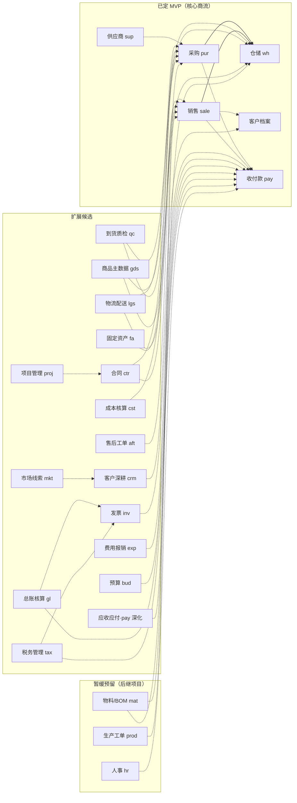
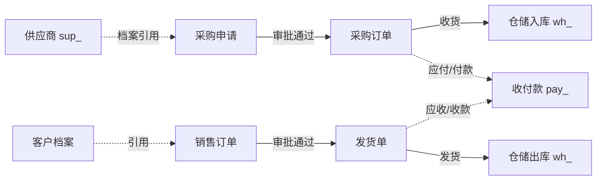

# biz 企业运营管理规划

> biz 企业运营管理 · 业务承载于 BMS 平台扩展

[文档首页](../文档首页.md) › 规划 › biz 企业运营管理规划　|　配套：bms 仓库《平台可扩展性规划》《项目规划说明》（平台专属，bms 仓库 `bms文档/规划/`）

## 1. 项目概述 

**biz（企业运营管理）** 为独立产品仓库：承载企业运营类业务——采购、收付款、供应商、销售、仓储，以及向财税、服务、资产、项目延展的候选业务域，作为 **BMS 平台扩展**运行（独立仓库、独立演进，运行时并入平台进程），本身只做运营业务域，不重复平台能力。

- **业务基座定位**：biz 同时作为 BMS 之上「业务运营基座」——向下复用平台通用能力，向上为后继商业运营项目（生产制造、人事、财务核算等）预留业务模型扩展位；前期设计中不将基础模型焊死，避免后继项目重改（模型兼容机制见[第 5 节](#compat)）。
- **板块归组原则**：业务域按行业惯例归入大板块（主数据 / 采购供应商 / 仓储物流 / 销售客户 / 财务资金 / 资产行政 / 人力资源 / 生产制造 / 项目协同），**归组是逻辑组织层**，各业务域仍独立注册标识符（表前缀/业务码/错误码段/事件域），不因归组做物理合并。
- **业务来源**：本仓库业务原为 BMS 规划中的自营模块（采购/收付款 MVP + 销售/仓储附加），随《平台可扩展性规划》「业务不入平台」原则整体迁出，独立为产品。
- **运行形态**：平台扩展——前端模块构建期合并进 bms 前端，后端扩展包并入 bms 进程；数据落租户库（业务表按模块前缀，如 `pur_/pay_/sup_/sale_/wh_`），注册要素在平台 sys_module 登记。
- **现状基线**：规划（含业务域全景分层与基座兼容性设计）已确立；概要设计采购/收付款已迁入；平台扩展代码机制（R4）未落地前，业务先以文档与设计沉淀，随 bms 开发节奏接入。

## 2. 技术基线 

复用 bms 平台全栈能力，本仓库**不含**后端/前端基础设施实现：

| 层 | 提供方 | 说明 |
| --- | --- | --- |
| 后端语言/框架 | bms 平台 | Python 3.14 / FastAPI / SQLAlchemy 2.0 异步 / Alembic（业务扩展包按既有分层） |
| 前端 | bms 平台 | Vue 3 + Vite + TypeScript（Element Plus / Vant 双工程），业务页面 Views 目录 |
| 数据层 | bms 平台 | MySQL / PostgreSQL / 达梦 DM8 三库、Redis、MinIO、RocketMQ、ES、Milvus |
| 平台能力 | bms 平台 | 认证/SSO、RBAC、租户、文件、通知、工作流、报表、审计、i18n、任务、事件、开放接口（见 bms《平台可扩展性规划》5.1） |
| 业务域 | 本仓库 | 各板块业务域（见第 3 节全景）的业务模型、API、页面、流程与种子 |

## 3. 功能模块（业务域全景与分层） 

### 3.1 业务域全景 

按行业惯例列出企业运营可管理的全部业务域，**不遗漏**，并标记归属与优先级，作为后续筛选与排期的依据：

- **优先级口径**：P0 已定 MVP（随平台阶段交付）／P1 高优候选／P2 中优候选／P3 暂缓候选（暂不实施、预留模型兼容）；「暂缓预留」指大型行业域，单独立项承接，biz 前期设计预留扩展位。
- **平台承载**：流程审批、通知公告、报表/BI/大屏、文件/知识/帮助、定时任务、审计/回收站/归档/备份、开放接口/Webhook 等由 bms 平台提供，biz 不重复建设，表格中以「平台承载」标注。

| 板块 | 业务域 | 简称/前缀 | 说明 | 状态/优先级 |
| --- | --- | --- | --- | --- |
| 主数据与基础 | 商品/物料主数据 | gds / gds_ | 商品 SKU 与基础档案，采购申请、销售订单引用；为生产项目物料（mat）预留承接过渡 | P1 候选 |
| 主数据与基础 | 组织机构/用户/岗位/角色 | — | 平台 sys 域提供，biz 复用绑定 | 平台承载 |
| 采购与供应商 | 采购申请/订单 | pur / pur_ | 申请-三级审批-订单闭环，采购退货/折让并入采购链路 | P0 已定 |
| 采购与供应商 | 供应商档案 | sup / sup_ | 名称/联系人/资质/状态 | P0 已定 |
| 采购与供应商 | 合同管理 | ctr / ctr_ | 采购/销售合同登记、审批、履约台账 | P1 候选 |
| 采购与供应商 | 到货质检 | qc / qc_ | 到货抽检、检验记录与判定 | P2 候选 |
| 仓储与物流 | 仓储/库存 | wh / wh_ | 仓库库位、库存余额流水、出入库/调拨/盘点 | P0 已定 |
| 仓储与物流 | 物流配送 | lgs / lgs_ | 物流单/运单/物流跟踪/运费登记分摊 | P2 候选 |
| 仓储与物流 | 库存预警/补货建议 | （wh 承载） | 经 wh 事件 + 报表/任务承载，不单设域 | P2 承载 |
| 销售与客户 | 销售订单/发货/退货/客户档案 | sale / sale_ | 商流主链路，客户档案内置于 sale | P0 已定 |
| 销售与客户 | CRM 深化 | crm / crm_ | 客户跟进、商机机会、报价单 | P2 候选 |
| 销售与客户 | 售后工单 | aft / aft_ | 退换货受理、维修登记、售后跟踪 | P2 候选 |
| 销售与客户 | 市场线索/营销 | mkt / mkt_ | 线索与营销活动（CRM 前端入口） | P3 候选暂缓 |
| 财务与资金 | 收付款/退款/流水台账 | pay / pay_ | 核心资金台账与支付渠道抽象 | P0 已定 |
| 财务与资金 | 应收应付账龄/核销/对账 | （pay 深化） | 在 pay 内深化，不单列域 | P1 候选 |
| 财务与资金 | 现金/银行资金与渠道 | （pay 深化） | 银企直连、资金计划、银行对账、现金/银行日记账与出纳（渠道层预留） | P2 候选 |
| 财务与资金 | 发票管理 | inv / inv_ | 进项/销项发票、开票审批、与收付款勾稽 | P1 候选 |
| 财务与资金 | 费用报销/借款 | exp / exp_ | 报销单/借款/还款，走工作流 | P2 候选 |
| 财务与资金 | 预算管理 | bud / bud_ | 部门/费用预算编制与执行比对 | P2 候选 |
| 财务与资金 | 总账/凭证/报表核算 | gl / gl_ | 复式记账核算，深度核算由专业财务软件承接做宽做深 | P3 候选暂缓 |
| 财务与资金 | 成本核算 | cst / cst_ | 存货成本/出库成本/生产成本/费用归集，与仓储、生产联动 | P3 候选暂缓 |
| 财务与资金 | 税务管理 | tax / tax_ | 税种税率、进销项认证、销项开票、纳税申报，与发票、收付款联动 | P3 候选暂缓 |
| 资产与行政 | 固定资产/低值易耗 | fa / fa_ | 资产台账、领用/归还、报废；含办公用品领用、折旧计提核算 | P2 候选 |
| 资产与行政 | 车辆/印章/证照/行政后勤 | （fa 深化） | 行政资产专项，可并入 fa 或后续专项 | P3 候选暂缓 |
| 人力资源 | 员工档案/考勤/薪酬/招聘绩效 | hr / hr_ | 大域，单独立项承接；biz 预留员工模型承接位（员工主数据不焊死） | 暂缓预留 |
| 生产制造 | 物料/BOM/工艺路线 | mat / mat_ | 大域，单独立项承接；物料主数据由 gds 过渡 | 暂缓预留 |
| 生产制造 | 生产工单/排产/报工/设备 | prod / prod_、eqp | 大域，单独立项承接；biz 预留生产完工入库（仓储）接驳 | 暂缓预留 |
| 项目与协同 | 项目管理/轻量任务 | proj / proj_ | 项目/任务/工时（行业常见但自成体系，暂缓深化） | P3 候选暂缓 |
| 项目与协同 | 流程/通知/报表/文件/任务/审计等 | — | 平台工作流/通知公告/报表/文件/任务/审计等能力 | 平台承载 |

**展望域**（占位兼容，不设错误码段、不建表、不承诺实施；仅在规划中占位，模型设计预留组织/币种/现金流等维度，避免后期无法扩展）：

| 板块 | 展望域 | 说明 | 状态 |
| --- | --- | --- | --- |
| 组织与核算 | 多组织/多公司 | 多公司/事业部核算，组织维度预留（单据预留 org_id 逻辑外键） | 展望 |
| 国际业务 | 多币种/外贸 | 币种+汇率、报关单据，金额字段预留 currency_code/exchange_rate | 展望 |
| 资金融通 | 供应链金融 | 应收/应付票据、保理融资 | 展望 |
| 业态拓展 | 会员积分/零售门店 | C 端会员与门店 POS 业态 | 展望 |

> 板块划分是逻辑组织层：面板导航、文档组织按板块归组；底层业务域仍独立注册、独立演进，不因归组做标识符物理合并（已注册的 `pay_` 等保持注册不变）。

### 3.2 模块划分 

biz 承接与预留的业务域明细（与[第 6 节标识符登记](#register)一一对应；「P3 候选暂缓」「暂缓预留」「展望」仅登记与文档沉淀，不进入近期实施）：

**已定 MVP（五模块）**：

| 模块 | 简称/前缀 | 说明 | 状态 |
| --- | --- | --- | --- |
| 采购管理 | pur / pur_ | 采购申请单提交与三级审批（复用工作流）、审批通过生成采购订单（含 Webhook 事件推送）；供应商档案复用 sup 模块 | MVP |
| 收付款管理 | pay / pay_ | 收款单/付款单/退款单登记与审批（付款/退款纳入审批）、统一收付款流水台账、支付渠道配置（渠道抽象预留——本期仅 manual 线下转账，后续银企直连/第三方支付） | MVP |
| 供应商管理 | sup / sup_ | 供应商档案维护（名称/联系人/资质/状态），采购申请/订单引用 | MVP |
| 销售管理 | sale / sale_ | 客户档案、销售订单登记与审批、审批通过生成发货单，退货单；出入库联动仓储 | MVP |
| 仓储管理 | wh / wh_ | 仓库库位、库存余额与流水、入库/出库/调拨/盘点单；采购收货入库、销售发货出库 | MVP |

**扩展候选**：

| 模块 | 简称/前缀 | 说明 | 状态 |
| --- | --- | --- | --- |
| 商品主数据 | gds / gds_ | 商品 SKU 基础档案，采购申请/销售订单引用商品；为生产项目物料承接过渡 | 扩展候选 |
| 合同管理 | ctr / ctr_ | 采购/销售合同登记、审批、履约跟踪与台账，与采购订单、销售订单双向衔接 | 扩展候选 |
| 发票管理 | inv / inv_ | 进项/销项发票登记、开票申请与审批、发票台账，与收付款流水勾稽核销 | 扩展候选 |
| 费用报销 | exp / exp_ | 报销单/借款/还款登记与审批（复用工作流），部门费用统计 | 扩展候选 |
| 预算管理 | bud / bud_ | 部门/费用预算编制与执行比对，与费用报销、采购支出联动控制 | 扩展候选 |
| 总账核算 | gl / gl_ | 简易总账/凭证数据承接，深度核算由专业财务软件承接 | 扩展候选 |
| 成本核算 | cst / cst_ | 存货/出库/生产成本与费用归集，与仓储成本、生产成本联动 | 扩展候选 |
| 税务管理 | tax / tax_ | 税种税率、进销项认证、销项开票、纳税申报，与发票、收付款联动 | 扩展候选 |
| 应收应付深化 | （pay 深化） | 应收/应付账龄、核销与对账，在 pay 模块内深化，不新增标识符 | 扩展候选 |
| 物流配送 | lgs / lgs_ | 发货物流单、运单与物流跟踪、运费登记分摊，衔接销售发货与仓储出库 | 扩展候选 |
| 售后工单 | aft / aft_ | 退换货受理、维修登记、售后跟踪，衔接销售退货单 | 扩展候选 |
| 到货质检 | qc / qc_ | 采购到货抽检、检验记录与判定，衔接采购收货与入库 | 扩展候选 |
| 固定资产 | fa / fa_ | 资产台账、领用/归还、报废处置；含办公用品领用与折旧计提核算 | 扩展候选 |
| CRM 深化 | crm / crm_ | 客户跟进记录、商机机会、报价单，衔接 sale 客户档案 | 扩展候选 |
| 市场线索 | mkt / mkt_ | 线索与营销活动，作为 CRM 前端入口 | 扩展候选 |
| 项目管理 | proj / proj_ | 轻量项目/任务/工时管理 | 扩展候选 |

**暂缓预留**：

| 模块 | 简称/前缀 | 说明 | 状态 |
| --- | --- | --- | --- |
| 生产制造-物料 | mat / mat_（预留） | 物料/BOM/工艺路线；暂不实施，物料主数据由 gds 过渡承接 | 暂缓预留 |
| 生产制造-工单 | prod / prod_（预留） | 生产工单/排产/报工、设备；暂不实施，预留生产完工入库（仓储）接驳 | 暂缓预留 |
| 人事 HR | hr / hr_（预留） | 员工档案/考勤/薪酬/招聘/绩效；暂不实施，预留后继 HR 项目承接位，员工模型不焊死 | 暂缓预留 |

### 3.3 核心业务链路 

1. **采购闭环**：采购申请提交 → 三级审批（复用平台工作流）→ 审批通过生成采购订单 → 到货收货生成入库单（wh_ 入库，库存余额更新 + 流水落库 + `wh.inbound.completed` 事件）→ 依据订单付款（pay_ 付款单，审批后执行，落收付款流水）。
2. **销售闭环**：销售订单登记 → 审批 → 审批通过生成发货单 → wh_ 出库扣库存 → 依据订单收款（pay_ 收款单，落流水）；退货单审批 → 退款（金额 ≤ 原单余额校验）。
3. **收付款台账**：每笔收/付/退款统一落 pay 流水（pay_payment_flow），支撑流水账单与对账。

### 3.4 扩展域衔接点 

主链路与候选/暂缓域的衔接关系（对齐设计、避免二次接驳）：

| 扩展域 | 衔接的主链路 |
| --- | --- |
| 商品主数据 gds | 采购申请/订单、销售订单的商品引用；生产项目物料承接 |
| 合同 ctr | 采购订单 ⇄ 采购合同、销售订单 ⇄ 销售合同 |
| 发票 inv / 应收应付深化 | 收付款流水与核销勾稽 |
| 预算 bud | 费用报销/采购支出的预算执行控制 |
| 总账 gl / 成本核算 cst | 收付款、发票、报销的凭证数据输出；出库成本、生产完工入库成本 |
| 税务管理 tax | 发票销项/进项、收付款税金处理 |
| 物流配送 lgs | 销售发货、仓储出库 |
| 到货质检 qc | 采购收货入库 |
| 售后工单 aft | 销售退货单 |
| CRM 深化 crm | 客户档案 |
| 市场线索 mkt | 线索 → 商机 → 报价 → 销售订单 |
| 项目管理 proj | 任务/工时与业务单据关联（轻量） |
| 生产制造 mat / prod | 物料主数据（gds 过渡）、生产完工入库（仓储） |

> 展望域（多组织/多公司、多币种/外贸、供应链金融、会员零售）未在此列衔接点——模型维度预留见[第 5 节](#compat)，具体衔接随立项另行设计。

## 4. 平台复用边界 

- 本仓库**只含业务域代码与设计**；认证/RBAC/多租户/文件/通知/工作流/报表/审计/i18n/任务/事件/开放接口全部复用平台（bms《平台可扩展性规划》5.1 能力清单）。
- 业务表落租户库，遵守平台**《架构设计·数据架构》**（bms 仓库）数据规范；跨库引用走逻辑外键；表级清单维护在本仓库设计文档。
- 扩展候选与暂缓域同样只做业务、复用平台，不重复平台能力；平台承载类（流程/通知/报表/任务等）在 biz 内只做挂接配置，不建业务代码。
- 独立服务类强隔离场景（外部团队/异构）走平台 `独立服务` 轨，不在本仓库范围。

## 5. 基座兼容性设计 

biz 作为业务运营基座，模型设计为后继项目（生产制造、人事、财务核算、外贸、多组织等）预留扩展位——**实不实施另说，前期先把扩展位留出来**，避免后期加一个字段都要迁移。

### 5.1 模型扩展机制 

- **扩展字段统一走平台表单定制/租户自建字段能力**（bms `sys_field_ext`：`ext_` 前缀动态 DDL 加列、停用不删列、跨库类型映射），biz **不另造**字段扩展机制；可扩展字段进 `ext_`，不进主表基础列，后续扩字段不迁表不锁表。
- 业务表遵循平台数据规范：雪花 ID 主键、软删除（deleted_at）、审计字段、乐观锁（version）、时间 UTC 存储；跨库引用走 **code 逻辑外键 + 单据快照**，不给后继项目设置物理强约束。
- 单据状态用状态码 + 可扩展转移表（**不写死枚举分支**），流程/事件演进可追加。

### 5.2 关键扩展位预留 

| 维度 | 预留方式 | 支撑的展望/后继 |
| --- | --- | --- |
| 币种与汇率 | 金额表预留 `currency_code` + `exchange_rate`（默认 CNY / 1） | 多币种/外贸 |
| 组织维度 | 业务单据预留 `org_id` 逻辑外键 | 多组织/多公司核算 |
| 数量与金额精度 | 数量统一 4 位、金额统一 2 位 | 避免精度不统一返工 |
| 主数据引用 | 主数据以 code 逻辑外键引用，单据保存名称/单价快照 | 主数据详情扩展不断链 |
| 事件域 | `{域}.{动作}` 事件命名，注册制追加 | 后继项目订阅不受限 |
| 核算接驳 | gl/cst/tax 凭证数据以单据号+行号关联，预留取数接口 | 核算深做或对接外部财务软件 |
| 生产接驳 | 物料主数据由 gds 承载；完工入库对接 wh | 生产制造项目 |
| 人事接驳 | 员工主数据不焊死在单据字段中，预留 code 引用 | 人事 HR 项目 |

### 5.3 对概要设计的约束 

- 各模块概要设计（数据模型/接口）遵循 5.1/5.2：单据表预留上述扩展位；新增字段先评估 `ext_` 承载。
- 后继项目承接时只需扩展子表与事件，**不迁移既有结构**。
- 与 bms《架构设计 · 数据架构》《架构设计 · 接口与集成》及《项目规划说明》表单定制模块口径一致。

## 6. 模块标识符登记 

按 bms《项目规划说明》「平台扩展接入流程」在平台 sys_module 登记（一处登记、启动与 CI 校验唯一）：

**已注册（五模块 MVP）**：

| 模块 | 简称 | 表前缀 | 业务码 | 错误码段 | 事件域 |
| --- | --- | --- | --- | --- | --- |
| 采购 | pur | pur_ | pur | 10xxxx | pur.*（如 pur.purchase.order.created） |
| 收付款 | pay | pay_ | pay | 11xxxx | pay.*（如 pay.payment.approved） |
| 销售 | sale | sale_ | sale | 12xxxx | sale.*（如 sale.order.created） |
| 仓储 | wh | wh_ | wh | 13xxxx | wh.*（如 wh.inbound.completed） |
| 供应商 | sup | sup_ | sup | 14xxxx | sup.* |

> 错误码段由平台统一分配（bms《项目规划说明》23.5），注册即定、稳定不变。

**规划预留**（扩展候选与暂缓域，段位自 15xxxx 顺延；接入开发时按平台「扩展接入流程」在 sys_module 正式注册确认，注册即定；未注册前不建表；展望域不占段位）：

| 模块 | 简称 | 表前缀 | 业务码 | 错误码段 | 事件域 |
| --- | --- | --- | --- | --- | --- |
| 商品主数据 | gds | gds_ | gds | 15xxxx | gds.* |
| 合同 | ctr | ctr_ | ctr | 16xxxx | ctr.* |
| 发票 | inv | inv_ | inv | 17xxxx | inv.* |
| 费用报销 | exp | exp_ | exp | 18xxxx | exp.* |
| 预算管理 | bud | bud_ | bud | 19xxxx | bud.* |
| 总账核算 | gl | gl_ | gl | 20xxxx | gl.* |
| 物流配送 | lgs | lgs_ | lgs | 21xxxx | lgs.* |
| 售后工单 | aft | aft_ | aft | 22xxxx | aft.* |
| 到货质检 | qc | qc_ | qc | 23xxxx | qc.* |
| 固定资产 | fa | fa_ | fa | 24xxxx | fa.* |
| CRM 深化 | crm | crm_ | crm | 25xxxx | crm.* |
| 市场线索 | mkt | mkt_ | mkt | 26xxxx | mkt.* |
| 项目管理 | proj | proj_ | proj | 27xxxx | proj.* |
| 生产制造-物料 | mat | mat_ | mat | 28xxxx | mat.* |
| 生产制造-工单 | prod | prod_ | prod | 29xxxx | prod.* |
| 人事 HR | hr | hr_ | hr | 30xxxx | hr.* |
| 成本核算 | cst | cst_ | cst | 31xxxx | cst.* |
| 税务管理 | tax | tax_ | tax | 32xxxx | tax.* |

> 应收应付、出纳/现金银行渠道为 pay 模块深化、不单列域，沿用 pay 段位（11xxxx）。

## 7. 演进路线 

| 阶段 | 内容 | 状态 |
| --- | --- | --- |
| 一 立项与骨架 | 本规划（含业务域全景分层与基座兼容性设计）+ 仓库骨架 + 基座软链引用（规范/资料/资源权威源 bms） | 本文档 |
| 二 业务设计 | 运营体系设计总纲 + 概要设计（采购/收付款已迁入；其余已注册模块与高优候选按 5.3 约束补建），对照平台扩展接入流程 | 部分完成 |
| 三 接入开发 | 平台扩展机制（R4）落地后，五模块 MVP 按 `平台扩展接入流程` 接入平台、随平台阶段交付 | 待定 |
| 四 扩展候选推进 | 按优先级分批：P1（商品主数据/合同/发票/应收应付深化）→ P2（报销/预算/物流/售后/质检/固定资产/CRM 深化）→ P3 暂缓域（总账/成本核算/税务/市场线索/项目） | 待定 |
| 五 暂缓预研 | 生产制造（物料/BOM、工单）、人事 HR、核算域（总账/成本核算/税务）：前期模型预留与后继项目承接设计（不实施） | 预留 |
| 六 深化 | 支付渠道对接（银企直连/第三方支付 + 对账核销）、报表与分析深度应用、移动端优化 | 待定 |

## 8. 风险与对策 

| 风险 | 影响 | 缓解措施 |
| --- | --- | --- |
| 依赖 bms 平台扩展机制（R4）落地 | 中 | 文档、设计先行（本规划 + 业务设计），代码接入随平台节奏；提前按注册流程定义已定与预留模块要素 |
| 扩展位早期未预留（币种/组织/扩展字段） | 高 | 第 5 节基座兼容性设计将币种/组织/扩展字段纳入单据表统一预留，概要设计按 5.3 约束执行；新字段优先走平台 ext_ |
| 依赖平台表单定制（ext_ 字段）能力 | 中 | 随平台表单定制能力落地；biz 设计阶段复用，不另造机制 |
| 暂缓域预留不足（生产制造/HR/核算） | 中 | 商品/物料、员工、凭证等基础模型在前期设计即预留扩展位、不焊死；候选域模型与接口保持中立，便于后继项目承接 |
| 候选域范围蔓延 | 中 | 全景按 P0~P3 标记优先级，展望域仅占位不实施；候选域仅文档沉淀与标识符预留，实施严格按优先级与阶段排期，超范围走变更确认 |
| 财务核算深度失控（gl/cst/tax） | 中 | 核算域仅承接简易取数与凭证数据，复式记账/成本核算/税务申报深度由专业财务软件承接，biz 不做核算引擎 |
| 支付渠道/对账复杂度 | 中 | 渠道抽象层预留（目前 manual 线下转账），对账核销随渠道对接迭代 |
| 基座引用漂移 | 低 | 工作区符号链接引用 bms 权威源（软链随 bms 提交即时生效），本仓库无基座副本可漂移（bms《基座文档清单》） |
| 与平台/其他产品标识符冲突 | 中 | 要素注册于 sys_module，启动与 CI 校验唯一（平台保障）；候选/暂缓域段位在同一预留表中顺延，避免跨产品误用 |

> 本文档依《文档生成规范》编写 · 与 bms《平台可扩展性规划》《项目规划说明》配套