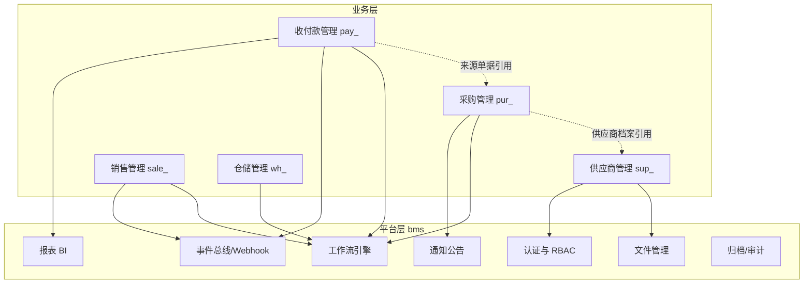

# 架构设计

> biz 企业运营管理 · 总纲

[文档首页](../../文档首页.md) › 01_架构设计_总览　|　[02-概要设计](../概要设计/01_概要设计_总览.md)

## 1. 文档目的 

本文档是 biz（企业运营管理）业务系统架构的**总纲**：说明业务系统在平台 bms 之上的体系架构、模块间关系与设计文档组织方式，并作为入口引用业务架构节点文件。

> biz 为按平台《微服务演进规划》以**产品服务（独立服务）**形态接入 bms 的产品仓库（接入流程见平台 bms《项目规划说明》「平台扩展接入流程」节）：平台技术底座（认证/RBAC/工作流/通知/事件总线/报表/文件/全文检索/AI）全部复用 bms《架构设计》，**业务架构层不做平台级新决策**；本仓库只承载业务系统自身的架构组织——模块边界、模块间依赖与主流程、对平台能力的依赖映射、数据与集成约定。

## 2. 业务架构总览 

- **业务层**：采购/收付款/供应商/销售/仓储五个业务模块（供应商为独立模块、其余模块引用其档案）；业务状态推进复用平台工作流引擎，事件经平台事件总线发布。
- **平台层**：bms 提供认证权限、工作流、通知、事件总线、报表、文件、归档审计等能力，业务模块按需依赖（见第 4 节映射表）。
- **数据与部署**：业务表落**每服务独立库**（每租户一组），遵循平台《架构设计 · 数据架构》规范；五服务独立构建与部署（不可变镜像 + Compose，迁 k3s 同模型），经平台网关统一入口。

## 3. 模块注册与标识 

业务模块在平台**服务目录（`sys_module` 升格，含契约 / 版本登记）**登记（权威值），本表为规划「模块标识符登记」节注册口径的架构落点，标识符全库统一。

| 模块 | 简称 | 表前缀 | 错误码段 | 事件域 | API 前缀 | 服务标识（service_key） |
| --- | --- | --- | --- | --- | --- | --- |
| 采购管理 | pur | pur_ | 10xxxx | pur | /api/v1/pur | pur |
| 收付款管理 | pay | pay_ | 11xxxx | pay | /api/v1/pay | pay |
| 销售管理 | sale | sale_ | 12xxxx | sale | /api/v1/sale | sale |
| 仓储管理 | wh | wh_ | 13xxxx | wh | /api/v1/wh | wh |
| 供应商管理 | sup | sup_ | 14xxxx | sup | /api/v1/sup | sup |

> 服务标识即 bms 服务目录 `service_key`（`product_key=biz`，当前状态 `planned`）；每服务独立工程、独立库、独立发布，按平台服务同构骨架（`new_service.py`）建立。

## 4. 对平台能力依赖映射 

| 业务模块 | 依赖平台能力 | 依赖说明 |
| --- | --- | --- |
| 采购管理 | 工作流、通知公告 | 申请→三级审批生命周期经工作流引擎；待办/结果通知经通知中心 |
| 收付款管理 | 工作流、事件总线、报表 BI | 收/付/退款审批经工作流；pay.* 事件入事件总线供 Webhook/对账消费；流水走报表数据集 |
| 供应商管理 | 文件管理、权限计算 | 资质附件经文件分片上传；档案按数据范围授权 |
| 销售管理 | 工作流、事件总线 | 订单审批经工作流；sale.* 事件发布（规划中） |
| 仓储管理 | 工作流、审计链 | 出入库审批经工作流；库存异动落审计（规划中） |

## 5. 数据与集成约定 

- **数据**：业务表单据落**本服务独立库**（每租户一组），前缀 `模块域名_`（如 pur_purchase_apply）；服务内引用走逻辑外键，跨服务读走契约 / 只读投影（如采购单引用供应商档案经 sup 服务契约或存快照，不做跨库外键）；系统级审计/归档由平台统一承担。
- **接口**：各服务公开契约 `/api/v1/{域}/...`（OpenAPI + 契约版本）；服务间同步调用走服务间调用基座（公开契约路径），异步协作走事件总线；开放能力经平台 `/api/open` + scope。
- **集成**：服务间解耦、经事件总线异步协作；对外 Webhook 订阅注册在平台，事件名以事件域前缀（pur.* / pay.*）。
- **前端**：业务页面以**运行时模块（Module Federation）**接入平台前端应用（构建期合并为过渡），路由挂在平台动态菜单体系（menu→form→业务码）。

## 6. 文档结构 

业务架构采用「总纲 + 节点文件」结构，现阶段以上述总纲承载骨架，后续随模块深化补建节点：

| 节点 | 文件 | 内容 |
| --- | --- | --- |
| 架构总览 | [01_架构设计_总览.md](01_架构设计_总览.md) | 业务架构总览、模块注册、平台依赖映射、数据与集成约定 |
| 业务主流程时序（待建） | 02_架构设计_业务主流程.md | 采购→收付款→销售→仓储的模块间业务流转时序 |
| 模块详细架构（按模块展开，随概要设计配套补建） | 0x_架构设计_模块_*.md | 模块内组件/状态机/事件清单细化 |

> 架构设计节点 · 与《biz 企业运营管理规划》及平台 bms《微服务演进规划》《架构设计》《文档生成规范》《命名规范》配套