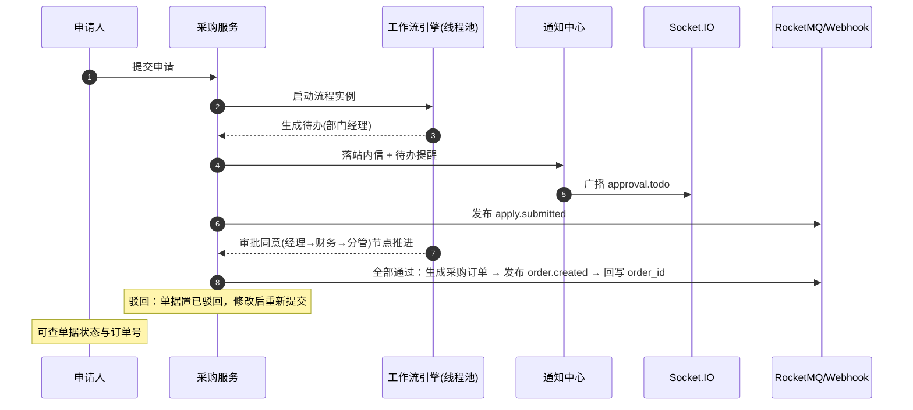

# 概要设计 · 采购管理

> biz · 采购申请、审批与供应商档案

[概要设计](01_概要设计_总览.md) › 02-采购管理　|　[← 01-概要总览](01_概要设计_总览.md) · [03-收付款管理 →](03_概要设计_收付款管理.md)

本节对应[《biz 企业运营管理规划》](../../规划/biz企业运营管理规划.md)「模块划分」节**采购管理（pur）**模块拆分（采购申请三级审批、
审批通过自动生成采购订单、供应商档案协作引用），架构与机制复用 bms《架构设计》17-工作流、18-通知公告、
14-实时推送节点与 bms《概要设计》工作流管理模块，biz 作为产品服务（独立服务）复用平台能力，不重复设计。

## 1. 模块概述与职责 

采购管理模块承载采购业务闭环：采购申请单提交与三级审批（部门经理 → 财务 → 分管领导，走工作流引擎）、
审批通过自动生成采购订单、供应商档案（独立服务 sup）维护。审批链路与 bms《概要设计》工作流管理模块强关联——
申请单仅发起流程并消费审批结果，审批动作本身由工作流引擎驱动。

- **模块定位**：biz 实际业务模块（采购申请-审批-订单闭环），走「业务单据 + 流程引擎 + 事件总线 + 实时推送」全链路
- **职责边界**：采购申请单 CRUD 与提交、采购订单生成与查询、供应商档案（sup 服务）维护；审批节点推进、待办生成、会签等归工作流管理模块
- **协作关系**：
  - 工作流（bms《架构设计》17-工作流）：提交申请启动流程实例（`wf_instance.business_type + business_id` 关联申请单）；审批通过事件回调生成订单
  - 通知与实时推送（bms《架构设计》18-通知公告 / 14-实时推送）：待办提醒经 bms《概要设计》通知中心（站内信）+ Socket.IO（approval.todo）实时触达
  - Webhook（出站集成）：审批相关事件经 RocketMQ 事件总线异步推送（pur.apply.submitted / pur.order.created）

## 2. 功能分解与业务流程 

### 2.1 功能点分解 

| 功能点 | 说明 | 权限码 |
| --- | --- | --- |
| 采购申请单维护 | 新建/编辑/删除/查询申请单（apply_no 自动生成）；主从结构：主表（标题/金额/理由/部门/供应商）+ 明细行（商品名称/规格/数量/单价，行内编辑，金额 = 数量 × 单价自动合计，明细合计须与主表金额一致） | pur:create / update / delete / query |
| 提交审批 | 提交后启动三级审批流程（部门经理 → 财务 → 分管领导），单据状态进入审批中，不可再编辑 | pur:create |
| 审批通过生成订单 | 流程全部节点通过后，按申请单生成采购订单（pur_purchase_order），订单号自动生成 | —（流程回调触发） |
| 驳回处理 | 任一节点驳回：单据状态回退，申请人可修改后重新提交（重新触发流程） | pur:update |
| 供应商档案维护 | 供应商增删改查（code/名称/联系人/电话/资质/状态），采购申请与订单引用供应商（独立服务 sup） | sup:manage |
| 我的申请/我的订单 | 申请人查看自己发起的申请与生成的订单 | pur:query |

### 2.2 申请→审批→订单流程 

1. 申请人填写申请单（标题、理由、部门、供应商 + 明细行：商品名称/规格/数量/单价，明细合计自动回填主表金额），保存草稿或直接提交
2. 提交时：单据状态置审批中 → 启动工作流实例（走最新版本流程定义）→ 发布 pur.apply.submitted 事件 → 部门经理收到待办（站内信 + Socket.IO 实时角标）
3. 审批链：部门经理 → 财务 → 分管领导，逐节点推进（同意 → 下一节点；驳回 → 流程终止、单据退回）
4. 异常分支：
  - 审批人缺失/离职：待办超时未处理不自动跳过（MVP 无超时自动通过），管理员可将任务转办/委托
  - 流程定义未部署：提交返回明确错误码，不允许提交
  - 并发重复提交：幂等键（Idempotency-Key）拦截，防止同一申请重复启动流程
5. 三级全部通过：生成采购订单 → 单据状态置已通过并回写 order_id → 发布 pur.order.created 事件
6. 驳回：单据状态置已驳回，申请人修改后重新提交（重新启动新流程实例）

## 3. 关键时序与协作 

协作要点：审批动作接口（工作流模块）为唯一推进入口，采购服务通过事件消费回调（或直接同步调用）
处理「流程结束」结果生成订单，保证单据状态与流程状态一致；所有对外通知/推送均异步，主链路不等待。

## 4. 数据模型与表设计 

核心表（落 pur 服务独立库，每租户一组；供应商档案属独立服务 sup）：

| 表 | 关键字段 | 说明 |
| --- | --- | --- |
| pur_purchase_apply | apply_no、title、amount、reason、dept_id、applicant_id、status（草稿/审批中/已通过/已驳回）、order_id | 采购申请单；order_id 在订单生成后回写（逻辑外键）；amount 为主表金额（明细合计回填） |
| pur_purchase_item | apply_id、name、spec、qty、price、amount、sort | 采购申请明细行（1:N）；amount = qty × price；apply_id 逻辑外键，随主表整体保存 |
| pur_purchase_order | order_no、apply_id、supplier、amount、status | 采购订单，审批通过后生成，apply_id 关联申请单 |
| sup_supplier | code、name、contact、phone、qualification、status | 供应商档案（独立服务 sup），采购申请/订单引用（code 逻辑外键，跨服务经 sup 契约 / 快照） |

- **通用规范**：雪花 ID 主键、软删除（deleted_at，复合唯一约束 `(apply_no, deleted_at)`）、审计字段、乐观锁（version）、时间 UTC；跨表引用用逻辑外键，不建物理外键
- **索引**：apply_no/order_no/supplier code 唯一索引；applicant_id、dept_id、status 建索引（数据权限过滤字段）
- **状态机**：申请单 草稿 → 审批中 → 已通过/已驳回；已驳回可修改重新提交（重新走草稿→审批中）；已通过不可改（仅可查看）；订单生成后申请单不可撤销
- **主从保存**：主表 + 明细整体单事务提交（保存时删除旧明细行重建，或按 id 增删改）；新增主表时明细的 apply_id 由事务内新主表 ID 回填；明细行行内编辑（未保存修改随整体提交），保存时过滤空行
- **金额校验**：前端按行计算并汇总（qty × price），提交时后端复算校验：明细合计 ≠ 主表 amount 拒绝保存（错误码 100008）
- **数据流转**：申请单提交 → 流程实例关联 → 审批通过 → 生成订单回写 order_id → 单据/订单状态驱动列表与统计；供应商变更不影响已生成单据（快照 supplier 名称）
- **归档**：单据表体量小，不按月分片；字段级审计（pur_purchase_*、sup_supplier 为关键表）自动记录至 sys_data_audit_log（按月分表）

## 5. 接口设计 

| 方法 | 路径 | 说明 | 权限码 |
| --- | --- | --- | --- |
| GET | /api/v1/pur/applies | 申请单列表（分页 + 状态/时间/申请人筛选） | pur:query |
| POST | /api/v1/pur/applies | 新建申请单（草稿，body 含主表字段 + items 明细数组） | pur:create |
| PUT | /api/v1/pur/applies/{id} | 编辑申请单（仅草稿/已驳回状态；主表 + items 明细整体提交） | pur:update |
| POST | /api/v1/pur/applies/{id}/submit | 提交审批（启动工作流） | pur:create |
| DELETE | /api/v1/pur/applies/{id} | 删除申请单（仅草稿状态，软删除） | pur:delete |
| GET | /api/v1/pur/orders | 采购订单列表 | pur:query |
| GET | /api/v1/pur/orders/{id} | 订单详情（含关联申请单） | pur:query |
| GET/POST/PUT | /api/v1/sup/suppliers | 供应商列表/新建/编辑 | sup:query / create / manage |
| GET | /api/v1/sup/suppliers/{id} | 供应商详情 | sup:query |

- **通用规范**：前缀 `/api/v1`、统一响应 `{code, message, data}`、分页 `{list, total, page, size}`、Bearer 鉴权 + require_permission 两级校验；生产环境按子域名解析租户，一人多租户走 X-Tenant-ID
- **幂等**：提交审批写接口支持 `Idempotency-Key`（Redis SETNX 前置去重 + 流程实例唯一约束兜底），防止重复启动流程
- **限流**：提交审批按用户限流（防误刷批量启动流程）
- **发布事件**（Webhook 可订阅）：pur.apply.submitted（apply_no、applicant_id、amount）、pur.order.created（order_no、apply_id、supplier）

## 6. 权限与配置 

- **权限码**：业务 `pur`（采购申请/订单，默认归属普通角色），动作 query/create/update/delete 归属 pur 业务（如 `pur:create`）；供应商为独立业务 `sup`（档案，pur 关联引用），动作 query/create/update/delete/manage 归属 sup 业务（如 `sup:manage`）
- **菜单挂接**：菜单「采购申请」「采购订单」分别挂表单（1:1），表单挂业务 pur；「供应商档案」表单挂业务 sup；工具栏按钮挂动作（新建=create、提交=create、编辑=update、删除=delete、供应商管理=manage）
- **数据权限**：申请单列表默认无数据范围（本人单据按申请人过滤为业务固有约束）；动作级数据范围（sys_data_scope）可按部门配置
- **sys_config 参数**：无独立参数；审批流程绑定初始种子「采购申请三级审批流程模板」（部门经理 → 财务 → 分管领导）
- **种子数据**：pur 与 sup 服务标识及业务码 / 动作码入平台服务目录登记；三级审批流程模板入平台工作流服务种子；供应商档案初始化由租户自行维护

## 7. 错误码与异常处理 

本服务为独立业务服务，错误码位于 **10xxxx 采购段**（100001-109999，登记于平台服务目录，按平台《项目规划说明》「错误码段规则与注册」节的段位规则分配，本产品段位明细见《biz 企业运营管理规划》，6xxxx 仅覆盖工作流平台机制）：

| 错误码 | 说明 | 场景 |
| --- | --- | --- |
| 100001 | 流程定义不存在或未发布 | 提交时关联流程模板不可用 |
| 100002 | 流程实例启动失败 | 提交审批时启动流程异常（回滚单据状态） |
| 100003 | 单据状态不允许该操作 | 非草稿/已驳回状态编辑、非草稿删除、重复提交 |
| 100004 | 审批未通过 | 仅审批通过流程可生成订单 |
| 100005 | 重复提交被拦截 | 幂等键命中或流程实例已存在 |
| 100006 | 供应商引用无效 | 申请/订单引用已停用或不存在的供应商 code |
| 100007 | 申请单不存在 | 订单生成时申请单已删除（软删除隔离） |
| 100008 | 明细金额合计与主表不一致 | 明细行合计 ≠ 主表 amount（前端实时校验 + 后端复算） |

- 异常处理：订单生成与流程结束在同一事务边界内尽量原子化，失败时单据回退至审批中并告警，支持人工重试（内置重试任务）
- 审批链路异常（引擎故障）：提交接口快速失败返回错误码，不产生半开流程；文案由前端 i18n 映射

## 8. 页面清单与验收要点 

| 页面 | 端 | 说明 |
| --- | --- | --- |
| 采购申请 | PC（移动端仅审批入口） | 申请单列表/新建/编辑/详情、明细行内编辑（自动空行/金额合计）、提交审批、审批进度查看（关联流程实例）、驳回修改重新提交 |
| 采购订单 | PC（移动端仅审批入口） | 订单列表与详情（含申请单溯源），审批通过自动出现 |
| 供应商档案 | PC | 供应商增删改查、资质与状态维护 |

**验收要点**：

- 申请→三级审批（部门经理 → 财务 → 分管领导）→生成订单全链路通过，单据状态与流程状态一致
- 任一节点驳回：单据回退、申请人可修改重新提交；重新提交不产生重复订单
- 待办提醒经通知中心 + Socket.IO 实时触达（待办角标即时 +1）；重复提交被幂等键拦截
- pur.apply.submitted 与 pur.order.created 事件经 Webhook 推送成功（含 HMAC 签名与失败重试）
- 供应商档案 CRUD 与采购引用可用；单据引用已停用供应商被拒

> 概要设计节点 · 与《biz 企业运营管理规划》及平台 bms《文档生成规范》《命名规范》配套