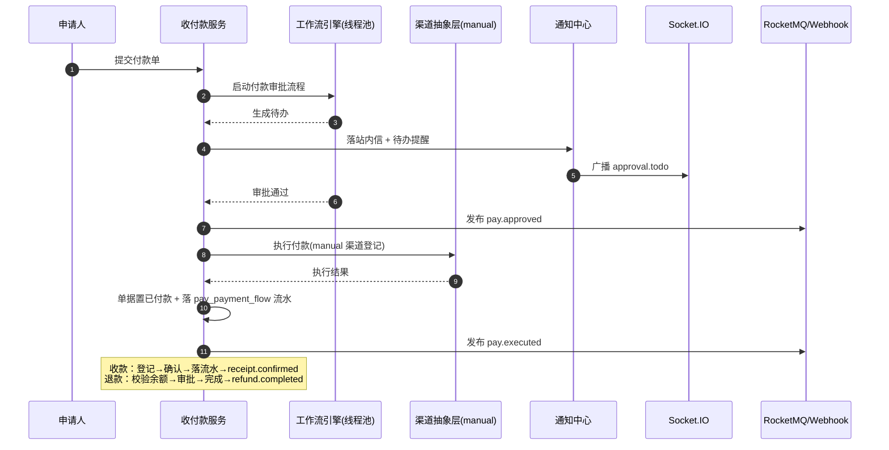

# 概要设计 · 收付款管理

> biz · 收款、付款、退款与收付款流水台账

[概要设计](01_概要设计_总览.md) › 03-收付款管理　|　[← 02-采购管理](02_概要设计_采购管理.md)

本节对应[《biz 企业运营管理规划》](../../规划/biz企业运营管理规划.md)「模块划分」节**收付款（pay）**模块拆分（收款/付款/退款单据登记与审批、
统一收付款流水台账、支付渠道配置），架构与机制复用 bms《架构设计》17-工作流、12-事件总线、14-实时推送节点，
biz 作为平台扩展应用复用平台能力，不重复设计。

## 1. 模块概述与职责 

收付款管理模块承载收付款业务：收款单登记与确认、付款单登记与审批（走工作流引擎）、退款单（原收款退回/原付款追回）、
统一收付款流水台账、支付渠道配置。单据可关联任意业务（biz_type + biz_id，如关联一笔采购订单，跨模块逻辑外键），
渠道对接走**渠道抽象层**（本期仅 manual 线下转账渠道，后续接入银企直连/第三方支付适配器）。

- **模块定位**：biz 实际业务模块，复用工作流引擎与事件总线实现「单据 + 审批 + 流水 + 事件」闭环
- **职责边界**：收/付/退款单据生命周期、流水台账、渠道配置；审批节点推进、待办生成归工作流管理模块
- **协作关系**：
  - 工作流（bms《架构设计》17-工作流）：付款/退款单提交启动流程实例（`wf_instance.business_type + business_id` 关联单据）；审批通过事件回调置单据状态
  - 事件总线（bms《架构设计》12-事件总线）：pay.receipt.confirmed / pay.approved / pay.executed / pay.refund.completed 事件（Webhook 可订阅）
  - 通知与实时推送（bms《架构设计》18-通知公告 / 14-实时推送）：付款待办经 bms《概要设计》通知中心 + Socket.IO 实时触达

## 2. 功能分解与业务流程 

### 2.1 功能点分解 

| 功能点 | 说明 | 权限码 |
| --- | --- | --- |
| 收款单登记/确认 | 新建/编辑/删除/查询收款单（receipt_no 自动生成），登记收款来源（biz_type/biz_id），确认后生效并落流水 | pay:create / update / delete / query |
| 付款单登记与审批 | 新建/编辑/查询付款单（payment_no 自动生成），提交后启动付款审批流程，审批通过后由财务执行付款（manual 渠道登记） | pay:create / update / query / approve |
| 退款单 | 原收款退回（receipt_refund）/原付款追回（payment_return），退款金额 ≤ 原单未退余额校验，需审批 | pay:refund / approve |
| 收付款流水台账 | 每笔收/付/退款完成落 pay_payment_flow 流水（方向/金额/渠道/时间），可查询与汇总（按单据/业务/渠道/时间） | pay:query |
| 支付渠道配置 | 渠道增删改查（code/名称/类型/配置），本期仅 manual；bank/third_party 类型占位预留渠道抽象 | pay:manage |

### 2.2 收付款与退款流程 

1. **收款**：登记收款单（付款方、金额、币种、渠道、关联业务）→ 确认收款 → 落流水 → 发布 pay.receipt.confirmed 事件
2. **付款**：登记付款单（收款方、金额、币种、渠道）→ 提交启动付款审批流程 → 全部节点通过（落 pay.approved 事件）→ 财务执行付款（manual 渠道）→ 单据置已付款、落流水 → 发布 pay.executed 事件
3. **退款**：选择原收款/付款单发起退款 → 校验退款金额 ≤ 原单未退余额 → 启动退款审批 → 完成后原单回写 related_refund_id、落流水 → 发布 pay.refund.completed 事件
4. 异常分支：
   - 付款审批被驳回：单据回退，可修改后重新提交
   - 退款金额超限：返回明确错误码，不允许提交
   - 并发重复提交：幂等键（Idempotency-Key）拦截，防止重复启动流程/重复确认
   - 审批人缺失：管理员可将任务转办/委托（同工作流管理模块约定）

## 3. 关键时序与协作 

协作要点：渠道执行走**渠道抽象层**（本期仅 manual 实现，接口定义与 bank/third_party 适配器预留）；单据状态、流水与事件经单事务保证一致；
所有对外通知/推送均异步，主链路不等待。

## 4. 数据模型与表设计 

核心表（均租户库，业务表前缀 pay_）：

| 表 | 关键字段 | 说明 |
| --- | --- | --- |
| pay_receipt | receipt_no、biz_type、biz_id、payer、amount、currency、channel_code、status（草稿/已确认/已冲正）、receipt_date、operator_id、related_refund_id | 收款单，可关联任意业务（如采购订单） |
| pay_payment | payment_no、biz_type、biz_id、payee、amount、currency、channel_code、status（草稿/审批中/已通过/已驳回/已付款）、pay_date、applicant_id、approver_id、related_refund_id | 付款单，审批复用工作流引擎；related_refund_id 在追回退款后回写 |
| pay_refund | refund_no、refund_type（receipt_refund/payment_return）、original_id、amount、currency、reason、status（审批中/已完成/已驳回）、refund_date | 退款单，退款金额 ≤ 原单未退余额校验 |
| pay_payment_channel | code、name、type（manual/bank/third_party）、config（JSON 预留）、status | 支付渠道配置（渠道抽象预留；本期仅 manual 线下转账） |
| pay_payment_flow | flow_no、flow_type（receipt/payment/refund）、source_id、biz_type、biz_id、direction（in/out）、amount、currency、channel_code、biz_time、operator_id | 统一收付款流水台账，每笔收/付/退款完成落流水 |

- **通用规范**：雪花 ID 主键、软删除（deleted_at，复合唯一约束 `(receipt_no/payment_no/refund_no, deleted_at)`）、审计字段、乐观锁（version）、时间 UTC；跨表引用用逻辑外键，不建物理外键
- **索引**：单据号唯一索引；biz_type + biz_id、channel_code、status、biz_time 建索引（列表筛选与流水汇总）
- **状态机**：付款单 草稿 → 审批中 → 已通过 → 已付款；驳回可修改重新提交；已付款不可改；收款单 草稿 → 已确认（冲正经退款单承载）
- **数据流转**：单据确认/执行后落流水（同事务）；退款完成回写原单 related_refund_id 并更新未退余额（按关联退款单汇总计算）
- **归档**：单据与流水表体量可控，不按月分片；字段级审计（pay_payment_*、pay_receipt、pay_refund 为关键表）自动记录至 sys_data_audit_log（按月分表）

## 5. 接口设计 

| 方法 | 路径 | 说明 | 权限码 |
| --- | --- | --- | --- |
| GET/POST | /api/v1/pay/receipts | 收款单列表/新建 | pay:query / create |
| PUT/DELETE | /api/v1/pay/receipts/{id} | 编辑/删除收款单（仅草稿） | pay:update / delete |
| POST | /api/v1/pay/receipts/{id}/confirm | 确认收款（落流水 + 发事件） | pay:create |
| GET/POST | /api/v1/pay/payments | 付款单列表/新建 | pay:query / create |
| POST | /api/v1/pay/payments/{id}/submit | 提交审批（启动工作流） | pay:create |
| POST | /api/v1/pay/payments/{id}/execute | 执行付款（渠道抽象层调用，仅审批通过后可执行） | pay:approve |
| GET/POST | /api/v1/pay/refunds | 退款单列表/新建（关联原单 + 余额校验） | pay:query / refund |
| GET | /api/v1/pay/flows | 收付款流水台账（分页 + 方向/渠道/时间/业务筛选） | pay:query |
| GET/POST/PUT | /api/v1/pay/channels | 渠道列表/新建/编辑 | pay:query / manage |

- **通用规范**：前缀 `/api/v1`、统一响应 `{code, message, data}`、分页 `{list, total, page, size}`、Bearer 鉴权 + require_permission 两级校验；生产环境按子域名解析租户，一人多租户走 X-Tenant-ID
- **幂等**：提交审批、确认收款、执行付款等写接口支持 `Idempotency-Key`（Redis SETNX 前置去重 + 单据状态唯一约束兜底）
- **限流**：执行付款按用户限流（防误刷）
- **发布事件**（Webhook 可订阅）：pay.receipt.confirmed、pay.approved、pay.executed、pay.refund.completed

## 6. 权限与配置 

- **权限码**：业务 `pay`（收付款管理，默认归属普通角色）；动作 query/create/update/delete/manage/approve/refund 归属 pay 业务（如 `pay:create`、`pay:refund`、`pay:manage`）
- **菜单挂接**：菜单「收款管理」「付款管理」「退款管理」「收付款流水」「支付渠道配置」分别挂表单（1:1），表单挂业务 pay；工具栏按钮挂动作（新建=create、提交=create、确认=create、执行=approve、退款=refund、渠道管理=manage）
- **数据权限**：单据列表默认无数据范围（本人单据按申请人过滤为业务固有约束）；动作级数据范围（sys_data_scope）可按部门/金额配置
- **sys_config 参数**：无独立业务参数；审批流程绑定初始种子「付款申请审批流程模板」
- **种子数据**：pay 业务码与动作码入平台库登记；付款申请审批流程模板入租户库 wf_process 种子；初始支付渠道 manual（线下转账）入租户库，bank/third_party 类型占位

## 7. 错误码与异常处理 

本模块为独立业务模块，错误码位于 **11xxxx 收付款段**（110001-119999，注册于 sys_module，按平台《项目规划说明》「错误码段规则与注册」节的段位规则分配，本产品段位明细见《biz 企业运营管理规划》，6xxxx 仅覆盖工作流平台机制）：

| 错误码 | 说明 | 场景 |
| --- | --- | --- |
| 110001 | 单据状态不允许该操作 | 非草稿状态编辑/删除、未审批通过执行付款、重复确认 |
| 110002 | 退款金额超限 | 退款金额大于原单未退余额 |
| 110003 | 原单据不存在或已冲正 | 退款关联原单不可用 |
| 110004 | 渠道无效或未启用 | 单据引用已停用/不存在的渠道 code |
| 110005 | 重复提交被拦截 | 幂等键命中或流程实例已存在 |
| 110006 | 执行付款失败 | 渠道执行异常（manual 渠道登记失败） |

- 异常处理：确认收款/执行付款/完成退款与流水写入在同一事务边界内原子化，失败时回滚单据状态并告警，支持人工重试（内置重试任务）
- 审批链路异常（引擎故障）：提交接口快速失败返回错误码，不产生半开流程；文案由前端 i18n 映射

## 8. 页面清单与验收要点 

| 页面 | 端 | 说明 |
| --- | --- | --- |
| 收款管理 | PC | 收款单列表/新建/编辑/详情、确认收款（关联业务来源） |
| 付款管理 | PC（移动端仅审批入口） | 付款单列表/新建/详情、提交审批、审批进度查看、执行付款（manual 渠道） |
| 退款管理 | PC | 退款单列表/新建（关联原单、余额校验）/详情、审批进度查看 |
| 收付款流水 | PC | 流水台账列表与汇总（方向/渠道/业务/时间筛选） |
| 支付渠道配置 | PC | 渠道增删改查（类型/配置/状态），manual 渠道维护，bank/third_party 占位 |

**验收要点**：

- 收款登记→确认→流水落账→事件发布全链路通过；付款登记→审批（复用工作流）→执行→流水落账→事件发布全链路通过
- 退款金额 ≤ 原单未退余额校验生效，超限被拒；退款完成回写原单并更新未退余额
- 收付款流水台账一致（单据状态与流水一一对应），按渠道/业务/时间汇总正确
- 渠道配置（manual 渠道）可用；bank/third_party 类型占位可配置但不可执行（渠道抽象预留验证）
- pay.* 四个事件经 Webhook 推送成功（含 HMAC 签名与失败重试）；重复提交被幂等键拦截

> 概要设计节点 · 与《biz 企业运营管理规划》及平台 bms《文档生成规范》《命名规范》配套