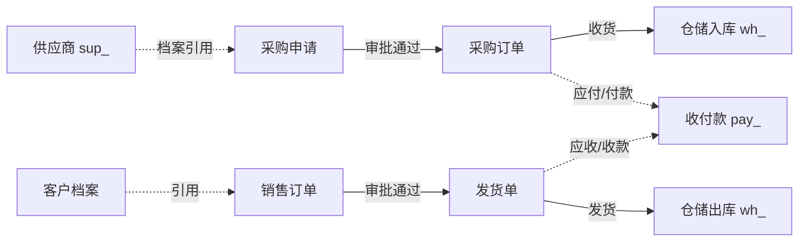

# 项目规划说明

> biz 企业运营管理 · 业务承载于 BMS 平台扩展

[文档首页](../文档首页.md) › 规划 › 项目规划说明　|　配套：bms 仓库《[平台可扩展性规划](平台可扩展性规划.md)》《项目规划说明》

## 1. 项目概述 

**biz（企业运营管理）** 为独立产品仓库：承载原 BMS 规划中企业运营类业务——采购、收付款、供应商、销售、仓储，作为 **BMS 平台扩展**运行（独立仓库、独立演进，运行时并入平台进程），本身只做运营业务域，不重复平台能力。

- **业务来源**：本仓库业务原为 BMS 规划中的自营模块（采购/收付款 MVP + 销售/仓储附加），随《平台可扩展性规划》「业务不入平台」原则整体迁出，独立为产品。
- **运行形态**：平台扩展——前端模块构建期合并进 bms 前端，后端扩展包并入 bms 进程；数据落租户库（业务表 `pur_/pay_/sup_/sale_/wh_` 前缀），注册要素（表前缀/业务码/错误码段/事件域）在平台 sys_module 登记。
- **现状基线**：规划与业务设计处于立项阶段；平台扩展代码机制（R4）未落地前，业务先以文档/设计沉淀，随 bms 开发节奏接入。

## 2. 技术基线 

复用 bms 平台全栈能力，本仓库**不含**后端/前端基础设施实现：

| 层 | 提供方 | 说明 |
| --- | --- | --- |
| 后端语言/框架 | bms 平台 | Python 3.14 / FastAPI / SQLAlchemy 2.0 异步 / Alembic（业务扩展包按既有分层） |
| 前端 | bms 平台 | Vue 3 + Vite + TypeScript（Element Plus / Vant 双工程），业务页面 Views 目录 |
| 数据层 | bms 平台 | MySQL / PostgreSQL / 达梦 DM8 三库、Redis、MinIO、RocketMQ、ES、Milvus |
| 平台能力 | bms 平台 | 认证/SSO、RBAC、租户、文件、通知、工作流、报表、审计、i18n、任务、事件、开放接口（见 bms《平台可扩展性规划》5.1） |
| 业务域 | 本仓库 | 采购 / 收付款 / 供应商 / 销售 / 仓储的业务模型、API、页面、流程与种子 |

## 3. 功能模块（五模块全 MVP） 

### 3.1 模块划分 

| 模块 | 简称/前缀 | 说明 | 状态 |
| --- | --- | --- | --- |
| 采购管理 | pur / pur_ | 采购申请单提交与三级审批（复用工作流）、审批通过生成采购订单（含 Webhook 事件推送）；供应商档案复用 sup 模块 | MVP |
| 收付款管理 | pay / pay_ | 收款单/付款单/退款单登记与审批（付款/退款纳入审批）、统一收付款流水台账、支付渠道配置（渠道抽象预留——本期仅 manual 线下转账，后续银企直连/第三方支付） | MVP |
| 供应商管理 | sup / sup_ | 供应商档案维护（名称/联系人/资质/状态），采购申请/订单引用 | MVP |
| 销售管理 | sale / sale_ | 客户档案、销售订单登记与审批、审批通过生成发货单；出入库联动仓储 | MVP |
| 仓储管理 | wh / wh_ | 仓库库位、库存余额与流水、入库/出库/调拨/盘点单；采购收货入库、销售发货出库 | MVP |

### 3.2 核心业务链路 

1. **采购闭环**：采购申请提交 → 三级审批（复用平台工作流）→ 审批通过生成采购订单 → 到货收货生成入库单（wh_ 入库，库存余额更新 + 流水落库 + `wh.inbound.completed` 事件）→ 依据订单付款（pay_ 付款单，审批后执行，落收付款流水）。
2. **销售闭环**：销售订单登记 → 审批 → 审批通过生成发货单 → wh_ 出库扣库存 → 依据订单收款（pay_ 收款单，落流水）；退货单审批 → 退款（金额 ≤ 原单余额校验）。
3. **收付款台账**：每笔收/付/退款统一落 pay 流水（pay_payment_flow），支撑流水账单与对账。

## 4. 平台复用边界 

- 本仓库**只含业务域代码与设计**；认证/RBAC/多租户/文件/通知/工作流/报表/审计/i18n/任务/事件/开放接口全部复用平台（bms《平台可扩展性规划》5.1 能力清单）。
- 业务表落租户库，遵守平台**《架构设计·数据架构》**（bms 仓库）数据规范；跨库引用走逻辑外键；表级清单维护在本仓库设计文档。
- 独立服务类强隔离场景（外部团队/异构）走平台 `独立服务` 轨，不在本仓库范围。

## 5. 模块标识符登记 

按 bms《项目规划说明》「平台扩展接入流程」在平台 sys_module 登记（一处登记、启动与 CI 校验唯一）：

| 模块 | 简称 | 表前缀 | 业务码 | 错误码段 | 事件域 |
| --- | --- | --- | --- | --- | --- |
| 采购 | pur | pur_ | pur | 10xxxx | pur.*（如 pur.purchase.order.created） |
| 收付款 | pay | pay_ | pay | 11xxxx | pay.*（如 pay.payment.approved） |
| 销售 | sale | sale_ | sale | 12xxxx | sale.*（如 sale.order.created） |
| 仓储 | wh | wh_ | wh | 13xxxx | wh.*（如 wh.inbound.completed） |
| 供应商 | sup | sup_ | sup | 14xxxx | sup.* |

> 错误码段由平台统一分配（bms《项目规划说明》23.5），注册即定、稳定不变。

## 6. 演进路线 

| 阶段 | 内容 | 状态 |
| --- | --- | --- |
| 一 立项与骨架 | 本规划 + 仓库骨架 + 基座同步（规范/资料/资源权威源 bms） | 本文档（2026-09-10） |
| 二 业务设计 | 运营体系设计总纲 + 各模块概要设计（采购/收付款/供应商/销售/仓储），对照平台扩展接入流程 | 待定 |
| 三 接入开发 | 平台扩展机制（R4）落地后，业务扩展包按 `平台扩展接入流程` 接入平台，五模块随平台阶段推进交付 | 待定 |
| 四 深化 | 支付渠道对接（银企直连/第三方支付 + 对账核销）、报表与分析深度应用、移动端优化 | 待定 |

## 7. 风险与对策 

| 风险 | 影响 | 缓解措施 |
| --- | --- | --- |
| 依赖 bms 平台扩展机制（R4）落地 | 中 | 文档/设计先行（本规划 + 理念设计），代码接入随平台节奏；提前按注册流程定义五模块要素 |
| 支付渠道/对账复杂度 | 中 | 渠道抽象层预留（目前 manual 线下转账），对账核销随渠道对接迭代 |
| 基座同步漂移 | 中 | 订阅 bms 权威源，运行 base-sync 刷新（bms《基座文档清单》） |
| 与平台/其他产品标识符冲突 | 中 | 要素注册于 sys_module，启动与 CI 校验唯一（平台保障） |

> 本文档依《文档生成规范》编写 · 与 bms《平台可扩展性规划》《项目规划说明》配套 · 生成日期：2026-09-10