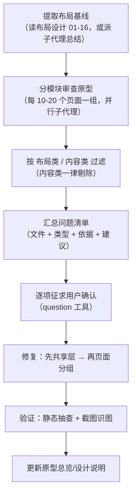

# 原型审查规范

> 原型设计与布局设计对齐审查 · 检查清单与流程

[文档首页](../文档首页.md) › [规范](文档生成规范.md) › 原型审查规范

## 1. 目的与适用范围 

本规范统一「原型设计 → 布局设计」的对齐审查方法，适用于 `文档/设计/原型设计/` 下全部
可交互原型页面的审查、修复与验收。审查结论直接决定原型是否需要修改，避免「原型好看但布局体系不一致」的问题在评审阶段爆发。

依据体系关系：原型页面必须符合[《布局设计》](../设计/布局设计/01_布局设计_总览.html)统一约定；与布局冲突时以布局设计为准并修订原型。

## 2. 审查原则：三层依据体系 

原型审查的问题按性质分三层，**各以对应的设计体系为准**，审查时先分清问题属于哪一层：

| 问题层 | 依据体系 | 冲突处理 |
| --- | --- | --- |
| 布局类 | [《布局设计》](../设计/布局设计/01_布局设计_总览.html) | 改原型就范 |
| 内容类（命名/功能项/文案/流程） | [《概要设计》](../设计/概要设计/01_概要设计_总览.md) | 以概要设计为准；原型不符则改原型，原型暴露的新需求则先修订概要设计再同步原型 |
| 技术类（机制/协议/数据流） | [《架构设计》](../设计/架构设计/01_架构设计_总览.md) | 以架构设计为准，原型/概要均不得违背 |

与[《文档生成规范》](文档生成规范.md)第 8.1 节依赖关系一致：布局/原型服务于界面呈现，原型暴露的功能/流程问题须先修订概要设计，再同步原型。

### 2.1 布局类（以布局设计为准，必须对齐） 

| 子类 | 包含 | 示例 |
| --- | --- | --- |
| 骨架与结构 | 页面分区、Tab 体系、工具栏归属、信息栏构成 | 列表页三段式、信息栏双子 Tab、列表/表单 Tab 互斥 |
| 尺寸与间距 | 宽度、字号、间距、圆角、栅格、断点 | 关键字框 240px、间距 4px 阶梯、抽屉 640px |
| 组件形态 | 弹窗/抽屉选用、按钮形态、标签形态 | 表单编辑优先抽屉、确认按钮 danger、状态 tag 语义色 |
| 交互规则 | 双击开表单、dirty 拦截、确认框关闭规则、分页行为 | 确认类禁遮罩/Esc、查询条件变化回第 1 页 |
| 状态语义 | 状态色语义、只读/编辑分态、空态/加载态 | 待审批=warning、只读态字段禁用 |

### 2.2 内容类（以概要设计为准） 

| 子类 | 包含 | 示例 |
| --- | --- | --- |
| 命名 | 页面名、TabBar 项名、按钮名、菜单名 | TabBar 四项名称、个人中心菜单项构成 |
| 功能项 | 菜单项组成、快捷入口内容、分段切换内容 | 个人中心「语言与时区」是否合并、待办页分段构成 |
| 文案 | 提示语、空态文案、错误文案 | 「未找到匹配记录」vs「未找到相关内容」 |
| 流程与数据 | 页面流转、状态机、字段集合 | 审批操作顺序、公告已读上报时机、列表字段构成 |

> **注意**：内容类差异**不回写布局设计文档**——布局文档只负责布局约定，不维护原型的具体内容；内容的正误以概要设计核对。布局设计与概要设计之间没有「同步」关系，只有内容与概要、布局与布局各自的对应。

### 2.3 技术类（以架构设计为准） 

| 子类 | 包含 | 示例 |
| --- | --- | --- |
| 机制与协议 | 技术选型、集成方式、协议形态 | SSO 走 OIDC/CAS、实时推送用 Socket.IO |
| 数据流 | 数据来源、存储、流转链路 | 事件总线消息模型、ES 同步消费组 |
| 安全与合规 | 脱敏、鉴权、审计链 | 预签名 URL、哈希链防篡改、双 token 模型 |

技术类问题在原型审查中通常不涉及界面改动，但原型展示的技术机制不得与架构设计冲突；冲突时以架构设计为准。

## 3. 审查依据：布局设计文档对照表 

审查前按页面类型确定对应依据文档（布局设计系列，位于 `文档/设计/布局设计/`）：

| 原型页面类型 | 布局依据文档 |
| --- | --- |
| 主框架、导航、Tab、顶栏 | [04 主框架](../设计/布局设计/04_布局设计_主框架.html)、[05 导航](../设计/布局设计/05_布局设计_导航.html) |
| 表单框架（列表/表单 Tab 切换） | [06 表单框架](../设计/布局设计/06_布局设计_表单框架.html) |
| 列表页 | [07 列表页](../设计/布局设计/07_布局设计_列表页.html)、[09 表格明细](../设计/布局设计/09_布局设计_表格明细.html) |
| 表单页（信息栏/分态/明细） | [08 表单页](../设计/布局设计/08_布局设计_表单页.html)、09 表格明细 |
| 弹窗、抽屉、对话框 | [10 弹窗](../设计/布局设计/10_布局设计_弹窗.html) |
| 响应式适配 | [11 响应式适配](../设计/布局设计/11_布局设计_响应式适配.html) |
| 异常页、空状态、加载 | [12 异常与空状态](../设计/布局设计/12_布局设计_异常与空状态.html) |
| 首页工作台（网格卡片） | [13 首页工作台](../设计/布局设计/13_布局设计_首页工作台.html) |
| 表单设计器 | [14 表单定制](../设计/布局设计/14_布局设计_表单定制.html) |
| 移动端（总纲/细化） | [15 移动端](../设计/布局设计/15_布局设计_移动端.html)、[16 移动端细化](../设计/布局设计/16_布局设计_移动端细化.html) |
| 全局（令牌/主题） | [02 设计令牌](../设计/布局设计/02_布局设计_设计令牌.html)、[03 主题与租户品牌化](../设计/布局设计/03_布局设计_主题与租户品牌化.html) |
| 内容核对（命名/功能项/文案/流程） | [《概要设计》](../设计/概要设计/01_概要设计_总览.md)对应模块节点（模块职责、流程、数据表、接口、权限） |
| 技术核对（机制/协议/数据流） | [《架构设计》](../设计/架构设计/01_架构设计_总览.md)对应子系统节点（分层、子系统、数据、接口、性能安全） |

## 4. 高频问题检查清单 

以下清单来自原型对齐审查的实战高频问题，新模块原型可直接对照自查。

### 4.1 共享层（共享资源/原型样式.css、原型脚本.js，影响全部页面） 

- 弹窗遮罩透明度统一 **0.4**；确认类弹窗（删除/驳回/危险操作）**禁止遮罩点击或 Esc 关闭**，必须显式点按钮
- 弹窗宽度走阶梯：对话框 **420/480/520px**；抽屉 **400/480/640/720px**，禁止随意宽度
- 圆角走阶梯 **4/6/8px**；间距走 4px 基准阶梯（4/8/12/16/24/32），禁止魔法值
- 列表页三段式（工具栏/筛选区/表格）合并为**单卡片**，不嵌套多卡片
- 原型框架容器**不设固定最大宽度**，随视口自适应

### 4.2 列表页（全部模块） 

- 三段式：工具栏 → 筛选区 → 表格；工具栏在筛选区**上方**
- 首个输入框为**关键字框 240px**（placeholder 注明搜索范围）
- 条件 ≤3 个不折叠、**>3 个默认折叠为一行**，提供「展开/收起」；「查询」primary、「重置」次按钮
- 工具栏左侧：新增（primary）/刷新/关闭；批量操作**随选中态启用**；右侧：导出/自定义列；批量删除 danger
- 表格**无操作列**，双击行打开表单 Tab；多选列 48px；关键信息靠左、数字右对齐、状态 tag 语义色
- 分页区：总数 / 页码 / 跳页 / 每页条数 / 页码，**默认 20 条/页**
- 空状态（「暂无数据」+引导按钮）、加载态（遮罩/骨架屏）必须有
- 查询条件变化（含重置）回第 1 页；删除二次确认 danger

### 4.3 表单页 

- 信息栏**双子 Tab**：详细信息 / 系统信息（ID/版本号/创建用户/创建时间/修改用户/修改时间/表单标识，**label 上方三列只读栅格**、**disabled 输入框**与主表字段形态一致仅不可编辑（表单标识为**禁用下拉框**）、时间无时区后缀）
- 主表字段区**label 上方**（label-position="top"）、三列栅格（span=8）、长字段跨整行；**字段 >8 个**才用分区标题分组（≤8 平铺）
- 只读/编辑分态：只读态字段**禁用**；新增 Tab 打开即编辑态；修改未保存切换/关闭 **dirty 拦截确认**
- 保存整体提交单事务 + 乐观锁（冲突提示「记录已被修改」并重新加载）；保存后自动刷新列表
- 明细区：多明细 Tab 化、行内编辑仅编辑态、明细工具栏**图标化**（新增/删除/上移/下移）、≤10 行直展 >10 行分页（10 条/页）、编辑态自动空行 + 保存过滤空行
- 敏感字段脱敏掩码（138****5678）

### 4.4 弹窗与抽屉 

- **表单编辑优先抽屉**（保留列表上下文）；确认与轻量操作走对话框；对话框不承载大表单
- 标题 = 动作 + 对象（「编辑用户」「新增部门」）
- 确认类：正文说明后果（「删除后不可恢复」），确定按钮 **danger**
- 底部操作栏固定：主操作右、取消左，顶部 1px 分隔线，不随内容滚动
- 窄屏（<768px）抽屉/对话框占满宽度

### 4.5 工作台与表单设计器 

- 工作台：12 列网格（断点 12→8→6）；卡片规格 2×2 / 4×2 / 6×2 / 6×4 / 12×N；卡片头标题 16px；图表卡**必含坐标轴/图例/数据集标注**（禁裸图形）；右上「定制」入口；编辑模式（拖拽/缩放/显隐/添加）用**右侧抽屉**承载
- 设计器：三区结构（字段面板/画布/属性面板）；栅格 1/2/3 列；查询区 ≤3 项不折叠 >3 折叠「更多筛选」；平台默认层级**整体只读**；字段选中联动属性面板；编辑未保存脏数据确认

### 4.6 审批链路 

- 底部操作栏顺序**「驳回(danger) → 转办(默认) → 同意(primary)」**
- 审批轨迹用**时间线**（节点/审批人/意见/时间，当前节点高亮），不用箭头文本
- 转办需目标选择弹窗；同意/驳回提交防重复（按钮 loading + 幂等键）；驳回必填意见
- 已办视图无操作栏；公告详情打开即**自动上报已读**
- 待审批状态 tag 用 warning（橙黄）语义色

### 4.7 移动端 

- Tab 根页面 NavBar**无返回箭头**（居中标题）；子页面有返回箭头且**隐藏 TabBar**
- 列表卡片化：标题 16px / 摘要 13px / 时间 12px，状态 tag 右上角；下拉刷新 + 上拉加载（「没有更多了」）
- 详情页四段式：状态条 / 关键信息卡 / 流转记录时间线 / 底部操作栏
- 表单单列 + 底部固定提交按钮（安全区避让）；安全区（刘海/Home 条）标注或避让
- 登录页：图形验证码（连续失败 3 次强制）+ SSO 入口

### 4.8 异常与空状态 

- 404/403/500：居中插画 + 标题 + 说明 + 主操作按钮，不展示技术堆栈
- 空状态：插画 + 文案 + 引导按钮（列表「暂无数据」+去创建；待办「暂无待办，享受这一刻」；消息「暂无消息」）
- 断网提示「网络异常，请检查连接」+ 重试；401 跳登录带回跳参数；长任务进度反馈

## 5. 审查流程 

1. **提取基线**：审查前先精读布局设计文档（或派子代理提取结构化基线），确保依据一致。
2. **分模块审查**：原型按模块分组（共享层单独一组），每组一个子代理对照基线逐文件审查，输出「文件 + 类型（矛盾/缺失/不完善）+ 问题 + 依据（文档编号节号）+ 建议」。
3. **分类过滤**：按第 2 节三层原则分类——布局类留待对齐，内容类对照概要设计核对（原型不符则改，概要缺失则先修概要再同步原型），技术类对照架构设计核对；审查报告只列布局类问题，内容/技术类差异单独出「核对清单」。
4. **汇总确认**：合并去重为清单，关键决策（修复范围、规范与原型冲突谁改谁、视觉细节深度）用 question 工具**逐项征求确认**，不得擅自拍板。
5. **修复**：先修共享层（原型样式.css/原型脚本.js，影响全局），再按模块分组并行修页面；给子代理的指令须附共享层新类说明与逐文件修改指令。
6. **验证**：静态抽查关键修改点（grep 新类/新交互）→ Edge 无头截图 + 识图逐页验证布局。
7. **同步**：新增页面同步更新 `01_原型设计_总览.html` 模块地图与模块设计说明。

## 6. 修复与验证 

### 6.1 修复顺序

- **共享层先行**：遮罩/圆角/间距/弹窗宽度/抽屉组件等统一改在 `共享资源/原型样式.css` 与 `原型脚本.js`，页面只换类名，避免逐页重复修。
- **页面按模块**：共享层改动落地后，页面按模块并行修复；指令中明确「只改布局、不改内容」，防止子代理顺手改文案。
- **新组件先立类**：共享层新增能力（如抽屉 .p-drawer、分页 .p-pager、空态 .p-empty）先在 CSS/JS 中定义并提供全局函数（openDrawer/closeDrawer 等），页面直接引用。

### 6.2 验证手段

- **静态抽查**：grep 关键类与交互（keyword 240、p-drawer、pp-num、时间线、hash 联动等），核对 HTML 标签闭合与 onclick 函数存在。
- **截图识图**：Edge 无头截图 + 本地识图（Qwen3.8-27B 经本机 llama.cpp 服务 OpenAI 兼容接口直接调用）逐页验证布局；交互态页面（弹窗/详情）用静态检查确认结构。
- **内容与技术回归**：内容类元素（命名/文案/功能项）对照概要设计核对无误；技术机制与架构设计无冲突；修复过程中未误改内容。

## 7. 审查完成自检清单 

- □ 审查报告只列布局类问题，内容类/技术类差异已按概要/架构设计核对
- □ 每个问题均标注依据（布局文档编号 + 节号）
- □ 用户已逐项确认修复范围与冲突处理方式
- □ 共享层先行修复，页面引用新类统一
- □ 修改后 HTML 标签闭合、onclick 函数与共享类全部存在
- □ 截图识图验证关键页面无破版、无遮挡
- □ 内容类元素对照概要设计核对一致，未被误改
- □ 技术机制与架构设计无冲突
- □ 新增页面已同步到原型总览与模块设计说明

> 依《文档生成规范》编写 · 与《布局设计》系列配套