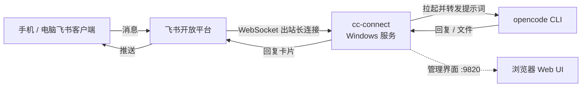

# CC-Connect 部署与使用说明

> IM ↔ 本地 AI 编码代理网关 · 让 opencode 进飞书

[文档首页](../../文档首页.md) › 资料 › 工具 › CC-Connect 部署使用说明　|　[同级：通用后台执行器部署使用说明 →](通用后台执行器部署使用说明.md)

## 1. 目的与适用范围 <a id="purpose"></a>

[CC-Connect](https://github.com/chenhg5/cc-connect) 把本机运行的 AI 编码代理（opencode、Claude Code、Codex 等）桥接到即时通讯平台（飞书、钉钉、Telegram、Slack 等）。手机上发消息给机器人，就能远程让 AI 检查代码、跑命令、排查问题——大多数平台走 WebSocket/长轮询出站连接，无需公网 IP。

本项目当前用法：

| 项 | 值 |
| --- | --- |
| 代理 | opencode，工作目录 `D:\Develop\bms` |
| 平台 | 飞书（WebSocket 出站）+ 个人微信（ilink 长轮询出站），均免公网 IP |
| 管理 Web UI | `http://localhost:9820` |
| 运行方式 | Windows 服务（开机自启、无窗口） |

## 2. 组成与原理 <a id="compose"></a>



本机落位（均在用户目录，不在仓库内）：

```text
%USERPROFILE%\.cc-connect\
├── config.toml               # 主配置：项目 / 代理 / 平台 / 管理端口
├── cc-connect-service.exe    # WinSW 服务包装器（v2.12.0）
├── cc-connect-service.xml    # 服务定义（账户、日志、自愈策略；含账户密码，勿提交勿外传）
└── logs\                     # 服务与应用日志
```

代理二进制本体由 npm 全局安装：`%APPDATA%\npm\node_modules\cc-connect\bin\cc-connect.exe`（Go 编译的单文件程序）；opencode 同为 npm 全局包，cc-connect 按 PATH 拉起它。

## 3. 部署 <a id="deploy"></a>

以下步骤在本机已全部完成，重装或迁移时照做即可。安装顺序必须是**先装好并登录代理 CLI，再装 cc-connect**，否则启动报 `agent CLI not found in PATH` 类错误。

### 3.1 安装 cc-connect <a id="deploy-install"></a>

```powershell
npm install -g cc-connect     # npm 已配置 npmmirror 国内源
cc-connect --version          # 当前 v1.5.0
```

### 3.2 编写主配置 <a id="deploy-config"></a>

首次运行 `cc-connect` 会自动生成 `%USERPROFILE%\.cc-connect\config.toml` 骨架，再手工补齐：

```toml
[log]
level = "info"

[[projects]]
name = "bms"

[projects.agent]
type = "opencode"            # 本项目接 opencode

[projects.agent.options]
work_dir = "D:/Develop/bms"
mode = "default"

[[projects.platforms]]
type = "feishu"

[projects.platforms.options]
app_id = "<飞书应用 App ID>"
app_secret = "<飞书应用 App Secret>"

[management]
enabled = true
port = 9820
token = "<Web UI 访问令牌>"
```

飞书侧需要一个自建应用并开通机器人能力、订阅消息事件，凭据也可用 `cc-connect feishu setup` 交互式绑定。

### 3.3 注册为 Windows 服务（WinSW） <a id="deploy-service"></a>

**为什么不用其他两种自启方式**（都实测过，均有弹窗或等价缺陷）：

| 方式 | 结果 |
| --- | --- |
| 计划任务 + 启动 bat（早期做法） | 登录类型 Interactive，每次登录弹黑色控制台窗口，已删除 |
| 官方 `cc-connect daemon install` | Windows 实现同样是 AtLogOn + Interactive 计划任务跑 powershell.exe，弹窗依旧，不采用 |

采用 WinSW 包装为真正的 SCM 服务：运行于 Session 0 无任何窗口、开机自启不依赖登录、崩溃自动拉起。

1. 下载 WinSW 单文件（GitHub release，可加 ghfast.top 加速前缀），放入 `%USERPROFILE%\.cc-connect\` 并改名 `cc-connect-service.exe`；
2. 同目录创建 `cc-connect-service.xml`：

```xml
<service>
  <id>cc-connect</id>
  <name>CC-Connect</name>
  <description>cc-connect 网关：桥接聊天平台与本地 AI 编码代理</description>
  <executable>%APPDATA%\npm\node_modules\cc-connect\bin\cc-connect.exe</executable>
  <argument>--force</argument>
  <workingdirectory>%USERPROFILE%\.cc-connect</workingdirectory>
  <startmode>Automatic</startmode>
  <serviceaccount><域名>\<运行账户></serviceaccount>
  <password><该账户的 Windows 登录密码></password>
  <env name="PATH" value="%APPDATA%\npm;%PATH%"/>
  <log mode="append">
    <logpath>%USERPROFILE%\.cc-connect\logs</logpath>
  </log>
  <onfailure action="restart" delay="10 sec"/>
  <resetfailure>1 hour</resetfailure>
</service>
```

要点：

- **服务账户必须用日常登录的用户账户**，不能用 LocalSystem——cc-connect 要拉起 opencode 子进程，依赖该用户保存的认证与环境变量；因此 XML 中必须明文写入该账户密码（文件受用户目录 ACL 保护，禁止提交到任何仓库）。
- `<env>` 显式把 `%APPDATA%\npm` 加进 PATH，保证服务的进程环境能找到 opencode。
- `<argument>--force</argument>` 让实例启动前自动清掉同配置的残留实例：服务停止时可能留下杀不掉的孤儿子进程锁死配置文件，无此参数会导致服务启动循环失败（实测踩坑）。
- WinSW 以「exe 与 xml 同名」约定关联配置，改名后二者必须保持一致。

3. 安装并启动：

```powershell
& "$env:USERPROFILE\.cc-connect\cc-connect-service.exe" install
& "$env:USERPROFILE\.cc-connect\cc-connect-service.exe" start
```

### 3.4 接入个人微信（ilink） <a id="deploy-weixin"></a>

个人微信走腾讯 ilink 官方机器人网关（`ilinkai.weixin.qq.com`），HTTP 长轮询出站，无需公网 IP。接入即扫码：

```powershell
# 先停服务再执行，避免配置热加载干扰；二维码导出为 PNG 便于手机扫描
cc-connect weixin setup --project bms --qr-image "%TEMP%\weixin-qr.png" --timeout 480
```

手机微信扫终端（或 PNG）二维码并确认登录，`token`、`base_url`、`account_id` 自动写回 config.toml 并挂到指定项目下。

实测注意三点：

1. **`allow_from` 不会自动回填**：官方文档称扫码后会自动写入使用者微信 ID，实测未写入。首次收发后从日志抓取发送者 ID（形如 `xxx@im.wechat`），手工补进微信平台配置：
   ```toml
   [projects.platforms.options]
   allow_from = "<你的微信ID@im.wechat>"   # 缺省为不限制任何使用者
   ```
2. **首次关联**：绑定后先由本人给机器人发一条消息，完成 `context_token` 关联后方可正常对话；
3. **群聊**：私聊默认可用；要绑定群聊需把群里发出的消息对应的 `chat_id`（`@chatroom` 结尾，见日志）填入 `chat_id` 配置。

响应有延迟属正常：opencode 冷启动加模型思考约 30 秒起，之后单轮通常十余秒。

### 3.5 验证 <a id="deploy-verify"></a>

```powershell
Get-Service cc-connect                                   # Status 应为 Running
Test-NetConnection 127.0.0.1 -Port 9820                  # Web UI 端口应通
Get-Content "$env:USERPROFILE\.cc-connect\logs\cc-connect-service.err.log" -Tail 20
```

最终以功能验证为准：飞书里给机器人发一条消息，收到 opencode 回复即部署成功；微信侧同理（见 3.4）。

## 4. 使用方法 <a id="usage"></a>

### 4.1 飞书对话 <a id="usage-chat"></a>

直接发消息即等于向 opencode 发提示词，常用斜杠命令：

| 命令 | 作用 |
| --- | --- |
| `/new [名称]` | 开新会话 |
| `/list` / `/switch <id>` | 列出 / 切换会话 |
| `/dir [路径]` | 查看 / 切换工作目录（跨项目操作时用） |
| `/mode yolo` | 切到全自动放行模式（默认 default 为逐工具询问） |
| `/model` / `/model switch` | 查看 / 切换模型 |
| `/status` / `/whoami` | 查看状态与自己的用户 ID |

### 4.2 Web 管理界面 <a id="usage-web"></a>

浏览器打开 `http://localhost:9820`（首次需 config.toml 中的 token 登录）：可视化管理项目、平台、Provider，也能直接对话。

## 5. 维护 <a id="maintain"></a>

| 操作 | 命令 |
| --- | --- |
| 启动 / 停止 / 重启 | `net start cc-connect` / `net stop cc-connect`（重启先 stop 再 start） |
| 看实时日志 | `Get-Content "$env:USERPROFILE\.cc-connect\logs\cc-connect-service.err.log" -Wait -Tail 50` |
| 升级 cc-connect | `npm install -g cc-connect` 后重启服务；或 `cc-connect update` |
| 改配置 | 编辑 `config.toml` 保存即可热加载，无需重启 |

注意：升级期间服务正占用 exe 时 npm 可能替换失败，先 `net stop cc-connect` 再升级。

## 6. 常见问题 <a id="faq"></a>

| 现象 | 处理 |
| --- | --- |
| 服务启动后立刻退出 | 看 `logs\cc-connect-service.err.log`；常见为 config.toml 语法错误或端口占用 |
| 机器人不回复 | 先确认服务 Running、err.log 有飞书 WebSocket 连接记录；再确认飞书应用事件订阅与机器人能力已开通 |
| 日志报 agent not found in PATH | 核对 xml 中 `<env name="PATH">` 是否含 `%APPDATA%\npm`，改后重启服务 |
| 提示 agent 认证失败 | 服务账户下重新执行一次 `opencode auth login` 完成登录 |
| 手动跑 `cc-connect` 报实例锁冲突 | 服务已在运行，同一配置仅允许一个实例；调试时先停服务 |
