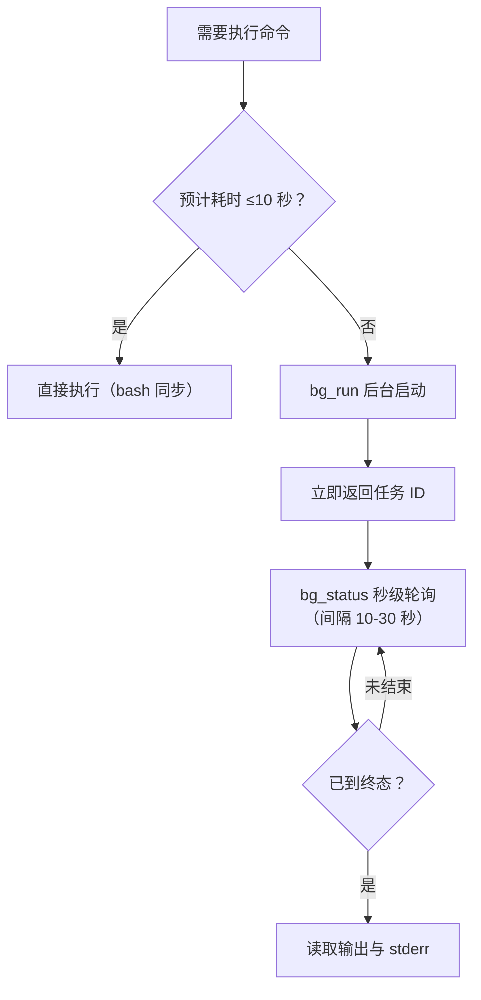

# 通用后台执行器

> bg 工具链 · 长命令后台化 + 秒级查状态

[文档首页](../../文档首页.md) › 资料 › 工具 › 通用后台执行器部署使用说明　|　[同级：开发服务器电源控制使用说明 →](../开发服务器/linux/开发服务器电源控制使用说明.md)

## 1. 目的与适用范围 <a id="purpose"></a>

AI 助手的命令执行通道是同步阻塞的：长命令（下载、构建、SSH 远程、安装、备份等）
执行期间无任何反馈，观感"卡死"。通用后台执行器（bg 工具链）把长命令放后台运行，
立即返回任务 ID，之后秒级查询状态与日志，彻底消除无反馈等待。

适用于：

- AI 助手（opencode）执行预计超过 10 秒的命令，按 AGENTS.md 纪律后台化；
- 开发机手工运维场景：把耗时命令丢后台，随时查进度。

> 工具链为纯 Python 标准库实现，无第三方依赖，Windows / Linux 通用（本项目运行于开发机 mjpc，Ubuntu 26.04.1 LTS）。

## 2. 工具链组成 <a id="compose"></a>

| 文件 | 作用 | 入口 |
| --- | --- | --- |
| bg-run.py | 后台执行命令：立即返回任务 ID，日志落盘 | 命令行 / bg_run 插件工具 |
| bg-status.py | 秒级查询任务状态（运行中 / 已完成）+ 日志尾部 | 命令行 / bg_status 插件工具 |
| bg-wait.py | 阻塞等待任务到终态（带超时上限），输出最终状态与日志尾部 | 命令行 / gl_watch_pipeline 内部依赖（不单独注册为插件工具） |
| bg-stop.py | 按任务名终止后台进程 | 命令行 / bg_stop 插件工具 |
| gitlab/watch_pipeline.py | 配套工具：GitLab 流水线盯守，轮询到终态即退出 | 命令行 / gl_watch_pipeline 插件工具（内部走 bg 链路） |
| bg.js | opencode 插件：向 AI 助手注册上述四组工具（`bg_run` / `bg_status` / `gl_watch_pipeline` / `bg_stop`） | opencode 自动加载 |

全部位于 `scripts/tools/bg/`（watch_pipeline.py 位于 `scripts/tools/gitlab/`）。

## 3. 部署 <a id="deploy"></a>

### 3.1 文件与依赖 <a id="deploy-file"></a>

无需安装任何依赖（标准库）；Python 3 即可运行，开发机已具备。脚本通过相对路径定位仓库根，从任意目录执行均可。

### 3.2 opencode 插件登记 <a id="deploy-plugin"></a>

在 `.opencode/opencode.json` 的 `plugin` 数组登记插件文件（相对路径），重启 opencode 生效：

```json
{
  "plugin": [
    ".opencode/plugins/graphify.js",
    "./scripts/tools/bg/bg.js"
  (
}
```


## 4. 使用方法 <a id="usage"></a>

### 4.1 命令行 <a id="usage-cli"></a>

后台执行命令：

```bash
python scripts\bg\bg-run.py --name 下载依赖 --command "pnpm install" [--workdir D:\AI\xxx( [--timeout 60(
```

查询、等待与停止：

```bash
python scripts\bg\bg-status.py --name 下载依赖
python scripts\bg\bg-wait.py --name 下载依赖 [--timeout 600] [--interval 5] [--tail 8]
python scripts\bg\bg-stop.py --name 下载依赖
```

| 参数 | 适用 | 说明 |
| --- | --- | --- |
| --name | 四个脚本 | 任务名（唯一标识，查询/等待/停止时使用；同名会覆盖） |
| --command | bg-run | 要执行的命令，经 pwsh 执行 |
| --workdir | bg-run | 工作目录（默认当前目录） |
| --timeout | bg-run / bg-wait | bg-run：命令超时秒数（0=不限，默认 0），超时自动终止任务；bg-wait：等待上限秒数（默认 600），超时输出 `BG_WAIT_TIMEOUT` 并以码 2 退出 |
| --interval | bg-wait | 轮询间隔秒数（默认 5） |
| --tail | bg-wait | 终态时输出的日志尾部行数（默认 8） |
| --base | 四个脚本 | 状态目录（默认 `%USERPROFILE%\.bg`，各脚本须一致） |

### 4.2 opencode 插件工具 <a id="usage-plugin"></a>

AI 助手直接使用（等价命令行）：

| 工具 | 参数 | 行为 |
| --- | --- | --- |
| `bg_run` | `name` 必填、`command` 必填、`workdir` / `timeout` 可选 | 后台启动命令，立即返回 `BG_STARTED` 与任务名、PID |
| `bg_status` | `name` 必填 | 秒级返回 `RUNNING`（含运行秒数与日志尾部）或 `FINISHED`（输出行数 + 尾部 + stderr） |
| `gl_watch_pipeline` | `pipeline_id` 必填、`project` / `timeout` / `interval` / `name` 可选 | GitLab 流水线盯守：内部经 bg_run 启动 watch_pipeline.py 并等待到终态，返回 success/failed/canceled 与流水线链接；凭据自动读 deploy/.env 的 GITLAB_API_*；盯守期间可按任务名用 bg_status / bg_stop 接管 |
| `bg_stop` | `name` 必填 | 终止任务进程，返回 `STOPPED` 或 `ALREADY_FINISHED` |

### 4.3 状态文件与输出格式 <a id="usage-status"></a>

每个任务在状态目录下生成三个文件（任务名中的 `\ / : * ? " < > |` 自动替换为 `_`）：

| 文件 | 内容 |
| --- | --- |
| `{任务名}.json` | 任务元数据：name、pid、started、command、日志路径 |
| `{任务名}.out.log` | 标准输出（UTF-8） |
| `{任务名}.err.log` | 标准错误 |

关键输出示例：

```bash
BG_STARTED name=下载依赖 pid=30724
状态查询: python D:\Develop\bms\scripts\bg\bg-status.py --name '下载依赖'
日志: C:\Users\minji\.bg\下载依赖.out.log

# bg_status 运行中
RUNNING name=下载依赖 pid=30724 已运行 16 秒
# bg_status 已完成
FINISHED name=下载依赖 输出行数=11
```

## 5. 执行纪律（AGENTS.md） <a id="discipline"></a>

本项目对命令做分级处理，禁止长时间无反馈等待（细则见 [AGENTS.md((../../../AGENTS.md) 后台任务执行节）：

- 预计 **≤10 秒**的命令（查询、状态、文件操作、短命令）：直接执行；
- 预计 **>10 秒**的命令（下载、安装、构建、ssh 远程、服务启动、备份等）：一律 `bg_run` 后台化 → 立即返回 → 用 `bg_status` 秒级轮询（间隔 10-30 秒）直到 FINISHED；绝不阻塞挂起等待；
- GitLab 流水线结果用 `gl_watch_pipeline` 盯守到终态，不手动拼 API 轮询；
- 不写长 `Start-Sleep` 等待；探测服务就绪用短超时（2-3 秒）轮询。



## 6. 实现原理 <a id="principle"></a>

- **后台启动**：`subprocess.Popen` 启动 `pwsh -NoProfile -Command "命令"`，stdout/stderr 重定向到日志文件（UTF-8），创建后立即返回 PID；
- **超时控制**：`--timeout > 0` 时启动守护线程轮询，超时未结束则强制终止进程（不阻塞主流程返回）；
- **状态查询**：读状态文件后以 `OpenProcess`（ctypes，PROCESS_QUERY_LIMITED_INFORMATION）探测进程存活，运行中返回尾部日志，结束返回全部统计与尾部；
- **停止**：按状态文件中的 PID 发送终止信号。

## 7. 常见问题排查 <a id="faq"></a>

| 现象 | 可能原因与处理 |
| --- | --- |
| bg_status 返回 NOT_FOUND | 任务名拼写不一致，或状态目录（--base）不一致；确认各脚本使用同一任务名与同一 base。 |
| 同名任务覆盖 | bg_run 按任务名覆盖旧状态文件与日志（属设计行为）；需并行任务时使用不同任务名。 |
| FINISHED 但输出为空 | 命令本身无输出（如 Start-Sleep）；查看 err.log 是否为空，两者皆空说明命令正常完成。 |
| 任务名含中文 | 支持中文任务名（状态文件按安全化规则落盘），输出 UTF-8 编码，终端需支持中文显示。 |
| 插件工具不可用 | 检查 `.opencode/opencode.json` 的 plugin 数组是否登记 `./scripts/tools/bg/bg.js`，登记后重启 opencode。 |
| 命令跑到了 `$HOME` 而不是项目根 | **背景**：opencode 插件进程的 cwd 为 `$HOME`，`bg_run` 不传 `workdir` 时，`bg-run.py` 默认用 `os.getcwd()`（即 `$HOME`），项目内相对路径命令（如 `graphify update .`）会跑偏、误扫整个 home。**处置**：对依赖项目根相对路径的命令，`bg_run` 必须显式传 `workdir=/home/minjian/develop/bms`（或直接用绝对路径命令）。误在 `$HOME` 生成的 `graphify-out/` 需手动删除（见《远程控制部署使用说明》排障记录同源问题）。

> 关联：《开发服务器电源控制使用说明》《GitLab 部署使用说明》