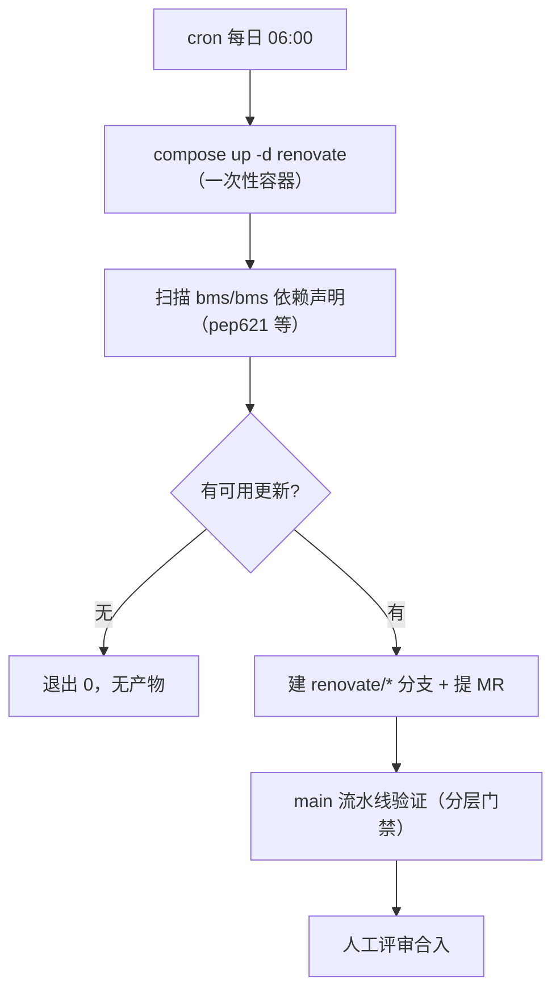

# Renovate 部署使用说明

> mjbk 依赖升级机器人部署实录 · 2026-08-23

[文档首页](../../../文档首页.md) › [资料](../../工具/Ubuntu安装部署使用说明.md) › [开发服务器部署使用说明总览](开发服务器部署使用说明总览.md) › Renovate 部署使用说明　|　[← 上一个：GitLab](GitLab部署使用说明.md)

## 1. 目的与适用范围 <a id="purpose"></a>

mjbk 上的 Renovate（容器 `bms-renovate`，随《[GitLab部署使用说明](GitLab部署使用说明.md)》的 `gitlab.yml` 编排）是依赖升级机器人：每日定时扫描本项目仓库的依赖声明，发现新版本或安全更新时自动建分支并提 MR（本项目《06 Renovate 与 GitHub 归档》）。

**管理范围（2026-08-23 定稿口径）**：

| 管理器 | 状态 | 说明 |
| --- | --- | --- |
| `pep621`（pyproject.toml） | 启用 | 当前无项目内 pyproject.toml（原 `scripts/tools/multimodal/` 已退役删除）；阶段一 uv 依赖落地后自动纳入 |
| `gitlabci`（.gitlab-ci.yml 的 docker 镜像） | 禁用 | mjbk 到 Docker Hub 不可达，且 `registryAliases` 对无前缀镜像不生效（Renovate #20225）；CI 镜像为刻意锁版本，不自动升 |

> Renovate 对自托管 GitLab 全本地运行（平台操作走本地 API），查新走各语言官方 registry（PyPI 可达），零 GitHub 依赖（平台《开发部署规划》4.5）；`GITHUB_COM_TOKEN` 仅用于个别依赖的版本数据源查询。

占位符取值：`<mjbk-IP>`、`<SSH账号>` 见《[本地资源](../../../用户文档/本地资源.md)》与 mjbk 本机 `deploy/.env`。

## 2. 部署构成 <a id="compose"></a>

### 2.1 Compose 服务

定义于仓库 `deploy/compose/gitlab.yml`（已同步至 mjbk `~/deploy/compose/gitlab.yml`）：

```yaml
  renovate:
    image: renovate/renovate:latest
    container_name: bms-renovate
    depends_on:
      - gitlab
    environment:
      RENOVATE_PLATFORM: gitlab
      RENOVATE_ENDPOINT: http://gitlab:8080/api/v4
      RENOVATE_TOKEN: ${GITLAB_PAT}
      RENOVATE_REPOSITORIES: bms/bms
      GITHUB_COM_TOKEN: ${GITHUB_PAT}
      LOG_LEVEL: info
```

| 环境变量 | 取值来源 | 说明 |
| --- | --- | --- |
| `RENOVATE_PLATFORM` | 固定 `gitlab` | 平台类型 |
| `RENOVATE_ENDPOINT` | 固定 `http://gitlab:8080/api/v4` | 容器网络内直连 GitLab API |
| `RENOVATE_TOKEN` | `deploy/.env` 的 `GITLAB_PAT` | GitLab root PAT（repo 权限） |
| `RENOVATE_REPOSITORIES` | 固定 `bms/bms` | 目标仓库路径（**不是 mj/bms**，见排障 #4） |
| `GITHUB_COM_TOKEN` | `deploy/.env` 的 `GITHUB_PAT` | GitHub 数据源 token（个别依赖版本信息走 GitHub API） |
| `LOG_LEVEL` | 固定 `info` | 日志级别（排障时临时改 `debug`） |

> renovate 服务不设 `restart` 策略：一次性任务，跑完即退出（Exited 0 属正常），由 cron 每日重新拉起。

### 2.2 cron 调度（每日 06:00）

```bash
# mjbk crontab -l
0 6 * * * cd ~/deploy && docker compose -f compose/gitlab.yml --env-file .env up -d renovate >> ~/deploy/renovate.log 2>&1
```

`~/deploy/renovate.log` 只记录 compose 的拉起输出；Renovate 运行日志在容器 stdout（`docker logs bms-renovate`）。

## 3. 部署步骤 <a id="deploy"></a>

```bash
# 1. 拉取镜像（2026-08-23 实测版本 44.39.1）
docker pull renovate/renovate:latest

# 2. 手动跑一次（验证）
cd ~/deploy
docker compose -f compose/gitlab.yml --env-file .env up -d renovate
docker logs -f bms-renovate    # 出现 "result: done" 即完成

# 3. 安装 cron（每日 06:00，内容见 2.2 节）
crontab -e
```

> 前置条件：GitLab 已部署（`bms-gitlab` Running）；`deploy/.env` 有 `GITLAB_PAT`（root PAT）与 `GITHUB_PAT`；仓库根目录有标准名配置 `renovate.json`（名字写错会进 onboarding 模式，见排障 #1）。

## 4. 验证 <a id="verify"></a>

```bash
# 运行结果（2026-08-23 实测）
docker logs bms-renovate 2>&1 | grep -E "renovateVersion|Repository finished"
#   "renovateVersion": "44.39.1"
#   "result": "done", "status": "activated", "onboarded": true

# 依赖识别统计
docker logs bms-renovate 2>&1 | grep -A4 '"managers"'
#   "gitlabci": {"fileCount": 1, "depCount": 13}   # 识别到但被禁用
#   "pep621": {"fileCount": 1, "depCount": 2}      # mcp + requires-python
```

验收口径：单次运行约 17 秒结束、无 Docker Hub 超时、无残留 `renovate/*` 分支与 MR（当前依赖均最新，故无升级 MR）。

## 5. 使用说明 <a id="use"></a>

### 5.1 配置文件（renovate.json，标准名红线）

仓库根目录 `renovate.json` 当前内容：

```json
{
  "$schema": "https://docs.renovatebot.com/renovate-schema.json",
  "packageRules": [
    {
      "matchManagers": ["gitlabci"],
      "enabled": false
    }
  ]
}
```

- **文件名必须是 `renovate.json`**（或 `renovate.json5`、`renovate.config.js`）——`.renovaterc.json` 不被识别，Renovate 会进 onboarding 模式（排障 #1）。
- 改配置 = 改文件 + 提交 main，下一次 cron 运行即生效（配置随仓库版本化，可追溯）。
- 常用规则示例（按需追加 `packageRules`）：

```json
{
  "packageRules": [
    { "matchManagers": ["gitlabci"], "enabled": false },
    { "matchUpdateTypes": ["major"], "enabled": false },
    { "matchDepTypes": ["devDependencies"], "automerge": true }
  ]
}
```

### 5.2 日常流程



- 升级 MR 在 GitLab `bms/bms` 的 Merge Requests 查看（作者 `root`）；合入与否由 CI 门禁 + 人工评审决定，Renovate 只提 MR 不改代码。
- 手动触发：`cd ~/deploy && docker compose -f compose/gitlab.yml --env-file .env up -d renovate`。

## 6. 日常运维 <a id="ops"></a>

| 操作 | 命令 |
| --- | --- |
| 查看状态 | `docker ps -a --filter name=bms-renovate`（跑完即 Exited 0，属正常） |
| 查看日志 | `docker logs --tail 100 bms-renovate`（每次运行覆盖上一次，以最新一次为准） |
| 手动触发 | `cd ~/deploy && docker compose -f compose/gitlab.yml --env-file .env up -d renovate` |
| 查看 cron | `crontab -l \| grep renovate` |
| 升级版本 | `docker pull renovate/renovate:latest`（滚动 tag，拉取后下次运行即新版） |
| 调试日志 | 临时 `LOG_LEVEL=debug`（compose 环境或 `docker run -e LOG_LEVEL=debug` 单次覆盖） |
| PAT 失效 | GitLab 重签 root PAT → 更新 mjbk `~/deploy/.env` 与本机 `deploy/.env` 的 `GITLAB_PAT`（2026-08-22 挂载事故曾致 PAT 全失效） |

## 7. 排障记录 <a id="trouble"></a>

| 问题 | 现象 | 处理 |
| --- | --- | --- |
| 配置文件名不被识别 | `.renovaterc.json` 下运行进入 onboarding 模式（试图给仓库做 onboarding 引导） | 改用标准名 `renovate.json`（2026-08-23 修正，commit `f307d31`） |
| registryAliases 对无前缀镜像不生效 | 配了 `docker.io → docker.1panel.live` 镜像源，`gitlab/gitlab-ce:latest` 这类无前缀镜像仍直连 Docker Hub 超时 | Renovate #20225：别名只对带 registry 前缀的引用生效；放弃镜像自动升级路线 |
| mjbk 到 Docker Hub 不可达 | gitlabci 管理器查新超时 | `renovate.json` 禁用 gitlabci 管理器（不碰 CI 刻意锁版本的 docker 镜像）；保留 pep621（PyPI 可达） |
| 指向空仓空跑 | 仓库路径配成 `mj/bms`（空仓），每日运行无依赖可管 | 修正为真实仓 `bms/bms`（2026-08-23，commit `5318492`）；路径以 `git remote -v` 为准 |
| PAT 失效（GitLab 挂载事故连带） | 运行报 401/Unauthorized | 先排查是否连到错误实例（见《GitLab部署使用说明》事故记录）；重签 root PAT 更新 `GITLAB_PAT` |
| Hidden Unicode characters WARN | 日志 WARN「Hidden Unicode characters have been discovered in file(s)」 | 仓库中文文档含不可见字符触发，无害，可忽略 |

## 8. 关联文档 <a id="related"></a>

- 《[GitLab部署使用说明](GitLab部署使用说明.md)》：renovate 服务的 compose 宿主与 PAT 管理
- 《[Renovate技术介绍](../../知识档案/部署与运维/Renovate技术介绍.md)》：选型依据与能力边界
- 本项目《06 Renovate 与 GitHub 归档》：需求落地记录（含 GitHub push mirror 口径）
- 平台《开发部署规划》：4.5 GitLab 与 CI 基础设施、11 节外网依赖风险
- 《[命名规范](../../../规范/命名规范.md)》：容器名 `bms-组件` 口径

> 依《[文档生成规范](../../../规范/文档生成规范.md)》编写 · 记录 2026-08-22 编排落地、2026-08-23 启用修正全过程
