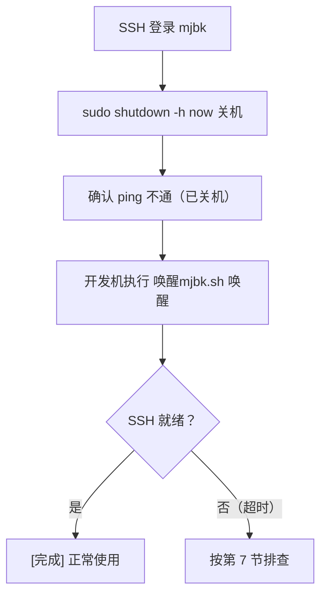
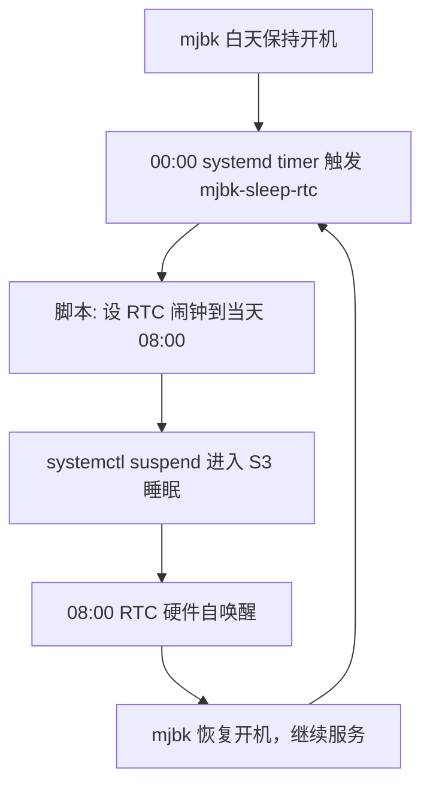

# 开发服务器电源控制

> 远程唤醒（WOL） + 远程睡眠 + 远程关机 + 每日自动睡眠/唤醒 · mjbk

[文档首页](../../../文档首页.md) › 资料 › 工具 › 开发服务器电源控制使用说明　|　[同级：GitLab 迁移使用说明 →](../../工具/GitLab迁移使用说明.md)

## 1. 目的与适用范围 <a id="purpose"></a>

Wake-on-LAN（局域网唤醒，简称 WOL）通过向关机状态机器的网卡发送「魔术包」（Magic Packet），
让机器从**完全关机（S5 待机）**状态远程开机，无需人到现场按电源键。
与之配套的远程关机则通过 SSH 执行系统关机命令。两套工具组合，即可完全远程控制开发服务器的电源。

本文档说明开发服务器 mjbk 的 WOL 配置方式与开发机上的远程唤醒 / 远程睡眠 / 远程关机脚本用法，适用于：

- mjbk 关机或断电恢复后，需要远程开机时；
- 需要远程让 mjbk 进入系统睡眠（S3），或用 RTC 定时让它**自动睡眠 / 自动唤醒**时；
- 需要远程关闭 mjbk 时（如节约耗电、维护窗口）；
- 重新部署服务器系统后，需要恢复 WOL 配置时。

`<mjbk-IP>`、`<SSH账号>` 取值见《[本地资源](../../../用户文档/本地资源.md)》与 mjbk 本机 `deploy/.env`（`MJBK_IP` / `MJBK_SSH_USER`）。

> WOL 只能唤醒「已关机」的机器；服务器运行中发送魔术包不会产生任何效果（也不会重启）。远程关机是破坏性操作，执行前脚本会要求二次确认。

## 2. 环境与前提 <a id="prereq"></a>

### 2.1 服务器参数 <a id="prereq-param"></a>

| 项目 | 值 | 说明 |
| --- | --- | --- |
| 主机名 | mjbk | 开发服务器 |
| IP 地址 | `<mjbk-IP>` | 内网固定地址 |
| 系统 | Ubuntu 24.04.4 LTS 桌面版 | 网卡由 netplan 管理 |
| SSH 用户 | `<SSH账号>` | 公钥免密登录（mjpc） |
| 有线网卡 | enp4s0 | WOL 目标网卡 |
| MAC 地址 | B0-25-AA-27-0C-32 | 魔术包发送目标（大小写与分隔符不敏感） |

### 2.2 BIOS 前提（需手动检查） <a id="prereq-bios"></a>

系统层面只能开启网卡的 WOL 功能，**能否从关机状态唤醒取决于 BIOS 设置**。请在 mjbk 本机检查：

- BIOS 中 Wake-on-LAN / LAN Power Control / Power On By LAN 等选项必须为 Enabled；
- 部分机型需关闭 ErP（深度节能）选项，否则关机后网卡无待机供电，收不到魔术包；
- 关闭系统后网卡指示灯保持点亮，说明待机供电正常。

> BIOS 选项无法远程设置，若唤醒失败先检查这一项。mjbk 为笔记本机型，选项通常在 Power / 电源 菜单下。

## 3. 服务器端配置（mjbk） <a id="server"></a>

以下操作在 mjbk 上以 SSH 方式执行（远程通道见[《开发服务器部署使用说明总览》](../../开发服务器/linux/开发服务器部署使用说明总览.md)）。

### 3.1 检查网卡 WOL 支持 <a id="server-check"></a>

查看网卡是否支持 WOL 及当前状态（ethtool 需 root，Ubuntu 桌面版默认已安装）：

```bash
sudo ethtool enp4s0 | grep -i wake
```

| 输出项 | 含义 |
| --- | --- |
| Supports Wake-on: pumbg | 网卡支持：p 物理层唤醒、u 单播、m 组播、b 广播、g 魔术包 |
| Wake-on: g | 当前已启用魔术包唤醒（g）；d 表示关闭 |

### 3.2 systemd 服务固化 <a id="server-service"></a>

网卡 WOL 设置重启后会丢失，通过 systemd 服务在每次开机时自动执行
`ethtool -s enp4s0 wol g` 固化（仅在本机生效，不影响网卡其他配置）。

创建服务文件 `/etc/systemd/system/wol.service`：

```bash
sudo tee /etc/systemd/system/wol.service <<'EOF'
[Unit]
Description=Enable Wake-on-LAN for enp4s0
After=network.target

[Service]
Type=oneshot
ExecStart=/usr/sbin/ethtool -s enp4s0 wol g

[Install]
WantedBy=multi-user.target
EOF
```

启用并立即执行一次：

```bash
sudo systemctl daemon-reload
sudo systemctl enable --now wol.service
```

### 3.3 验证 <a id="server-verify"></a>

```bash
systemctl status wol.service --no-pager | head -8
sudo ethtool enp4s0 | grep -i wake
```

- 服务状态显示 `enabled`，ExecStart 执行结果为 `status=0/SUCCESS`（oneshot 执行完即 inactive，属正常）；
- 网卡 `Wake-on: g` 已生效。

## 4. 开发机凭据配置（deploy/.env） <a id="env"></a>

工具脚本所需凭据统一从 `deploy/.env` 读取（该文件已在 `.gitignore` 中忽略，不入库；
真实值来源为[《本地资源》](../../../用户文档/本地资源.md)）。键位见 `deploy/.env.example` 模板：

| 键 | 用途 | 默认值 |
| --- | --- | --- |
| MJBK_IP | 服务器 IP | `<mjbk-IP>`（见《本地资源》） |
| MJBK_SSH_USER | SSH 登录用户 | `<SSH账号>`（见《本地资源》） |
| MJBK_SUDO_PASSWORD | 远程关机所需的 sudo 密码 | 无（必须填写） |
| MJBK_WOL_MAC | 网卡 MAC（WOL 魔术包目标） | B0-25-AA-27-0C-32 |

> 服务密码（MySQL / PostgreSQL / MinIO / DM8 / GitLab / GitHub PAT）也已迁入 deploy/.env 统一管理；脚本未引用时不读取。

## 5. 开发机工具脚本 <a id="tools"></a>

### 5.1 脚本清单 <a id="tools-list"></a>

全部位于 `scripts/tools/wol/`，纯 Python 标准库实现，无第三方依赖；`.sh` 为 Linux 入口脚本（开发机 mjpc 现为 Ubuntu，终端或桌面图标皆可用，自动跳到仓库根目录再调用对应脚本），`.bat` 为旧 Windows 开发机双击入口（规则相同，仅 Windows 下可用）。

| 文件 | 作用 | Linux 入口（现行） | Windows 入口（旧） |
| --- | --- | --- | --- |
| wake_mjbk.py | 发送魔术包唤醒并等待 SSH 就绪 | 唤醒mjbk.sh（桌面/菜单图标：唤醒mjbk） | 唤醒mjbk.bat |
| sleep_mjbk.py | 远程进入系统睡眠（S3，含二次确认） | 睡眠mjbk.sh（桌面/菜单图标：睡眠mjbk） | 睡眠mjbk.bat |
| shutdown_mjbk.py | 远程执行 sudo shutdown -h now（含二次确认） | 关机mjbk.sh（桌面/菜单图标：关机mjbk） | 关机mjbk.bat |

### 5.2 远程唤醒 <a id="tools-wake"></a>

在开发机 mjpc（Linux/Ubuntu）的仓库根目录执行（旧 Windows 开发机用 `python scripts\tools\wol\wake_mjbk.py` 或双击 `唤醒mjbk.bat`）：

```bash
./scripts/tools/wol/唤醒mjbk.sh
```

或双击桌面/应用菜单的 **唤醒mjbk** 图标（在终端窗口显示等待进度）。

脚本会发送魔术包并等待服务器 SSH 就绪，输出示例：

```bash
[1/2] 发送魔术包唤醒 <mjbk-IP>（B0-25-AA-27-0C-32）...
魔术包已发送，等待服务器启动（最多 120 秒）...
[完成] 开发服务器已就绪，可以 SSH 连接 <mjbk-IP>。
```

| 参数 | 默认值 | 说明 |
| --- | --- | --- |
| --host | deploy/.env 的 MJBK_IP | 服务器 IP |
| --mac | deploy/.env 的 MJBK_WOL_MAC | 服务器网卡 MAC |
| --timeout | 120 | 等待 SSH 就绪的超时秒数（慢速开机环境调大） |

逻辑：魔术包（MAC 重复 16 次，前导 6 字节全 FF）经 UDP 9 端口同时发往广播地址 `255.255.255.255` 与服务器 IP，提高跨网段/交换机环境下的成功率；随后每 1 秒探测一次 22 端口，就绪即成功，超时返回非 0 退出码。

### 5.3 远程关机 <a id="tools-shutdown"></a>

在开发机 mjpc 的仓库根目录执行（Linux/Ubuntu；SSH 连接走公钥免密，sudo 密码从 deploy/.env 读取；旧 Windows 开发机用 `python scripts\tools\wol\shutdown_mjbk.py` 或双击 `关机mjbk.bat`）：

```bash
./scripts/tools/wol/关机mjbk.sh
```

或双击桌面/应用菜单的 **关机mjbk** 图标。

脚本会先显示目标并**要求输入 y 确认**，确认后才下发关机指令：

```bash
确认远程关机 <mjbk-IP>（<SSH账号>）？(y/N) y
正在远程关机 <mjbk-IP> ...
关机指令已下发。
```

| 参数 | 说明 |
| --- | --- |
| --yes | 跳过确认直接关机（供脚本化调用，人工操作不建议） |

> 关机命令为 `echo '{密码}' | sudo -S shutdown -h now`，等待容器与 systemd 服务优雅停止后断电，属正常关机。

### 5.4 远程睡眠 <a id="tools-sleep"></a>

在开发机 mjpc 的仓库根目录执行（Linux/Ubuntu；SSH 连接走公钥免密，sudo 密码从 deploy/.env 读取；旧 Windows 开发机用 `python scripts\tools\wol\sleep_mjbk.py` 或双击 `睡眠mjbk.bat`）：

```bash
./scripts/tools/wol/睡眠mjbk.sh
```

或双击桌面/应用菜单的 **睡眠mjbk** 图标。

脚本会先显示目标并**要求输入 y 确认**，确认后才下发睡眠指令：

```bash
确认让 <mjbk-IP>（<SSH账号>）进入系统睡眠？(y/N) y
正在让 <mjbk-IP> 进入系统睡眠 ...
睡眠指令已下发，机器即将休眠（可随后用 wake_mjbk.py 唤醒）。
```

| 参数 | 说明 |
| --- | --- |
| --yes | 跳过确认直接睡眠（供脚本化调用，人工操作不建议） |

> 睡眠命令为 `echo '{密码}' | sudo -S systemctl suspend`，让机器进入 **S3 睡眠**（内存保电、网卡仍供电）。睡眠只是暂停而非关机，唤醒后服务自动继续；期间服务（GitLab / 数据库等）短暂不可用，属正常。与唤醒的对应关系：睡眠用 `睡眠mjbk.sh`，唤醒用 `唤醒mjbk.sh`（WOL）。

> 睡眠/唤醒也可用**每日定时**自动完成（见第 8 节），无需人工干预。

## 6. 完整操作流程 <a id="flow"></a>



1. 远程关机：`./scripts/tools/wol/关机mjbk.sh`（确认后执行），或 SSH 后执行 `sudo shutdown -h now`；
2. 开发机 ping 不通即确认关机完成；
3. 远程唤醒：`./scripts/tools/wol/唤醒mjbk.sh`，等待就绪提示后即可 SSH 使用。

> 睡眠是「关机」的轻量替代：若只是短时间不用，用 `睡眠mjbk.sh` 睡下、`唤醒mjbk.sh` 唤醒即可，比关机/开机更快；要彻底断电再走关机流程。

## 7. 常见问题排查 <a id="faq"></a>

| 现象 | 可能原因与处理 |
| --- | --- |
| 发送魔术包后长时间无法唤醒 | 先查 BIOS 的 WOL 选项（2.2 节）；再确认网线与电源已接、交换机端口正常；最后用 `sudo ethtool enp4s0 | grep -i wake` 确认服务端 `Wake-on: g` 生效。 |
| 唤醒后恢复过一次，重启后失效 | wol.service 未启用或未开机自动执行，按 3.2 节重做并确认 `systemctl is-enabled wol.service` 输出 enabled。 |
| 服务器运行中发魔术包 | 无效属正常，WOL 只对关机状态生效；先关机再唤醒。 |
| 关机脚本提示未配置 MJBK_SUDO_PASSWORD | 按第 4 节在 `deploy/.env` 填入真实密码（参考[《本地资源》](../../../用户文档/本地资源.md)）。 |
| 睡眠脚本提示未配置 MJBK_SUDO_PASSWORD | 同上，睡眠/设 RTC 闹钟均需 sudo，`MJBK_SUDO_PASSWORD` 必填。 |
| MAC 地址写错 | 以 `ip link show enp4s0` 输出为准（当前为 B0-25-AA-27-0C-32），大小写与分隔符均不敏感。 |
| 早晨未按时自动唤醒 | 多为 mjbk 在 00:00 前未开机（timer 未触发）；或 S3 态网卡/BIOS 未放开「睡眠态 LAN/时钟唤醒」，需在 mjbk 本机进 BIOS 检查（2.2 节）。 |

## 8. 每日自动睡眠 / 自动唤醒 <a id="auto"></a>

> 让 mjbk **每天 00:00 自动进入系统睡眠（S3）、早晨 08:00 自动唤醒**，无需人工干预。已实测：mjbk 可被自身 RTC 硬件时钟从 S3 唤醒。

### 8.1 原理 <a id="auto-principle"></a>

「自动唤醒」不能靠 WOL——早上 8 点 mjbk 自己睡着了、开发机也可能是关的，**没有醒着的发送方**。真正可靠的方式是 mjbk 用**自身 RTC 硬件时钟（实时时钟闹钟）**定时自唤醒，完全不依赖外部设备。

每日循环的驱动在 **mjbk 侧**：



> `mjbk-sleep-rtc.timer` 每晚 00:00 触发一次；`mjbk-sleep-rtc.service` 调用 `/usr/local/bin/mjbk_sleep_rtc.sh` 设闹钟并睡眠。若某天 00:00 mjbk 未开机，timer 自然不触发（无自愈需求）。

### 8.2 组件与文件 <a id="auto-files"></a>

| 位置 | 文件 | 作用 |
| --- | --- | --- |
| mjbk `/etc/systemd/system/` | `mjbk-sleep-rtc.timer` | 每晚 00:00 定时触发（`OnCalendar=*-*-* 00:00:00`，`Persistent=true`） |
| mjbk `/etc/systemd/system/` | `mjbk-sleep-rtc.service` | 调用下方脚本执行设闹钟 + 睡眠 |
| mjbk `/usr/local/bin/` | `mjbk_sleep_rtc.sh` | 设 RTC 闹钟为当天 08:00 → 写入 `wakealarm` → `systemctl suspend` |

### 8.3 启用与查看 <a id="auto-enable"></a>

在 mjbk 上执行（sudo 密码以下略）：

```bash
# 启用（开机自启，并立即让 timer 生效）
sudo systemctl enable --now mjbk-sleep-rtc.timer

# 查看下次触发时间（应为次日 00:00）
systemctl list-timers mjbk-sleep-rtc.timer --no-pager

# 查看单元状态
systemctl status mjbk-sleep-rtc.timer --no-pager
```

### 8.4 注意事项 <a id="auto-notes"></a>

- **夜间服务停用**：00:00 – 08:00 期间 mjbk 处于睡眠，GitLab / 数据库 / MinIO 等服务**不可用**；如需夜间访问，先用 `唤醒mjbk.sh` 唤醒。
- **仅睡眠不关机**：每日循环是 S3 睡眠，内存保电；断电（如停电、意外关机）后需 `唤醒mjbk.sh` 唤醒开机，timer 会随开机自动恢复。
- **唤醒后保持开机**：08:00 醒来后 mjbk 继续开机到下一个 00:00 才再次入睡，白天正常使用。
- 若需临时取消某晚睡眠：`sudo systemctl mask mjbk-sleep-rtc.timer`（当晚），恢复用 `sudo systemctl unmask mjbk-sleep-rtc.timer`。

> 关联：《开发服务器部署使用说明总览》《GitLab迁移使用说明》