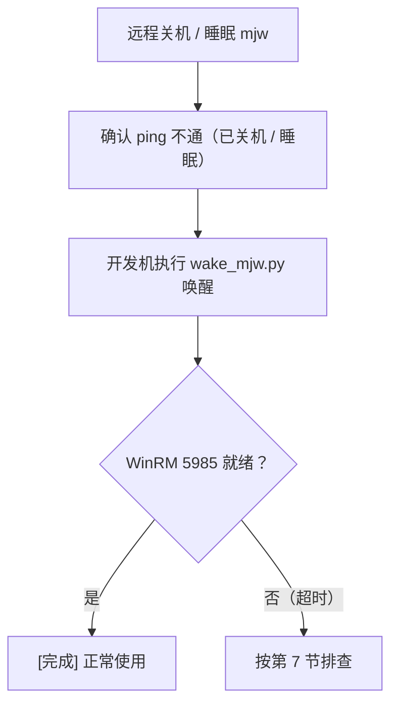
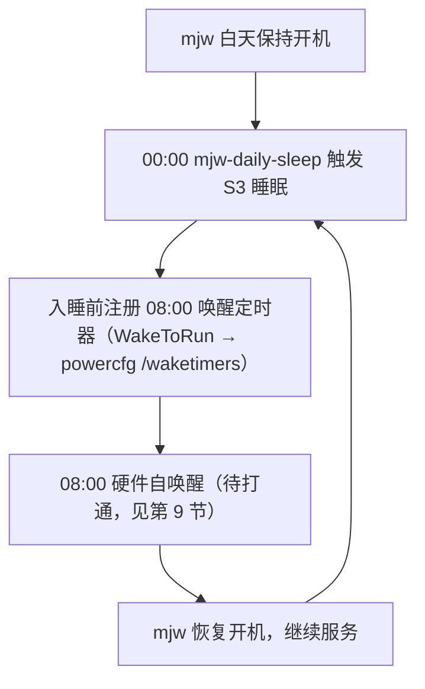

# 开发服务器Windows电源控制使用说明

> 远程唤醒（WOL）+ 远程睡眠 + 远程关机 + 每日自动睡眠/唤醒 · mjw（Windows 11）

[文档首页](../../../文档首页.md) › [资料](../../) › [开发服务器](../linux/开发服务器部署使用说明总览.md) › [Windows](开发服务器Windows部署使用说明总览.md)　|　[同级：远程控制部署使用说明 →](远程控制部署使用说明.md)　[开发服务器 Windows 部署使用说明总览 →](开发服务器Windows部署使用说明总览.md)

## 1. 目的与适用范围 <a id="purpose"></a>

Wake-on-LAN（局域网唤醒，简称 WOL）通过向关机状态机器的网卡发送「魔术包」（Magic Packet），
让机器从**睡眠（S3）或关机（S5）**状态远程开机，无需人到现场按电源键。
配套的远程睡眠 / 远程关机通过 WinRM 执行系统命令。这套工具组合可完全远程控制开发服务器 mjw 的电源。

本文档说明 mjw 的 WOL 配置、每日自动睡眠/唤醒任务与开发机上的远程唤醒 / 睡眠 / 关机脚本用法，适用于：

- mjw 关机或断电恢复后，需要远程开机时；
- 需要远程让 mjw 进入系统睡眠（S3），或让它在每日 00:00 自动睡眠、08:00 由 RTC 自动唤醒时；
- 需要远程关闭 mjw 时（如维护窗口）；
- 重装系统后需要恢复 WOL / 每日任务配置时。

`<mjw-IP>`、`<账号>`、`<密码>` 取值见《[本地资源](../../../用户文档/本地资源.md)》与开发机 `deploy/.env`（`MJW_IP` / `MJW_WINRM_USER` / `MJW_WINRM_PASSWORD`）。

> WOL 只能唤醒「已睡眠 / 已关机」的机器；机器运行中发送魔术包不会产生任何效果（也不会重启）。远程关机是破坏性操作，执行前脚本会要求二次确认。
>
> **定时唤醒是 OS 唤醒定时器，不是 BIOS 闹钟**：任务计划程序的 `WakeToRun` 在睡眠前把「唤醒定时器」交给 ACPI 硬件（`powercfg /waketimers` 可见），**从 S3 睡眠自醒只需 OS 唤醒定时器 + 电源计划允许，不依赖 BIOS RTC**；BIOS 的 RTC Wake / Power On By LAN 只有在需要从 **S5 关机**状态唤醒时才必备（见[第 9 节](#record)）。

## 2. 环境与前提 <a id="prereq"></a>

### 2.1 服务器参数 <a id="prereq-param"></a>

mjw 远程通道为基础 WinRM（HTTP 5985），不同于 mjbk 的 SSH——睡眠 / 关机的**下发**走 WinRM，**唤醒**走 WOL 魔术包（两者端口不同、职责不同）：

| 项目 | 值 | 说明 |
| --- | --- | --- |
| 主机名 | mjw | Windows 开发服务器 / 本地模型机 |
| IP 地址 | `<mjw-IP>` | 内网固定地址（路由器绑定） |
| 系统 | Windows 11 专业版 | 本地模型（识图 / 翻译）GPU 推理 |
| WinRM 用户 | `<账号>` | 管理员权限，ntlm 认证（WinRM 5985） |
| 有线网卡 | Realtek Gaming 2.5GbE | WOL 目标网卡 |
| MAC 地址 | B0-25-AA-40-57-CC | 魔术包发送目标（大小写与分隔符不敏感） |

### 2.2 BIOS 前提（需手动确认） <a id="prereq-bios"></a>

Windows 系统层面只能开启网卡的 WOL 功能。从 **S5 关机**状态唤醒（WOL 或 RTC）取决于 BIOS：

- BIOS 中 Wake-on-LAN / Power On By LAN 等选项为 Enabled（mjw 已实测 S3 睡眠唤醒，S5 见[第 9 节](#record)实测记录）；
- 若要 **S5 关机 → RTC 定时开机**，BIOS 中还需开启 RTC / Wake on RTC Alarm（S3 睡眠自醒不依赖它，见[第 7 节](#faq)）。

> BIOS 选项无法远程设置，若从 S5 唤醒失败，先检查这一项。mjw 为笔记本机型，选项通常在 BIOS「Advanced / Power」菜单下。

## 3. 服务器端配置（mjw / Windows 侧） <a id="server"></a>

以下配置已在 mjw 上完成（2026-09-06）。重装系统后需按本节重做，部分步骤需在 mjw **本机**操作。

### 3.1 网卡 WOL <a id="server-wol"></a>

mjw 本机以管理员 PowerShell 执行：

```powershell
# 网卡允许魔术包唤醒（需同配合 BIOS WOL，见 2.2 节）
Get-NetAdapterPowerManagement -Name '*Realtek*' | Set-NetAdapterPowerManagement -WakeOnMagicPacket Enabled
```

验证：

```powershell
Get-NetAdapterPowerManagement -Name '*Realtek*' | Select-Object Name, WakeOnMagicPacket
```

输出 `WakeOnMagicPacket: Enabled` 即生效。mjw 侧「禁睡眠 / 休眠关闭 / 合盖不休眠」常驻策略由《[远程控制部署使用说明](远程控制部署使用说明.md)》第 3.2 节脚本统一设置。

### 3.2 每日自动睡眠 / 唤醒任务 <a id="server-task"></a>

mjw 上注册了两个计划任务（系统账户 SYSTEM、最高权限、`WakeToRun` 唤醒定时器）：

```powershell
# 每晚 00:00 进入 S3 睡眠
$act1 = New-ScheduledTaskAction -Execute 'rundll32.exe' -Argument 'powrprof.dll,SetSuspendState 0,0,0'
$trg1 = New-ScheduledTaskTrigger -Daily -At '00:00'
$set1 = New-ScheduledTaskSettingsSet -WakeToRun -AllowStartIfOnBatteries -DontStopIfGoingOnBatteries -ExecutionTimeLimit ([TimeSpan]::Zero)
$pri1 = New-ScheduledTaskPrincipal -UserId 'SYSTEM' -LogonType ServiceAccount -RunLevel Highest
Register-ScheduledTask -TaskName 'mjw-daily-sleep' -Action $act1 -Trigger $trg1 -Settings $set1 -Principal $pri1 -Force

# 早晨 08:00 唤醒（WakeToRun 让系统在睡眠期间被 ACPI 唤醒定时器叫醒）
$act2 = New-ScheduledTaskAction -Execute 'notepad.exe' -Argument ''
$trg2 = New-ScheduledTaskTrigger -Daily -At '08:00'
$set2 = New-ScheduledTaskSettingsSet -WakeToRun -StartWhenAvailable -MultipleInstances Parallel -AllowStartIfOnBatteries -DontStopIfGoingOnBatteries -Compatibility Win8
$pri2 = New-ScheduledTaskPrincipal -UserId 'SYSTEM' -LogonType ServiceAccount -RunLevel Highest
Register-ScheduledTask -TaskName 'mjw-daily-wake' -Action $act2 -Trigger $trg2 -Settings $set2 -Principal $pri2 -Force
```

> 关键设置对照（网上标准做法与本配置一致）：「条件」页＝`-WakeToRun`（**唤醒计算机运行此任务**，缺它就不醒）；「常规」页＝SYSTEM 最高权限 + `-Compatibility Win8`（配置为 Windows 10 **兼容**，Win11 下更稳）；「设置」页＝`-StartWhenAvailable`（错过尽快补跑）与 `-MultipleInstances Parallel`（并发不冲突）。唤醒任务仅充当选醒动作，动作程序不限，取最低开销的 `notepad.exe`。**注意**：官方文档明确——唤醒定时器仅能唤醒**睡眠（S3）**状态，机器处于**完全关机（S5）**时需 BIOS 的 RTC Wake（见 2.2 节）。

允许**唤醒定时器**（否则 WakeToRun 不生效）：

```powershell
powercfg /setacvalueindex SCHEME_CURRENT SUB_SLEEP RTCWAKE 1
powercfg /setdcvalueindex SCHEME_CURRENT SUB_SLEEP RTCWAKE 1
powercfg /setactive SCHEME_CURRENT
```

验证：

```powershell
Get-ScheduledTask -TaskName 'mjw-daily-*' | Select-Object TaskName, State
```

- 两个任务 `State` 为 `Ready`；
- `mjw-daily-wake` 的 `Settings.WakeToRun = True`。

## 4. 开发机凭据配置（deploy/.env） <a id="env"></a>

工具脚本所需凭据统一从开发机 `deploy/.env` 读取（该文件已在 `.gitignore` 中忽略，不入库；
真实值来源为[《本地资源》](../../../用户文档/本地资源.md)）。键位见 `deploy/.env.example` 模板：

| 键 | 用途 | 默认值 |
| --- | --- | --- |
| MJW_IP | 服务器 IP | `<mjw-IP>`（见《本地资源》） |
| MJW_WOL_MAC | 网卡 MAC（WOL 魔术包目标） | B0-25-AA-40-57-CC |
| MJW_WINRM_USER | WinRM 登录用户 | `<账号>`（见《本地资源》） |
| MJW_WINRM_PASSWORD | WinRM 登录密码 | 无（必须填写） |

## 5. 开发机工具脚本 <a id="tools"></a>

### 5.1 脚本清单 <a id="tools-list"></a>

全部位于 `scripts/tools/winrm/`。`wake_mjw.py` 仅用 Python 标准库（发魔术包 + 探测端口）；
`sleep_mjw.py` / `shutdown_mjw.py` 依赖 pywinrm（开发机 venv：`~/tools/winrm-venv`）。
`.sh` 为 Linux 入口脚本（开发机 mjpc 现为 Ubuntu，终端或桌面图标皆可用，自动跳到仓库根目录并选用 venv Python 调用对应脚本），`.bat` 为旧 Windows 开发机双击入口（仅 Windows 下可用）。

| 文件 | 作用 | Linux 入口（现行） | Windows 入口（旧） | 依赖 |
| --- | --- | --- | --- | --- |
| wake_mjw.py | 发送魔术包唤醒并等待 WinRM（5985）就绪 | 唤醒mjw.sh（桌面/菜单图标：唤醒mjw） | 唤醒mjw.bat | 无（标准库） |
| sleep_mjw.py | 远程进入系统睡眠（S3，含确认） | 睡眠mjw.sh（桌面/菜单图标：睡眠mjw） | 睡眠mjw.bat | pywinrm |
| shutdown_mjw.py | 远程关机（S5，含确认） | 关机mjw.sh（桌面/菜单图标：关机mjw） | 关机mjw.bat | pywinrm |

pywinrm 环境（开发机 mjpc）：

```bash
python3 -m venv ~/tools/winrm-venv
~/tools/winrm-venv/bin/pip install -i https://pypi.tuna.tsinghua.edu.cn/simple pywinrm
```

### 5.2 远程唤醒 <a id="tools-wake"></a>

在开发机 mjpc（Ubuntu）仓库根目录执行（旧 Windows 开发机用 `python scripts\tools\winrm\wake_mjw.py` 或双击 `唤醒mjw.bat`）：

```bash
./scripts/tools/winrm/唤醒mjw.sh
```

或双击桌面/应用菜单的 **唤醒mjw** 图标（在终端窗口显示等待进度）。

脚本发送魔术包并等待 WinRM 端口就绪，输出示例：

```
[1/2] 发送魔术包唤醒 <mjw-IP>（B0-25-AA-40-57-CC）...
魔术包已发送，等待 WinRM 就绪（最多 120 秒）...
[完成] 开发服务器已就绪，WinRM 端口 5985 可连。
```

| 参数 | 默认值 | 说明 |
| --- | --- | --- |
| --host | deploy/.env 的 MJW_IP | 服务器 IP |
| --mac | deploy/.env 的 MJW_WOL_MAC | 网卡 MAC |
| --timeout | 120 | 等待 WinRM（5985）就绪的超时秒数 |

逻辑：魔术包（MAC 重复 16 次，前导 6 字节全 FF）经 UDP 9 端口同时发往广播地址 `255.255.255.255` 与服务器 IP；随后每秒探测一次 5985 端口（mjw 无 SSH，就绪判据取 WinRM），就绪即成功，超时返回非 0 退出码。

### 5.3 远程睡眠 <a id="tools-sleep"></a>

在开发机 mjpc（Ubuntu）仓库根目录执行（旧 Windows 开发机用 `python scripts\tools\winrm\sleep_mjw.py` 或双击 `睡眠mjw.bat`；依赖 pywinrm venv，缺失时脚本会给出安装指引）：

```bash
./scripts/tools/winrm/睡眠mjw.sh
```

或双击桌面/应用菜单的 **睡眠mjw** 图标。

脚本会先显示目标并**要求输入 y 确认**，确认后经 WinRM 执行 `rundll32.exe powrprof.dll,SetSuspendState 0,0,0`：

```
确认让 <mjw-IP>（<账号>）进入系统睡眠？(y/N) y
正在让 <mjw-IP> 进入系统睡眠 ...
睡眠指令已下发，机器即将休眠（可随后用 wake_mjw.py 唤醒）。
```

| 参数 | 说明 |
| --- | --- |
| --yes | 跳过确认直接睡眠（供脚本化调用，人工操作不建议） |

> 睡眠命令让 mjw 进入 **S3 睡眠**（内存保电、网卡仍供电，睡眠期间可被 WOL 或 RTC 唤醒）。MJW_WINRM_PASSWORD 必须已在 deploy/.env 填写。

### 5.4 远程关机 <a id="tools-shutdown"></a>

在开发机 mjpc（Ubuntu）仓库根目录执行（旧 Windows 开发机用 `python scripts\tools\winrm\shutdown_mjw.py` 或双击 `关机mjw.bat`；依赖 pywinrm venv，缺失时脚本会给出安装指引）：

```bash
./scripts/tools/winrm/关机mjw.sh
```

或双击桌面/应用菜单的 **关机mjw** 图标。

脚本会先显示目标并**要求输入 y 确认**，确认后经 WinRM 执行 `shutdown /s /t 0`（优雅关闭，等待应用退出）：

```
确认远程关机 <mjw-IP>（<账号>）？(y/N) y
正在远程关机 <mjw-IP> ...
关机指令已下发。需要开机时用 wake_mjw.py 唤醒。
```

| 参数 | 说明 |
| --- | --- |
| --yes | 跳过确认直接关机（供脚本化调用，人工操作不建议） |

> 关机瞬间 WinRM 连接即断开，脚本正常视为「已下发」；从 **S5 关机**状态能否用 WOL 唤醒取决于 BIOS 设置（见[第 9 节](#record)实测记录）。

## 6. 完整操作流程 <a id="flow"></a>



1. 远程睡眠：`sleep_mjw.py`（确认后执行）；或远程关机：`shutdown_mjw.py`；
2. 开发机 ping / 端口探测确认离线；
3. 远程唤醒：`wake_mjw.py`，等待「5985 可连」提示后即可 WinRM / RDP 使用。

> 睡眠是「关机」的轻量替代：短时间不用用 `sleep_mjw.py` 睡下、`wake_mjw.py` 唤醒即可，比关机/开机更快；要彻底断电再走关机流程。

## 7. 常见问题排查 <a id="faq"></a>

| 现象 | 可能原因与处理 |
| --- | --- |
| 发送魔术包后长时间无法唤醒 | 确认 mjw 处于睡眠/关机态（运行中发包无效）；查 BIOS 的 WOL 选项（2.2 节）；确认网线电源已接；查 `WakeOnMagicPacket` 为 Enabled（3.1 节）。 |
| S3 睡眠后唤醒任务不生效 / 每日 08:00 未自醒 | 逐项排查（参考官方与社区标准做法）：① `powercfg /q SCHEME_CURRENT SUB_SLEEP RTCWAKE` 必须为 `0x1`（**`0x2` 是「仅重要唤醒定时器」，普通任务叫不醒**）；② `Get-ScheduledTask mjw-daily-wake` 的 `Settings.WakeToRun = True` 且任务 `State = Ready`；③ **睡眠前**用 `powercfg /waketimers` 确认 08:00 触发已注册为唤醒定时器；④ 关闭 **快速启动**（控制面板 → 电源选项 → 选择电源按钮的功能 → 取消勾选"启用快速启动"），快速开启会锁死唤醒通路；⑤ S3 自醒**不需要** BIOS RTC（那是 S5 关机开机才用），若以上全对仍不醒，才怀疑硬件，查 `powercfg /lastwake`。 |
| S3 睡眠能唤醒、从 S5 关机不能 | 查 BIOS 的 WOL（Power On By LAN）或 ErP 未放开，S5 关机下网卡无待机供电（2.2 节，参见[第 9 节](#record)）。 |
| 睡眠脚本提示未配置 MJW_WINRM_PASSWORD | 按第 4 节在 `deploy/.env` 填入真实密码（参考[《本地资源》](../../../用户文档/本地资源.md)）。 |
| 关机 / 睡眠脚本报 pywinrm 未安装 | 用 venv Python 运行（`~/tools/winrm-venv/bin/python`），或按 5.1 节安装。 |
| MAC 地址写错 | 以 mjw 上 `Get-NetAdapter | Select MacAddress` 输出为准（当前 B0-25-AA-40-57-CC），大小写与分隔符均不敏感。 |
| 睡眠期间被随机自行唤醒（非计划时间） | Power-Troubleshooter 事件查唤醒源；实测为 **Intel USB 3.1 xHCI 主控**（USB 设备允许唤醒系统）。mjw 本机关闭无关 USB 的「允许此设备唤醒计算机」（设备管理器 → USB 根集线器/鼠标/接收器 → 电源管理）。 |
| remmina 连不上 mjw 远程桌面（RDP 握手失败） | 先确认服务端正常：3389 监听 / TermService / 防火墙入站 / NLA（mjw 侧均已验证通过）。再查开发机 remmina 连接配置：**`tls-seclevel` 由 5 降为 4**（过高触发 Win11 NLA 握手失败，2026-09-06 实测修复）；疑难时 `freerdp_log_level=TRACE` 打开客户端日志，配合服务端 `RdpCoreTS` 事件日志定位。 |

## 8. 每日自动睡眠 / 自动唤醒 <a id="auto"></a>

> 让 mjw **每天 00:00 自动进入 S3 睡眠、早晨 08:00 自动唤醒**，无需人工干预。计划任务执行**睡眠已实测精确触发**；**定时自醒尚未打通**（唤醒定时器已注册但不发电），需按[第 7 节](#faq)/[第 9 节](#record)待办处理（见实测记录）。

### 8.1 原理 <a id="auto-principle"></a>

「自动唤醒」不能靠 WOL——早上 8 点开发机可能也是关的，**没有醒着的发送方**。可靠方式是 mjw 用**定时任务 + 硬件唤醒闹钟**定时自醒：任务计划程序的 `WakeToRun` 在入睡前的 `powercfg /waketimers` 里注册唤醒定时器，由系统转交 ACPI/RTC 硬件到点叫醒。

每日循环的驱动在 **mjw 侧**：



### 8.2 组件 <a id="auto-files"></a>

| 位置 | 任务 / 设置 | 作用 |
| --- | --- | --- |
| mjw 计划任务 | `mjw-daily-sleep` | 每晚 00:00 触发 rundll32 SetSuspendState 进入 S3 |
| mjw 计划任务 | `mjw-daily-wake` | 每天 08:00 触发（`WakeToRun`，入睡前安装唤醒闹钟） |
| mjw 电源计划 | `RTCWAKE = 1` | 允许唤醒定时器叫醒系统 |

### 8.3 取消 / 恢复 <a id="auto-toggle"></a>

```powershell
# 临时取消某晚自动睡眠（00:00 不再入睡）
Disable-ScheduledTask -TaskName 'mjw-daily-sleep'
# 恢复
Enable-ScheduledTask -TaskName 'mjw-daily-sleep'
```

### 8.4 注意事项 <a id="auto-notes"></a>

- **夜间服务停用**：00:00 – 08:00 mjw 处于睡眠，本地模型（识图 / 翻译）等服务**不可用**；如需夜间访问，先 `wake_mjw.py` 唤醒。
- **仅睡眠不关机**：每日循环是 S3 睡眠，内存保电；断电（停电、意外关机）后需 `wake_mjw.py` 唤醒开机，计划任务会随开机自动恢复。
- **唤醒后保持开机**：08:00 醒来后 mjw 继续开机到下一个 00:00，白天正常使用。
- mjw 本身「禁睡眠 / 合盖不休眠」常驻策略与每日任务不冲突：前者防**闲置**自动睡，后者是**定时主动**入睡（见《[远程控制部署使用说明](远程控制部署使用说明.md)》第 3.2 节）。

## 9. 实测记录 <a id="record"></a>

| 日期 | 项目 | 结果 | 说明 |
| --- | --- | --- | --- |
| 2026-09-06 | S3 睡眠 → WOL 唤醒（wake_mjw.py，5985 就绪） | ✅ 通过 | 系统级 WakeOnMagicPacket 在 S3 下即生效，无需 BIOS |
| 2026-09-06 | 自动睡眠（mjw-daily-sleep 机制一次性任务，触发 13:10:41 → 事件日志确认 13:10:41 入睡） | ✅ 精确触发 | 计划任务执行睡眠链路无误 |
| 2026-09-06 | S3 睡眠 → 定时自醒（唤醒任务 WakeToRun 同机制，多轮验证） | ❌ 未自醒 | 唤醒定时器已注册（`powercfg /waketimers` 可见 12:55:25）、WakeToRun=True、RTCWAKE=1，到点依旧不醒。期间系统曾被 **USB 设备（Intel USB 3.1 xHCI 主控连接的外设）随机抢先唤醒**、也被 WOL/电源键唤醒——说明唤醒事件源正常，唯独**计划任务定时器不发唤醒信号**。真因按第 7 节清单排查：**关闭快速启动**（实测 HiberbootEnabled=1）+ BIOS 支持 |
| 2026-09-06 | S3 睡眠 → USB 设备随机唤醒 | ❌ 非预期 | Power-Troubleshooter 记录唤醒源为 Intel USB 3.1 xHCI 主控；睡眠 5 分+被 USB 设备自行唤醒，需 mjw 本机关闭无关 USB 的允许唤醒 |
| 2026-09-06 | S5 关机 → WOL 唤醒 | ❌ 未唤醒 | 120s 超时；S5 下网卡无待机供电，需 BIOS 开启 Power On By LAN（2.2 节），需 mjw 本机进 BIOS |

**待办（需 mjw 本机人工操作后远程复核）**：

1. 现场进入 Windows 后，先按[第 7 节](#faq)排查表 S3 自醒链路：**关闭快速启动**（控制面板 → 电源选项 → 选择电源按钮的功能 → 取消勾选「启用快速启动」）、睡眠前跑 `powercfg /waketimers` 验证 08:00 定时器已注册、`powercfg /lastwake` 确认唤醒源；
2. **关闭无关 USB 设备的「允许此设备唤醒计算机」**（设备管理器 → USB 根集线器/鼠标/接收器 → 属性 → 电源管理），防 USB 随机抢先唤醒；
3. 进 BIOS 开启 **Power On By LAN / Wake on LAN**（S5 关机状态 WOL 唤醒用）；
4. 若确需 **S5 关机 → 定时开机**，再于 BIOS 开启 **RTC Wake / Wake on RTC Alarm**（S3 每日循环不依赖它）。

完成后重启一次系统即可远程复测第 8 节每日循环与 S5 唤醒；mjw 睡眠 / 关机脚本与 S3 WOL 唤醒已全部验证可用。

> 关联：《开发服务器 Windows 部署使用说明总览》《远程控制部署使用说明》