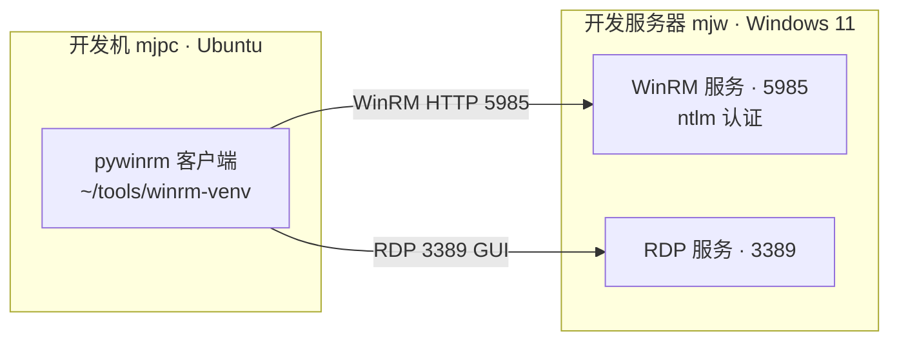

# 远程控制部署使用说明

> mjw Windows 笔记本远程控制（WinRM + RDP）部署·使用·验证·排障

[文档首页](../../../文档首页.md) › [资料](../../) › [开发服务器](../linux/开发服务器部署使用说明总览.md) › [Windows](开发服务器Windows部署使用说明总览.md)　|　[同级：开发服务器 Windows 部署使用说明总览 ←](开发服务器Windows部署使用说明总览.md)

## 1. 目的与适用范围 <a id="purpose"></a>

本文档描述如何对 Windows 开发服务器 **mjw**（Windows 11 专业版）进行远程操作：

- **远程命令行**：WinRM（Windows Remote Management，PowerShell Remoting），端口 5985，用于命令与脚本执行、自动化运维；
- **远程桌面 GUI**：RDP（Remote Desktop Protocol），端口 3389，用于本地模型（识图 / 翻译）等需要图形界面的场景。

**取值说明**：`<mjw-IP>`、`<账号>`、`<密码>` 占位符具体值见《[本地资源](../../../用户文档/本地资源.md)》（已 gitignore，不入库）。

> 本文档与 mjbk 的关系：mjbk（Ubuntu）以 SSH 免密远程控制（见《[开发服务器部署使用说明总览](../linux/开发服务器部署使用说明总览.md)》）；mjw（Windows）统一走 WinRM，**不启用内置 OpenSSH**——原因见[第 2 节](#arch)。

## 2. 方案总体 <a id="arch"></a>



| 通道    | 端口 | 用途                     | 客户端（mjpc 侧）                                          |
| ------- | ---- | ------------------------ | ---------------------------------------------------------- |
| WinRM   | 5985 | 命令行 / 脚本远程执行    | python + pywinrm（`ntlm` 认证）                            |
| RDP     | 3389 | 远程桌面 GUI（识图演示） | 任意 RDP 客户端（如 Vinagre / Remmina / xfreerdp）         |

**为何不用 OpenSSH**：上次在 Windows 上启用内置 OpenSSH Server 后，部分命令（PowerShell 会话、管道、编码敏感命令）执行异常，排障成本高；WinRM 是 Windows 原生远程管理，对 PowerShell 支持完整，因此 Windows 侧远程一律走 WinRM。

## 3. 服务端（mjw / Windows 侧）配置 <a id="server"></a>

### 3.1 前提条件 <a id="server-pre"></a>

- 登录用户具备管理员权限（`<账号>` 已加入 `Administrators`）。
- 以**管理员身份**打开 PowerShell（右键 PowerShell → 以管理员身份运行）。
- 系统已设静态 IP（路由器绑定保留），见《[开发服务器 Windows 部署使用说明总览](开发服务器Windows部署使用说明总览.md)》。

### 3.2 配置脚本 <a id="server-script"></a>

以下脚本一次性完成：启用 WinRM（HTTP 5985）、调整认证与 UAC 令牌、防火墙限内网、启用 RDP、账号入组、设置常驻电源策略与网卡 WOL。**脚本首次在 mjw 本机执行（远程无法配置 WinRM 自身），之后即可远程操作。**

```powershell
# 以管理员身份在 mjw 本机 PowerShell 执行
# 1) 启用 WinRM（HTTP 5985）
Enable-PSRemoting -Force -SkipNetworkProfileCheck
Set-Service WinRM -StartupType Automatic
Start-Service WinRM

# 2) WinRM 认证与内存（HTTP 明文，仅内网；ntlm 默认即可，basic 备用）
Set-Item -Path 'WSMan:\localhost\Service\AllowUnencrypted' -Value $true -Force
Set-Item -Path 'WSMan:\localhost\Service\Auth\Basic' -Value $true -Force
winrm set winrm/config/winrs '@{MaxMemoryPerShellMB="1024"}'

# 3) 远程管理员获得完整令牌（否则经 WinRM 登录的管理员被 UAC 降权）
Set-ItemProperty -Path 'HKLM:\SOFTWARE\Microsoft\Windows\CurrentVersion\Policies\System' -Name LocalAccountTokenFilterPolicy -Value 1 -Type DWord

# 4) 防火墙：WinRM / RDP 仅放行内网网段
Get-NetFirewallRule -DisplayGroup 'Windows Remote Management' -ErrorAction SilentlyContinue |
    ForEach-Object { Set-NetFirewallRule -InputObject $_ -RemoteAddress '192.168.0.0/24' }
$rdp = Get-NetFirewallRule -DisplayGroup 'Remote Desktop' -ErrorAction SilentlyContinue
if (-not $rdp) { $rdp = Get-NetFirewallRule -DisplayGroup '远程桌面' -ErrorAction SilentlyContinue }
if ($rdp) { $rdp | ForEach-Object { Set-NetFirewallRule -InputObject $_ -RemoteAddress '192.168.0.0/24' } }
Get-NetFirewallRule -DisplayName 'WinRM HTTP-In LAN' -ErrorAction SilentlyContinue | Remove-NetFirewallRule
New-NetFirewallRule -DisplayName 'WinRM HTTP-In LAN' -Direction Inbound -Protocol TCP -LocalPort 5985 `
    -RemoteAddress '192.168.0.0/24' -Action Allow -Profile Any
Get-NetFirewallRule -DisplayName 'RDP-In LAN' -ErrorAction SilentlyContinue | Remove-NetFirewallRule
New-NetFirewallRule -DisplayName 'RDP-In LAN' -Direction Inbound -Protocol TCP -LocalPort 3389 `
    -RemoteAddress '192.168.0.0/24' -Action Allow -Profile Any

# 5) 启用 RDP（远程桌面）与网络级身份验证（NLA）
Set-ItemProperty -Path 'HKLM:\System\CurrentControlSet\Control\Terminal Server' -Name fDenyTSConnections -Value 0 -Type DWord
Set-ItemProperty -Path 'HKLM:\System\CurrentControlSet\Control\Terminal Server\WinStations\RDP-Tcp' -Name UserAuthentication -Value 1 -Type DWord

# 6) 账号入组
Add-LocalGroupMember -Group 'Remote Management Users' -Member '<账号>' -ErrorAction SilentlyContinue
Add-LocalGroupMember -Group 'Administrators' -Member '<账号>' -ErrorAction SilentlyContinue

# 7) 常驻：合盖不休眠、禁睡眠、休眠关闭；网卡 WOL
powercfg /setacvalueindex SCHEME_CURRENT SUB_BUTTONS LIDACTION 0
powercfg /setdcvalueindex SCHEME_CURRENT SUB_BUTTONS LIDACTION 0
powercfg /setactive SCHEME_CURRENT
powercfg /change standby-timeout-ac 0
powercfg /change standby-timeout-dc 0
powercfg /change hibernate-timeout-ac 0
powercfg /change hibernate-timeout-dc 0
powercfg /hibernate off
$ad = Get-NetAdapter -Physical | Where-Object { $_.MacAddress -eq '<有线网卡MAC>' } | Select-Object -First 1
if ($ad) { Set-NetAdapterPowerManagement -Name $ad.Name -WakeOnMagicPacket Enabled }
```

### 3.3 关键配置项说明 <a id="server-keys"></a>

| 配置项                            | 作用                                                                 |
| --------------------------------- | -------------------------------------------------------------------- |
| `Enable-PSRemoting -SkipNetworkProfileCheck` | 创建 WinRM HTTP listener 并放行防火墙（跳过"网络为公用则拒绝"检查） |
| `AllowUnencrypted=true`           | 允许 HTTP 明文通道（配 `basic` 备用；`ntlm` 认证本身带会话加密）     |
| `LocalAccountTokenFilterPolicy=1` | 远程登录的本地管理员获得完整令牌，避免被 UAC 过滤成标准用户          |
| 防火墙 `RemoteAddress 192.168.0.0/24` | WinRM/RDP 仅对内网网段开放，减少暴露面                             |
| `fDenyTSConnections=0` + `UserAuthentication=1` | 开启 RDP 并保持 NLA（网络级身份验证）                           |
| `powercfg … LIDACTION 0`          | 合盖不睡眠（交流 / 电池两档都设）                                    |
| `WakeOnMagicPacket Enabled`       | 网卡允许魔术包唤醒（2026-09-06 已实测 S3 下生效，无需进 BIOS）      |

## 4. 客户端（mjpc / Ubuntu 侧）使用 <a id="client"></a>

### 4.1 pywinrm 客户端安装 <a id="client-install"></a>

Ubuntu 26.04 系统 Python 受 PEP 668（externally-managed-environment）保护，不能直接用 `pip install`，需落在 venv 中。按约定装在 `~/tools/winrm-venv`（持久目录，勿放 /tmp，会被清理）：

```bash
python3 -m venv ~/tools/winrm-venv
~/tools/winrm-venv/bin/pip install pywinrm -i https://mirrors.aliyun.com/pypi/simple/
```

> 阿里云 PyPI 镜像为约定源（见 AGENTS.md「网络与镜像」）。

### 4.2 连接与执行示例 <a id="client-example"></a>

```bash
# 连通性验证（执行 Windows 版本命令）
~/tools/winrm-venv/bin/python -c "import winrm; s=winrm.Session('<mjw-IP>',auth=('<账号>','<密码>'),transport='ntlm'); print(s.run_cmd('ver').std_out.decode())"
```

执行 PowerShell 脚本（获取硬件信息示例）：

```bash
~/tools/winrm-venv/bin/python - <<'EOF'
import winrm
s = winrm.Session('<mjw-IP>', auth=('<账号>','<密码>'), transport='ntlm')
ps = r"""
$cs = Get-CimInstance Win32_ComputerSystem
$cpu = Get-CimInstance Win32_Processor | Select-Object -First 1
$gpu = Get-CimInstance Win32_VideoController | Select-Object -First 1
Write-Output "HOST=$($cs.Name)"
Write-Output "CPU=$($cpu.Name) CORES=$($cpu.NumberOfCores)P/$($cpu.NumberOfLogicalProcessors)T"
Write-Output "MEM=$([math]::Round($cs.TotalPhysicalMemory/1GB,1))GB"
Write-Output "GPU=$($gpu.Name)"
"""
r = s.run_ps(ps)
print(r.status_code)
print(r.std_out.decode('utf-8','replace'))
EOF
```

### 4.3 API 说明与编码 <a id="client-api"></a>

| 方法            | 作用                       | 备注                                                           |
| --------------- | -------------------------- | -------------------------------------------------------------- |
| `run_cmd(...)`  | 执行 cmd 命令              | 输出 `std_out / std_err` 为 bytes，按需解码                    |
| `run_ps(...)`   | 执行 PowerShell 脚本       | 适用于 `Get-CimInstance` 等 PowerShell 语句                    |
| `transport=`    | `ntlm`（默认）/ `basic`    | 工作组环境优先 `ntlm`；`basic` 需服务端 `AllowUnencrypted=true` |

- PowerShell 输出 `std_err` 中常见 `<# CLIXML ... #<Objs...` 进度流，属正常进度报告，可忽略（`<Objs` 开头为 CLIXML 序列化内容，非错误）。
- 中文等非 ASCII 输出在部分 cmdlet（如 `Win32_OperatingSystem.Caption`）中会乱码，此时改用注册表取值（如 `EditionID`）或 ASCII 字段。
- 登录账号含 `@`、`/` 等字符时注意 Python 字符串转义。

### 4.4 经 pwsh7 远程执行（mjw PowerShell 7 宿主） <a id="client-pwsh7"></a>

> 2026-09-10 联调。mjw 已装 **PowerShell 7.6.6**（见《[开发服务器Windows部署使用说明总览](开发服务器Windows部署使用说明总览.md)》2.1）；Windows PowerShell 5.1 语法/输出受限，作为薄壳保留。

**推荐用法**：仓库自带工具 `scripts/tools/winrm/pwsh_mjw.py`——脚本以 UTF-16(BOM) 落盘 mjw 后经 `pwsh7 -File` 执行，返回 stdout 与退出码：

```bash
~/tools/winrm-venv/bin/python scripts/tools/winrm/pwsh_mjw.py \
  'Get-Service | Where-Object {$_.Status -eq "Running"} | Select -First 3 Name,Status | Format-Table | Out-String'
~/tools/winrm-venv/bin/python scripts/tools/winrm/pwsh_mjw.py --file task.ps1   # 长任务: --timeout 300
```

**Linux 直连 remoting（Enter-PSSession / Invoke-Command → mjw 5985）——未打通，暂缓**：

| 尝试 | 结果 |
| --- | --- |
| mjpc 装 Linux pwsh 7.6.6（`~/tools/pwsh/7.6.6`，软链 `~/.local/bin/pwsh`） | ✅ |
| 补 WSMan 客户端库 `PSWSMan 2.3.1` + NTLM 机制 `gss-ntlmssp` | ✅ 已装 |
| `-Authentication Negotiate`（NTLM） | ✗ SPNEGO 协商挂起（mjw 端 WinRM 事件 91 刷但未完成） |
| `-Authentication Basic` | ✗ Unix WSMan 客户端禁 Basic over HTTP（仅 HTTPS） |
| 结论 | 直连需 mjw 侧启用 **HTTPS WinRM（自签证书 + 5986）** 后走 Basic/Kerberos，成本中等；当前 pywinrm（ntlm）+ pwsh7 宿主已覆盖日常 |

**踩坑记录**：脚本文件必须带 **UTF-16/UTF-8 BOM** 落盘（PS 5.1 按 ANSI 读无 BOM 文件词法错乱）；ps1 内 `'x' + 裸命令名` 是语法错误（用 `$( )` 内插或 `& `）；`-EncodedCommand` 用无 BOM UTF-16LE；中文输出先 `[Console]::OutputEncoding=[Text.Encoding]::UTF8`。

## 5. 验证方法 <a id="verify"></a>

### 5.1 服务端自检（mjw 本机） <a id="verify-server"></a>

```powershell
Test-NetConnection localhost -Port 5985
Get-Service WinRM | Select Status,StartType
winrm enumerate winrm/config/listener
Get-NetConnectionProfile | Select Name,InterfaceAlias,NetworkCategory
Get-NetFirewallRule -DisplayName 'WinRM HTTP-In LAN','RDP-In LAN' | Select DisplayName,Enabled,Profile,Action
```

判断：WinRM 服务 **Status=Running**、listener 存在（Port=5985）、规则 **Enabled=True、Action=Allow**。

### 5.2 客户端端口探测（mjpc / 任意 Linux） <a id="verify-port"></a>

对 Windows 目标**建议用 python socket 探测**（`bash /dev/tcp` 在部分远程 shell 环境不可靠，见[第 6 节](#trouble)排障 4）：

```bash
python3 - <<'EOF'
import socket
for p in (5985, 3389):
    s = socket.socket(); s.settimeout(2)
    try:
        s.connect(('<mjw-IP>', p)); print(p, 'OPEN')
    except Exception as e:
        print(p, 'closed:', e)
    finally:
        s.close()
EOF
```

> 注意：Windows 默认禁 ping（ICMP），「pint 不通」不代表离线；离线/在线判断应结合 ARP 与端口探测，`TTL=128` 即确认对端是 Windows。

### 5.3 完整连通测试 <a id="verify-winrm"></a>

执行 [4.2](#client-example) 的连通性命令，返回 `Microsoft Windows [Version …]` 即为全链路打通。

## 6. 排障记录 <a id="trouble"></a>

> 首次部署联调实录（2026-09-06）。以下问题与对策为本链路历史经验，复现时按图对照。

| # | 问题现象                                                 | 根因 / 定位                                   | 处理                                       |
|---| -------------------------------------------------------- | --------------------------------------------- | ------------------------------------------ |
| 1 | 全部端口探测不到，ping 不通                              | mjw 处于睡眠 / 关机，非配置问题               | 先人为开机保持亮屏，Web 确认在线再排       |
| 2 | ping 通但 5985/3389/135/445 全关                         | WinRM / RDP 服务未监听，或第三方安全软件拦截  | 本机 `netstat -ano \| findstr ":5985 :3389 :135 :445"` 二分定位 |
| 3 | 关闭 Windows 防火墙后 135/445 仍不通                     | 存在第三方安全软件（火绒 / 360 / 品牌管家等）入站拦截 | 在安全软件中放行指定端口 / 应用 |
| 4 | mjbk 与 mjpc 探测结果不一致（mjbk 全 closed、mjpc 部分 OPEN） | SSH 远程 shell 中 `bash /dev/tcp` 探测不可靠 | 统一改用 python socket 复测，以 OPEN 结果为准 |
| 5 | 睡眠后发 WOL 魔术包未唤醒                                | 机器在线时发包无效（网卡忽略）/ BIOS 未启用 / 无线链路不支持 / 深度睡眠 | 2026-09-06 已实测 S3 下有线网卡唤醒成功；若仍失败再查 BIOS 与深度睡眠 |
| 6 | pywinrm 安装失败 `externally-managed-environment`        | Ubuntu 系统 Python 受 PEP 668 保护            | 使用 venv（`python3 -m venv` 后 pip 安装） |
| 7 | 客户端 venv 放在 /tmp 重启后丢失                         | /tmp 为临时目录，重启清理                     | 固定安装至 `~/tools/winrm-venv`            |
| 8 | `ntlm` 认证失败                                           | 服务端认证或令牌过滤未设置                    | 确认 `AllowUnencrypted`/`Basic` 已开、`LocalAccountTokenFilterPolicy=1` |
| 9 | 远程执行的部分命令提示权限不足                           | UAC 过滤，远程管理员获得的是标准令牌          | 设置 `LocalAccountTokenFilterPolicy=1` 后重启 WinRM 会话 |
| 10 | PowerShell 输出出现 `<# CLIXML` / 中文乱码               | 进度流与编码差异                              | CLIXML 进度段忽略；非 ASCII 字段改注册表取值 |

### 6.1 睡眠 / 关机时的判断流程 <a id="trouble-alive"></a>

mjw 设置常驻策略后理论合盖不睡，但部署初期仍可能因未插电、BIOS 或第三方电源管理进入待机。在线判断优先级：

1. `ip neigh` 查看 ARP：有 MAC 条目说明物理链路曾连通（`DELAY`/`REACHABLE`）；
2. 端口探测 `5985`：通 = 服务在线；不通 = 睡眠或服务未启动，需本机确认。

### 6.2 防火墙确认口径 <a id="trouble-fw"></a>

- 「关闭 Windows 防火墙」要三个 profile（域 / 专用 / 公用）全部关闭才算关闭；
- 若第三方安全软件常驻（火绒 / 360 / 机械革命电脑管家等），其网络防护与 Windows 防火墙独立，需单独放行；
- 部署目标是将放行范围收紧为内网网段，不建议长期保持防火墙全关（本机「全关」仅为排障手段，联调完成后按[第 3 节](#server)规则恢复）。

### 6.3 补充方案：计划任务交互法（远程跑 GUI / 安装器） <a id="trouble-schtask"></a>

> 2026-09-10 PoC 实测。现象：WinRM 远程执行 GUI 程序 / 安装器无反应或立即退出，mjw 本机双击可装。
> 根因：WinRM 会话在 **Session 0**（非交互、无桌面窗口站），GUI 无法投递到桌面——换 SSH / PsExec 默认形态同理，不是通道问题。

实测对照（notepad 为样本，2026-09-10）：

| 执行方式 | 实测结果 |
| --- | --- |
| WinRM 直跑 GUI 程序 | 进程 `session=0`，窗口不可见 |
| 计划任务 `LogonType=Interactive` | 需**活动用户会话**；用户会话为 RDP 断开（Disc）态时不投递（`LastTaskResult=0xFFFD0000`） |
| 计划任务 `LogonType=Password` + `RunLevel=Highest` | **可执行**（`0x0`，用户令牌正确），但进程仍在 session=0 → GUI 不可见，适合配静默参数的命令 |

结论与用法：

- **需要 UI 弹窗**（真 GUI 安装向导等）：唯一途径是 mjw 存在活动登录会话——保持一个最小化 RDP 连接后，`Interactive` 计划任务即可把窗口投递到桌面（等价坐在 mjw 前操作）；或直接 RDP 操作。
- **无人值守跑用户级程序 / 静默安装**：`Password` 登录类型 + 最高权限 + 静默参数（`/S`、`/qn`、`/verysilent` 等），绝大多数安装器可覆盖。注册模板（经 WinRM 的 PS 5.1）：

```powershell
$action = New-ScheduledTaskAction -Execute 'C:\path\setup.exe' -Argument '/S'
Register-ScheduledTask -TaskName demo -Action $action `
  -User '<账号>' -Password '<密码>' -RunLevel Highest -Force | Out-Null
Start-ScheduledTask -TaskName demo        # 查结果: Get-ScheduledTaskInfo -TaskName demo
```

踩坑记录（PoC 实测）：

| 坑 | 对策 |
| --- | --- |
| PS 5.1 执行无 BOM 的 UTF-16/UTF-8 脚本词法错乱（报 `The term '$' is not recognized`） | 任务脚本文件必须带 **UTF-16/UTF-8 BOM**（base64 写文件时前缀 `FF FE`） |
| 经 WinRM 查 `Win32_ComputerSystem.UserName` 在无控制台登录用户时返回空 | 注册任务直接用《[本地资源](../../../用户文档/本地资源.md)》中的账号名 |
| `New-ScheduledTaskPrincipal -Password` 参数在 PS 5.1 不存在 | 密码改传 `Register-ScheduledTask -User/-Password`（与 `-Principal` 互斥，二者只用一个） |
| `Interactive` 任务在断开/锁定会话不投递 | 保持活动 RDP 会话；自动化场景改用 `Password` 类型 |
| 任务密码以明文存于任务 XML | 单人内网可接受；介意则改用 `Interactive`（需活动会话） |

## 7. 关联文档 <a id="related"></a>

- 《[开发服务器 Windows 部署使用说明总览](开发服务器Windows部署使用说明总览.md)》：mjw 部署总览
- 《[本地资源](../../../用户文档/本地资源.md)》：真实 IP / 账号 / 密码（已 gitignore，不入库）
- 《[开发服务器部署使用说明总览](../linux/开发服务器部署使用说明总览.md)》：mjbk 总览（Ubuntu，SSH 远程通道）
- 《[开发服务器电源控制使用说明](../../开发服务器/linux/开发服务器电源控制使用说明.md)》：mjbk 的 WOL / 关机工具链（与本文档 WOL 设置参考）
- 平台《开发部署规划》：整体部署方案与机器分工
- 《[文档生成规范](../../../规范/文档生成规范.md)》与《[命名规范](../../../规范/命名规范.md)》：本文档遵循的规范

> 依《文档生成规范》编写 · 首次部署联调收录排障 10 条