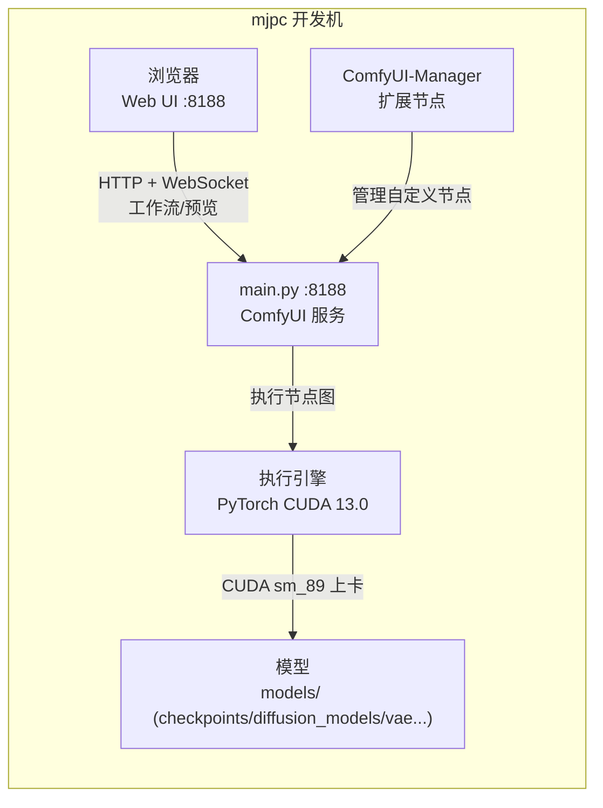

# ComfyUI 部署与使用说明

> mjpc 开发机（Ubuntu 26.04 / RTX 4090 24G）· ComfyUI 0.34.0（git commit `e7051b0`，2026-08-28 发布）

[文档首页](../../文档首页.md) › 资料 › 开发机 › ComfyUI 部署与使用说明　|　[同级：开发机部署使用说明总览 →](开发机部署使用说明总览.md)　[opencode部署使用说明 →](opencode部署使用说明.md)　[中文输入法部署使用说明 →](中文输入法部署使用说明.md)

## 1. 概述 <a id="intro"></a>

ComfyUI 是一个**节点式（node-based）**的本地图像生成工具：把提示词、模型、采样器、VAE、放大等画成一张张可连线的节点图（工作流），连好后一键运行，底层的 Stable Diffusion / FLUX 等模型在本地 GPU 上完成生成。它既是一个面向人的可视化界面（Web UI，浏览器操作），也提供 HTTP API，可被脚本或 AI Agent 调用（本项目后续或将其用于 AI 生图能力，见《[AI能力](../../设计/概要设计/35_概要设计_AI能力.md)》）。

本机用它做**本地文生图 / 图生图**，全程离线、免费、无 API Key，数据不离开本机。

核心特点：

- **节点工作流**：每个功能（加载模型、采样、放大、LoRA、ControlNet 等）即一个节点，用连线定义数据流向，可保存 / 复用 / 分享为 `.json` 工作流。
- **本地 GPU 推理**：基于 PyTorch + CUDA，用本机 RTX 4090（24G 显存）执行，无需外部 API。
- **Web UI**：浏览器访问 `http://127.0.0.1:8188`，所见即所得，实时预览生成进度。
- **HTTP API**：`/prompt`、`/history`、`/websocket` 等接口，支持脚本与自动化调用。
- **自定义节点生态**：通过 [ComfyUI-Manager](https://github.com/ltdrdata/ComfyUI-Manager)（本机已装）一键安装 / 更新扩展节点。

> 与本地大模型推理的关系：本机已有的《[llamacpp 部署与使用说明](../AI/llamacpp部署使用说明.md)》跑的是**文本大模型**（llama-server :8080），ComfyUI 跑的是**图像生成模型**（:8188），两者互不相关、各自独立。

## 2. 环境要求 <a id="prereq"></a>

本机（mjpc，Ubuntu 26.04.1 LTS）已验证的环境：

| 项 | 值 |
| --- | --- |
| 主机 | mjpc（开发机；内网 IP 见《[本地资源](../../用户文档/本地资源.md)》） |
| 系统 | Ubuntu 26.04.1 LTS（resolute），x86_64，内核 7.0.0-30-generic |
| GPU | NVIDIA GeForce RTX 4090，显存 24564 MiB，驱动 595.84（CUDA 13.0） |
| 内存 | 64 GB |
| 磁盘 | 单块 NVMe 3.7 TB，剩余约 3.4 TB |
| Python | venv 内 Python 3.14.4（系统 `/usr/bin/python3` 同为 3.14.4） |
| 环境工具 | [uv 0.12.7](https://github.com/astral-sh/uv)（建 venv + 装依赖；venv 内无 pip） |
| pip 源 | 清华 TUNA（`https://pypi.tuna.tsinghua.edu.cn/simple`，已配置于 `~/.config/pip/pip.conf`） |
| ComfyUI | 0.34.0（`comfyui_version.py`），源码目录 `/home/minjian/develop/ComfyUI/` |

### 2.1 源码与目录 <a id="prereq-dir"></a>

```text
/home/minjian/develop/ComfyUI/
├── main.py              # 入口：ComfyUI 服务（启动参数见第 3、4 节）
├── requirements.txt     # 依赖清单（torch、前端包等）
├── venv/                # uv 创建的虚拟环境（Python 3.14.4，无 pip）
├── models/              # 模型目录（第 5 节；当前全空）
├── custom_nodes/        # 自定义 / 扩展节点（ComfyUI-Manager 等）
├── user/                # 用户数据与运行日志（comfyui_8188.log）
├── input/               # 图生图等输入图片
├── output/              # 生成结果图片
└── temp/                # 临时文件
```

> **运行日志**：`user/comfyui_8188.log`（旧版轮转为 `.prev.log`、`.prev2.log`）。Web UI 与 API 的报错都在这里。

### 2.2 关键依赖 <a id="prereq-deps"></a>

venv 内已装（`uv pip list --python venv/bin/python` 核实）：

| 包 | 版本 | 说明 |
| --- | --- | --- |
| torch | 2.13.0+cu130 | CUDA 13.0 版，`torch.cuda.is_available()` 为 True |
| torchvision / torchaudio | 0.28.0 / 2.11.0 | 配套 |
| numpy | 2.5.2 | 数值计算 |
| transformers | 5.16.1 | 文本编码器等 |
| safetensors | 0.8.0 | 模型权重格式 |
| aiohttp / aiohttp-socks | 3.14.3 / 0.12.0 | HTTP 服务与代理 |
| huggingface-hub | 1.29.0 | HuggingFace 下载（国内镜像已配，见第 6 节） |
| comfyui-frontend-package | 1.51.9 | Web 前端（Python 包，静态资源） |
| comfyui-workflow-templates | 0.11.50 | 内置工作流模板 |
| ComfyUI-Manager | V3.41 | 扩展节点管理（`custom_nodes/`） |

## 3. 部署 <a id="deploy"></a>

### 3.1 克隆源码 <a id="deploy-clone"></a>

```bash
# 国内网络用 ghfast.top 前缀加速（实测有效），克隆到 ~/develop/
git clone https://ghfast.top/https://github.com/comfy-org/ComfyUI.git ~/develop/ComfyUI
cd ~/develop/ComfyUI
# 查看版本
cat comfyui_version.py    # __version__ = "0.34.0"
```

### 3.2 创建虚拟环境并装依赖 <a id="deploy-venv"></a>

用 `uv` 建 venv（venv 内无 pip，依赖由 uv 管理；pip 源已统一配清华 TUNA）：

```bash
cd ~/develop/ComfyUI
# 建 venv（Python 3.14）
uv venv --python 3.14 venv
# 先装带 CUDA 的 torch（cu130 对应 RTX 4090 / 驱动 595.84 / CUDA 13.0）
uv pip install --python venv/bin/python \
  torch torchvision torchaudio \
  --index-url https://download.pytorch.org/whl/cu130
# 再装 ComfyUI 其余依赖（读 requirements.txt）
uv pip install --python venv/bin/python -r requirements.txt
# 验证 GPU 可用
venv/bin/python -c "import torch; print(torch.__version__, torch.cuda.is_available())"
```

> torch 的 cu 版从 `https://download.pytorch.org/whl/cu130` 安装；若该索引访问不畅，可改用国内 PyTorch 镜像（如清华 `https://mirrors.tuna.tsinghua.edu.cn/pytorch/...`）。`torch` 在 `requirements.txt` 里**无版本约束**，先用 cu130 装好可确保运行时走 GPU。

### 3.3 systemd 用户服务 <a id="deploy-systemd"></a>

服务单元 `~/.config/systemd/user/comfyui.service`：

```ini
[Unit]
Description=ComfyUI 本地图像生成服务
After=network.target

[Service]
Type=simple
WorkingDirectory=/home/minjian/develop/ComfyUI
ExecStart=/home/minjian/develop/ComfyUI/venv/bin/python /home/minjian/develop/ComfyUI/main.py --port 8188 --listen 0.0.0.0
Restart=on-failure
RestartSec=5
Environment=PYTHONUNBUFFERED=1

[Install]
WantedBy=default.target
```

> 当前服务为 **disabled**（未设为开机自启），需要时手动启动（第 4 节）。若你的用户服务目录为新加，先 `systemctl --user daemon-reload` 使其被识别。

### 3.4 控制脚本 <a id="deploy-script"></a>

`~/.local/bin/comfyui-control.sh`（启动时同步 `journalctl -f` 跟踪日志、停止时 `notify-send` 提示）：

```bash
comfyui-control.sh start     # 启动并跟踪日志
comfyui-control.sh stop      # 停止
comfyui-control.sh status    # 查看状态
```

> 该脚本走 systemd 用户服务（`comfyui.service`），启动后关闭终端不会停掉服务。

## 4. 启动与验证 <a id="run"></a>

### 4.1 启动 <a id="run-start"></a>

```bash
comfyui-control.sh status   # 查看当前状态
comfyui-control.sh start    # 启动（首次加载约 10–30 秒）
```

或直接用 systemd：

```bash
systemctl --user start comfyui.service
systemctl --user status comfyui.service --no-pager
journalctl --user -u comfyui.service -f
```

### 4.2 验证服务就绪 <a id="run-verify"></a>

```bash
# Web 首页可达
curl -s -o /dev/null -w "HTTP %{http_code}\n" http://127.0.0.1:8188/
# 系统 / 版本信息
curl -s http://127.0.0.1:8188/system_stats | head -c 400
```

首页返回 HTTP 200 即就绪；浏览器打开 `http://127.0.0.1:8188` 进入 Web UI。

### 4.3 服务与数据流 <a id="run-arch"></a>



> 工作流（节点图）可存为 `.json` 保存 / 导入；Web UI 打开一个带模型的默认模板即可开跑（前提是第 5 节已放入模型）。

## 5. 模型获取 <a id="models"></a>

> **当前 `models/` 目录全空（只有 `put_*_here` 占位），ComfyUI 尚不能实际生成图片。** 需先把模型下载到对应目录。`models/` 目录结构（罗列型内容，用目录清单）：

```text
/home/minjian/develop/ComfyUI/models/
├── checkpoints/       # 单文件大模型：SD / SDXL / FLUX 单文件（Load Checkpoint 节点）
├── diffusion_models/  # FLUX 等扩散模型主体（Load Diffusion Model / UNETLoader）
├── text_encoders/     # CLIP、T5 文本编码器（CLIPLoader / DualCLIPLoader）
├── vae/               # VAE 解码器（VAELoader）
├── loras/             # LoRA 轻量微调
├── controlnet/        # ControlNet 控制
├── clip_vision/       # 视觉编码器（IP-Adapter 等）
├── embeddings/        # 词向量
└── upscale_models/    # 放大模型
```

### 5.1 国内下载源 <a id="models-source"></a>

两种常用方式（国内优先，速度与可达性更好）。

**方式 A：ModelScope 魔搭（国内首选，速度最快）**

在 ComfyUI 的 venv 里装 `modelscope` 并下载（`--local_dir` 指向目标目录）：

```bash
uv pip install --python ~/develop/ComfyUI/venv/bin/python modelscope
# 在魔搭官网搜索模型名（如 FLUX.1-dev、stable-diffusion-xl-base-1.0）拿到模型 id，下载到对应目录
modelscope download --model <魔搭模型id> <文件名> \
  --local_dir ~/develop/ComfyUI/models/checkpoints
```

> 魔搭下载后有时会建立一层子文件夹，`ls` 确认后用 `mv` 把文件移到对应目录根下（如 `checkpoints/`）。

**方式 B：hf-mirror.com（HuggingFace 镜像源）**

用环境变量把 HuggingFace 指到国内镜像：

```bash
export HF_ENDPOINT=https://hf-mirror.com
# 用 huggingface-cli / hf 下载（hf 来自 huggingface-hub）
hf download <repo> <文件名> --local-dir ~/develop/ComfyUI/models/checkpoints
```

> 两种方式都建议**先 `cd` 进目标目录再下载**，避免目录层级错乱。

### 5.2 常用模型 <a id="models-common"></a>

| 模型 | 关键文件 | 放置目录 | 体积（约） | 说明 |
| --- | --- | --- | --- | --- |
| SDXL Base 1.0 | `sdxl_base_1.0.safetensors` | `models/checkpoints/` | 6.9 GB | 通用文生图，生态广、显存适中，**推荐入门** |
| FLUX.1-dev | `flux1-dev.safetensors`（fp8） | `models/diffusion_models/` | 11.9 GB | 画质高、提示词理解好，配 24G 显存合适 |
| FLUX.1-dev 配套 | `clip_l.safetensors`、`t5xxl_fp8.safetensors` | `models/text_encoders/` | 0.25 GB + 4.9 GB | FLUX 必需的双文本编码器 |
| FLUX.1-dev 配套 | `ae.safetensors` | `models/vae/` | 0.34 GB | FLUX 的 VAE |
| SD 1.5 | `v1-5-pruned-emaonly.safetensors` | `models/checkpoints/` | 2.0 GB | 轻量、插件兼容最广，画质较旧 |

> 上表体积为常见量化 / 官方版本近似值，以实际下载为准。SDXL 用 `Load Checkpoint` 节点选 checkpoint 即可；**FLUX.1-dev 推荐用** `Load Diffusion Model`（选 `diffusion_models/flux1-dev`）+ `DualCLIPLoader`（`clip_l` + `t5xxl_fp8`）+ `VAELoader`（`ae`）。在 Web UI 用内置模板（左侧 Workflow Templates）可直接生成对应节点组合，无需手工连线。

### 5.3 刷新与加载 <a id="models-refresh"></a>

下载完成后回到 Web UI，点左侧「刷新（Refresh）」；在 `Load Checkpoint` / `Load Diffusion Model` 等节点的模型下拉里应能看到新模型。首次加载模型会较慢（本质是读入显存），属正常。

## 6. 国内镜像配置 <a id="mirror"></a>

ComfyUI 的资源下载主要有两条链路——**模型 / HuggingFace 资源**和**自定义节点（GitHub）**，默认直连境外站点，国内网络下可能缓慢或失败。本机已各配一片国内镜像，避免卡顿（以下均已于 2026-08-29 生效）。

| 链路 | 默认来源 | 国内镜像 | 生效位置 |
| --- | --- | --- | --- |
| 模型 / HF 资源（内置下载、节点里的 `huggingface_hub`、comfy-cli） | huggingface.co | `https://hf-mirror.com` | `~/.bashrc` 的 `HF_ENDPOINT` + `comfyui.service` 的 `Environment` |
| 自定义节点拉取（ComfyUI-Manager 下载 / 更新节点） | github.com | `ghfast.top`（`https://ghfast.top/https://github.com/`） | git 全局 `url.insteadOf` 重写 |

三处配置：

```bash
# 1) HF 镜像：让 HuggingFace 下载走国内（命令行的 comfy-cli / hf 生效）
echo 'export HF_ENDPOINT=https://hf-mirror.com' >> ~/.bashrc

# 2) GitHub 重写：任何 git 拉取 github.com/... 都自动走 ghfast.top（ComfyUI-Manager 拉节点生效）
git config --global url."https://ghfast.top/https://github.com/".insteadOf "https://github.com/"

# 3) ComfyUI 服务进程：把 HF_ENDPOINT 写进 comfyui.service 的 [Service] 段
#    在 Environment=PYTHONUNBUFFERED=1 之后追加一行：Environment=HF_ENDPOINT=https://hf-mirror.com
#    然后让服务进程生效（会短暂重启）：
systemctl --user daemon-reload
systemctl --user restart comfyui.service
```

**改动生效点**：`comfyui.service` 改 `Environment` 需 `daemon-reload` + `restart`（服务短暂中断）；`~/.bashrc` 对**新开的 shell**（含命令行 comfy-cli）生效，已运行的 shell 需重新 `source ~/.bashrc`；git 重写对**之后的所有 git 命令**立即生效。

**验证**：

```bash
# 服务进程是否注入 HF_ENDPOINT
PID=$(systemctl --user show -p MainPID --value comfyui.service)
tr '\0' '\n' < /proc/$PID/environ | grep HF_ENDPOINT   # 应输出 https://hf-mirror.com
# git 重写是否生效
git config --global --get-regexp '^url\..*\.insteadof'
```

> **注意**：git 全局重写只针对 `https://github.com/`，不影响 BMS 仓库——它推的是内网 GitLab（非 github.com）。ComfyUI-Manager 的节点列表刷新仍走 `raw.githubusercontent.com`（`channel_url`，不在本次范围），如刷新慢可单独处理。

## 7. 命令行工具（comfy-cli） <a id="cli"></a>

ComfyOrg 官方提供命令行工具 **comfy-cli**，命令为 `comfy`（另有 `comfy-cli`、`comfycli` 别名），可用于命令行安装 / 更新 ComfyUI、下载模型、管理自定义节点、直接运行工作流。**它不等同于 ComfyUI 主程序本身**——主程序是 Web UI + HTTP API，comfy-cli 是它的运维 / 自动化命令行入口。

**安装**（装为独立工具，命令落在 `~/.local/bin/`，不污染 ComfyUI 的 venv）：

```bash
uv tool install comfy-cli --index-url https://pypi.tuna.tsinghua.edu.cn/simple
comfy --version   # 实测 1.19.0
```

**关键**：本机 ComfyUI 在自建目录 `~/develop/ComfyUI`（不是 comfy-cli 的默认落点），用 `--workspace` 指向它，或在源码目录内用 `--here`：

```bash
comfy --workspace ~/develop/ComfyUI <子命令>
cd ~/develop/ComfyUI && comfy --here <子命令>
```

**常用子命令**（都支持 `--workspace`）：

| 子命令 | 用途 |
| --- | --- |
| `outdated` | 查看 ComfyUI 核心 / 自定义节点是否有新版本 |
| `update` | 更新 ComfyUI 环境 |
| `model download --url <URL> --relative-path <目录>` | 下载模型到 workspace 对应目录（支持 `--background` 后台、`--downloader aria2`） |
| `node install / update / show / disable / enable / fix` | 管理自定义节点 |
| `node save-snapshot / restore-snapshot` | 节点依赖快照 / 还原 |
| `run` | 直接跑一个 API 工作流（`--wait` 阻塞等待；配合 `upload` / `download`） |

> `comfy model download` 走 URL 下载（`--url` 必填），配合国内镜像把魔搭 / hf 直链填进去、`--relative-path models/checkpoints` 即可落到正确目录。
> `comfy node uv-sync` 需要 **ComfyUI-Manager v4.1+**，本机当前为 **V3.41**，该子命令暂不可用；如有需要，升级 Manager 后即可。

## 8. 日常使用 <a id="daily"></a>

### 8.1 打开 Web UI <a id="daily-ui"></a>

浏览器访问 `http://127.0.0.1:8188`（本机）；若从局域网其他设备访问，用 `http://<mjpc-IP>:8188`（注意安全，见第 11 节）。

界面左侧是**节点面板**（双击空白处或右键添加节点），中间是**画布 / 工作流**，右侧是**节点参数与运行日志**。

### 8.2 跑一张文生图 <a id="daily-txt2img"></a>

1. 从内置模板（Workflow Templates）选一个「文生图」模板，或手工放置：`Load Checkpoint` → `CLIP Text Encode`（正向 / 负向提示词）→ `Empty Latent Image` → `KSampler` → `VAE Decode` → `Save Image`。
2. 在 `Load Checkpoint` 的模型下拉选已下载模型（如 `sdxl_base_1.0`）。
3. 在 `CLIP Text Encode` 填正向提示词（描述要画的内容）。
4. 点右侧「Run / 排队」运行，画布下方实时预览；完成后 `Save Image` 节点输出到 `output/`。

### 8.3 图生图 & 其他 <a id="daily-img2img"></a>

- **图生图**：加 `Load Image` 读 `input/` 或拖图，接 `VAE Encode` 再进采样；或用「img2img」模板。
- **LoRA**：模型放 `models/loras/`，加 `Load LoRA` 节点接在模型与提示词之间。
- **放大**：`Upscale Model` + `Latent Upscale` 或 `Load Upscale model` 节点。
- **批量 / 自动化**：用 HTTP API（`POST /prompt`）提交工作流，配合脚本或 AI Agent；详见 [ComfyUI 官方文档](https://docs.comfy.org/)。

## 9. 维护与排障 <a id="maintain"></a>

### 9.1 常用运维命令 <a id="maintain-ops"></a>

| 操作 | 命令 |
| --- | --- |
| 启动 / 停止 / 状态 | `comfyui-control.sh {start \| stop \| status}` |
| 手动操控服务 | `systemctl --user {start \| stop \| restart} comfyui.service` |
| 实时日志 | `journalctl --user -u comfyui.service -f` |
| 运行日志文件 | `~/develop/ComfyUI/user/comfyui_8188.log` |
| 查看 GPU 占用 | `nvidia-smi` |

> `nvidia-smi` 看显存占用，判断模型是否已上卡；服务工作目录为 `~/develop/ComfyUI`，故日志在 `user/` 下。

### 9.2 更新 <a id="maintain-update"></a>

```bash
cd ~/develop/ComfyUI
git pull     # 拉取新版（remote 已用 ghfast.top 加速）
uv pip install --python venv/bin/python -r requirements.txt   # 同步依赖
comfyui-control.sh restart   # 重启生效
```

> 前后端版本（`comfyui-frontend-package` 等）随 `requirements.txt` 固定；大版本（major）升级可能破坏自定义节点兼容性，升级前先备份工作流与 `custom_nodes/`。

### 9.3 改动生效顺序 <a id="maintain-apply"></a>

| 改动对象 | 生效方式 |
| --- | --- |
| `comfyui.service` 参数（端口 / 监听 / 环境变量） | `systemctl --user daemon-reload && systemctl --user restart comfyui.service` |
| 模型文件 | 放入 `models/` 对应目录后在 Web UI 刷新即可，无需重启服务 |
| 自定义节点 / ComfyUI-Manager | 用 Manager 安装后一般需重启 ComfyUI |
| 依赖（requirements） | 重装依赖后重启服务 |

## 10. 常见问题 <a id="faq"></a>

| 问题 | 处理 |
| --- | --- |
| 服务起不来 / 8188 连不上？ | `comfyui-control.sh status` 看状态；`journalctl --user -u comfyui.service -n 50` 看报错（多为依赖缺失、显存不足或端口占用）。 |
| 打开界面没有模型可选？ | `models/` 里还没放模型；按第 5 节下载到对应目录后「刷新」。 |
| 生图很慢 / 显存爆？ | 确认用 cu130 版 torch（第 3.2 节）；显存吃紧选更小模型（SD 1.5）或更小分辨率 / 批次。 |
| 生成报 CUDA 错误？ | 检查 `torch.cuda.is_available()` 是否为 True；驱动 / CUDA 不匹配时重装对应版本 torch。 |
| 局域网怎么访问？ | 服务监听 `0.0.0.0`，用 `http://<mjpc-IP>:8188`；无鉴权，仅限内网（见第 11 节）。 |
| `comfyui-control.sh: 命令不存在`？ | 确认脚本在 `~/.local/bin/` 且已加入 `$PATH`；或直接 `~/.local/bin/comfyui-control.sh ...`。 |
| 日志滚了 `.prev` / `.prev2` 两份？ | 正常轮转，看最新 `comfyui_8188.log` 即可。 |

## 11. 安全提示 <a id="security"></a>

> **重要**：当前以 `--listen 0.0.0.0` 启动，服务监听**所有网卡**，且 ComfyUI 本身**无用户登录鉴权**。这意味着局域网内任何设备都能访问 Web UI 并通过 API 提交任务（会消耗本机 GPU 与磁盘）。

- 若只在开发机本机使用，建议改为 `--listen 127.0.0.1`（改 `comfyui.service` 的 `--listen` 参数后重启）。
- 若确需局域网访问，请务必限制在内网（mjpc 与 mjbk 同域），**不要**把 8188 端口暴露到公网；不要在公共网段使用。
- 局域网开放时，注意不要在 UI 里放置任何敏感凭证；生成的图片会写入本地 `output/`。

---

> 本文档基于 ComfyUI 0.34.0（git commit `e7051b0`，CUDA 13.0 / RTX 4090 环境）编写，2026-08-29 部署完成于 mjpc。
> 官方项目：https://github.com/comfy-org/ComfyUI · Web UI 文档：https://docs.comfy.org/
