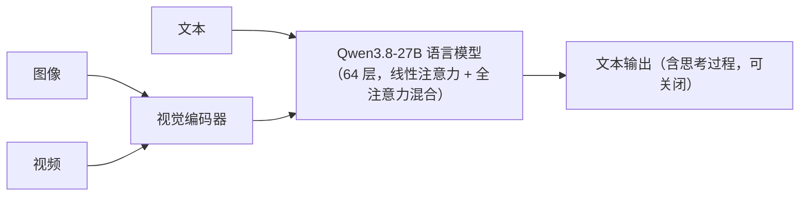

# Qwen3.8-27B 技术介绍

> 本地多模态大模型 · 本地多模态工具链引擎

[文档首页](../../../文档首页.md) › [知识档案](../技术栈知识档案总览.md) › [AI 工具](../技术栈知识档案总览.md#ai) › Qwen3.8-27B 技术介绍　|　[← 返回总览](../技术栈知识档案总览.md)

---

## 1. 技术概述 <a id="overview"></a>

**Qwen3.8-27B** 是阿里通义千问（Qwen）团队 2026 年 8 月开源的**原生多模态稠密（Dense）大模型**：
27B 参数、全部参与计算（非稀疏 MoE），原生支持文本、图像、视频输入，输出文本。
它在 Qwen3.6-27B 基础上大幅强化编程与办公场景，官方称多项能力超越 Qwen3.7-Plus（十倍参数量级的 MoE 模型）。

本项目中的角色：

- **本地多模态引擎**（主用途）：跑在本机 llama.cpp 服务（llama-server，OpenAI 兼容接口，端口 8080）上，提供识图、界面评审、文档理解、交叉检查能力。
- **LLM 适配层候选**：Qwen 系是 BMS LLM 适配层的模型候选之一（OpenAI 兼容接口），私有化部署路径（vLLM/Ollama 自托管）可直接加载本模型，见《[LLM 适配层技术介绍](../后端核心/LLM适配层技术介绍.md)》。

| 项 | 值 |
| --- | --- |
| 发布 | 2026 年 8 月初 Qwen3.8 系列发布，2026-08-14 权重开源（Hugging Face / ModelScope） |
| 参数 | 27B 稠密（dense），全部参数参与计算 |
| 模态 | 文本 / 图像 / 视频输入，文本输出（原生视觉编码器） |
| 上下文 | 262,144 tokens 原生，YaRN 可外推至 1,000,000 tokens |
| 许可 | Apache-2.0，可自由下载、部署、商用 |
| 权重 | BF16 约 55.6GB（18 个 safetensors 分片）；社区量化包约 18GB；官方另提供 FP8 权重 |
| 生态 | Transformers、vLLM、SGLang、TokenSpeed 官方接入；LM Studio、Ollama 直接可用 |

## 2. 核心概念与原理 <a id="principles"></a>

| 概念 | 说明 |
| --- | --- |
| 稠密模型（Dense） | 每次计算全部 27B 参数都参与（对比：MoE 只激活部分专家）；单卡可跑、部署简单，但同尺寸下算力开销大于 MoE |
| Gated DeltaNet | 线性注意力（linear attention）机制，长序列计算成本更低；本模型 48 个 V 头 / 16 个 QK 头，头维度 128 |
| Gated Attention | 全注意力（full attention）层，24 个 Q 头 / 4 个 KV 头，头维度 256，负责精确的长程依赖 |
| 混合注意力布局 | `16 × (3 × (Gated DeltaNet → FFN) → 1 × (Gated Attention → FFN))`：按「3 层线性注意力 + 1 层全注意力」循环排布 64 层，兼顾长文成本与精度 |
| 原生多模态 | 视觉编码器与语言模型一起预训练、联合推理（对比「后接视觉适配器」方案），能理解 STEM 图、公式、文档版面与视频 |
| 262K 上下文 | 原生上下文 262,144 tokens；YaRN（RoPE 缩放）可外推至约 100 万 tokens |
| 思考模式（thinking） | 回答前先输出思考过程（`reasoning_content`），默认开启，可按请求关闭直接回答 |
| reasoning_effort | 官方思考强度档位：`xhigh`（默认，复杂任务）/ `medium`（平衡）/ `low`（速度与成本优先） |
| preserve_thinking | 多轮对话中保留历史消息的思考块（默认开启），利于 agent 决策一致，但占用上下文与显存 |
| MTP | 多 token 预测（Multi-Token Prediction）训练，提升生成效率 |
| CI | 官方评测术语（with CI / without CI）：开启推理档位后的评测设置，开启后视觉类得分普遍明显更高 |

## 3. 架构与参数 <a id="arch"></a>



来自官方模型卡（config.json）的参数：

| 项 | 值 |
| --- | --- |
| 类型 | Causal Language Model with Vision Encoder |
| 层数 | 64 |
| 隐藏维度 | 5120 |
| FFN 中间维度 | 17,408 |
| 词表 | 248,320（Padded） |
| 注意力布局 | 16 × (3 × (Gated DeltaNet → FFN) → 1 × (Gated Attention → FFN)) |
| Gated DeltaNet | 48 V 头 / 16 QK 头，头维度 128 |
| Gated Attention | 24 Q 头 / 4 KV 头，头维度 256，RoPE 维度 64 |
| MTP | 多 token 预测（多步训练） |
| 上下文 | 262,144 原生 / 1,000,000（YaRN 外推） |

## 4. 性能评测（厂商自报） <a id="bench"></a>

> 数据来自官方模型卡（2026-08），均为厂商自报成绩；跨模型对比仅供参考，不作为验收依据。
> 粗体为官方标注的该行最佳。

### 4.1 文本性能（编程 / Agent / 通用） <a id="bench-text"></a>

| 评测 | Qwen3.8-27B | Qwen3.6-27B | Qwen3.7-Plus | Opus 4.6 Max |
| --- | --- | --- | --- | --- |
| Terminal Bench 2.1（终端编程） | 73.0 | 63.4 | 64.0 | **78.2** |
| SWE-bench Pro（Agent 编程） | **61.7** | 53.5 | 57.6 | 53.4 |
| QwenSWEBench（软件工程） | **79.0** | 49.3 | 59.2 | 63.8 |
| DeepSWE 1.1 | **42.2** | 13.3 | 14.2 | — |
| NL2Repo-Bench（仓库级生成） | 42.3 | 36.2 | 41.1 | **47.6** |
| CoWorkBench（长程办公） | **70.7** | 61.0 | 65.1 | 68.2 |
| JobBench（职业任务） | **33.4** | 21.8 | 27.6 | — |
| LiveCodeBench v6（竞赛编程） | **90.3** | 83.9 | 89.6 | 88.8 |
| IFBench（指令遵循） | **79.5** | 69.1 | 79.1 | 62.5 |
| GPQA Diamond（科学推理） | 89.2 | 87.8 | 90.3 | **91.3** |
| HLE（多学科推理） | 30.8 | 24.0 | 34.7 | **40.0** |

### 4.2 多模态性能 <a id="bench-vl"></a>

| 评测 | Qwen3.8-27B | Qwen3.6-27B | Qwen3.7-Plus | Opus 4.6 Max |
| --- | --- | --- | --- | --- |
| OSWorld-Verified（电脑操作） | **84.3** | 63.9 | 73.3 | 72.7 |
| AndroidWorld（手机操作） | **81.9** | 70.3 | 81.0 | 62.0 |
| WebArena-Verified（浏览器操作） | **64.8** | 48.8 | 55.3 | — |
| RecreationBench（应用复刻） | **47.1** | 29.8 | 30.2 | — |
| ClawEval-MM（多模态工具调用，Pass@3 / 均分） | **57.4** / 56.9 | 42.6 / 50.4 | 57.4 / **60.1** | 52.5 / 54.7 |
| SWE-MM（多模态软件工程） | **38.6** | 25.7 | 30.0 | 27.1 |
| Vision2Web（视觉 Web 开发） | **62.9** | 45.0 | 42.1 | — |
| MathVision（视觉数学，无 CI / 开 CI） | 90.0 / **94.6** | 85.1 | **90.3** | 65.5 |
| BabyVision（通用视觉推理，无 CI / 开 CI） | 65.7 / **85.6** | 28.9 | 64.7 / 70.4 | 12.6 |
| CharXiv RQ（科学图表，无 CI / 开 CI） | 83.7 / **90.2** | 78.4 | 85.8 | 66.0 |
| OmniDocBench 1.5（文档理解） | 91.1 | 89.4 | **91.4** | 86.6 |
| RealWorldQA（真实场景感知） | 85.9 | 84.1 | **86.9** | 73.9 |
| ERQA（具身推理） | 65.5 | 62.5 | **69.8** | 40.8 |

## 5. 在 BMS 项目中的用途 <a id="usage"></a>

- **本地多模态工具链（主用途）**：作为本机 LM Studio 的本地模型，经《》的 MCP 工具暴露能力——原型评审识图、文档图/图表/公式图理解、日志与配置整理、主模型交叉检查；全部推理在本机，数据不出机器。
- **LLM 适配层候选**：Qwen 系是 BMS LLM 适配层的模型候选（外部 API 或 vLLM/Ollama 自托管，均 OpenAI 兼容），本模型可作私有化端点（见《[LLM 适配层技术介绍](../后端核心/LLM适配层技术介绍.md)》）。
- **OCR 复杂场景切换**：BMS 阶段十五 OCR 默认 PaddleOCR，复杂版面/公式可切换多模态模型（《[项目规划说明](../../../规划/项目规划说明.md)》3.1 节），本模型是该路径的本地引擎候选（见《[PaddleOCR 技术介绍](../后端核心/PaddleOCR技术介绍.md)》选型对比）。
- **边界**：BMS 业务运行时不依赖本模型；它服务本地 AI 工具链（助手多模态能力与模型交叉检查），与业务 AI 链路分离。

## 6. 本地部署与运行 <a id="deploy"></a>

### 6.1 硬件要求 <a id="hw"></a>

- BF16 原版权重约 55.6GB：需 24GB+ 显存整卡加载，或多卡 / CPU 卸载；更常见的做法是直接用量化版。
- 量化版（GGUF 约 18GB）：24GB 显存（RTX 3090/4090 级别）可整卡装下；内存充足的笔记本也可跑（社区验证）。
- 上下文受显存约束：262K 是理论值，KV 缓存与图像 token 随上下文和分辨率增长，「装得下」不等于「跑得动 256K」。

### 6.2 部署路径 <a id="paths"></a>

| 路径 | 适用 | 说明 |
| --- | --- | --- |
| LM Studio（本项目本地路径） | 本地助手多模态工具链 | 下载量化权重，启用本地服务（默认 `127.0.0.1:1234`，OpenAI 兼容）；把模型设为常驻内存避免冷加载 |
| Ollama | 本地快速体验 | 标准包约 18GB，一条命令拉起 |
| vLLM / SGLang / TokenSpeed | 服务化、高吞吐 | 官方 recipe；可下载官方 FP8 权重 |

### 6.3 调用示例（OpenAI 兼容，图像输入） <a id="api"></a>

```python
from openai import OpenAI

client = OpenAI(base_url="http://127.0.0.1:1234/v1", api_key="local")

resp = client.chat.completions.create(
    model="qwen/qwen3.8-27b",
    messages=[
        {
            "role": "user",
            "content": [
                {"type": "image_url", "image_url": {"url": "data:image/png;base64,..."}},
                {"type": "text", "text": "评审这张界面截图，列出问题"},
            ],
        }
    ],
    # 官方推荐采样：非思考模式 temperature=0.7, top_p=0.80, top_k=20, presence_penalty=1.5
    # 思考模式 temperature=1.0, top_p=0.95, top_k=20
    extra_body={"chat_template_kwargs": {"enable_thinking": False}},  # 关闭思考，直接回答
)
print(resp.choices[0].message.content)
```

### 6.4 思考控制 <a id="thinking"></a>

- `reasoning_effort`：`xhigh`（默认）/ `medium` / `low`，按任务难度调思考深度、控制成本。
- `enable_thinking: false`（经 `chat_template_kwargs`）：不输出思考过程直接回答，简单任务省 token 省时。
- `preserve_thinking`：默认开启，历史思考块保留在上下文（利于多轮 agent 一致，占显存），可按需关闭。

## 7. 常见问题与注意事项 <a id="pitfalls"></a>

- **思考模式费 token**：默认开启，先输出 `reasoning_content`；识图类简单任务应关闭或降档（本项目工具链默认关闭思考，并对不识别该参数的接口做 400 去掉重试兜底）。
- **上下文 ≠ 显存**：262K 上下文是理论值；本地高分辨率截图的图像 token、KV 缓存都吃显存，多图输入建议不超过 2 张（本项目实测的保守值）。
- **YaRN 是静态缩放**：外推到 1M 上下文可能影响短文本表现，确需长文才启用；`factor` 按典型长度调整（如典型 512K 用 2.0）。
- **视频吃 token**：支持小时级视频，但视频 token 量大；官方默认视频预处理参数偏保守，小时级视频可把 `longest_edge` 设为 `469,762,048`（约 224k 视频 token）提高采样帧率。
- **采样参数分模式**：思考模式 temperature=1.0/top_p=0.95；非思考 temperature=0.7/top_p=0.80/presence_penalty=1.5。LM Studio 等框架对部分参数支持不一，工具链已有「400 报错后去掉参数重试」的兜底。
- **低思考强度不一定更快**：多轮 agent 任务中思考过少可能失败重试更多，总耗时反而上升（官方提示）。
- **评测成绩是厂商自报**：跨模型对比仅作选型参考，实际效果以本项目场景实测为准。
- **版本与制品区分**：BF16 原版、官方 FP8、Ollama/MLX 量化包、社区 GGUF 不是同一制品，精度、上下文默认值、工具支持可能不同，记录实际使用的制品与参数。

## 8. 学习与参考资料 <a id="learn"></a>

| 资源 | 网址 | 说明 |
| --- | --- | --- |
| 官方模型卡（Hugging Face） | https://huggingface.co/Qwen/Qwen3.8-27B | 参数、评测、调用示例与最佳实践（权威入口） |
| ModelScope 集合 | https://www.modelscope.cn/collections/Qwen/Qwen38 | 国内下载入口（Qwen3.8 全系列） |
| 通义千问官网 | https://qwen.ai/ | 系列发布与博客 |
| vLLM 官方 recipe | https://recipes.vllm.ai/Qwen/Qwen3.8-27B | vLLM 部署配方 |
| SGLang Cookbook | https://docs.sglang.io/cookbook/autoregressive/Qwen/Qwen3.8-27B | SGLang 部署配方 |
| LM Studio | https://lmstudio.ai/ | 本地量化模型管理（本项目本地路径） |
| Ollama 模型库 | https://ollama.com/ | 本地快速上手（约 18GB 量化包） |

## 9. 项目内关联文档 <a id="related"></a>

| 文档 | 说明 |
| --- | --- |
| 《》 | 本模型的主要使用方：LM Studio + MCP 工具链、场景模板与能力清单 |
| 《[LLM 适配层技术介绍](../后端核心/LLM适配层技术介绍.md)》 | Qwen 系作为适配层模型候选、私有化部署路径 |
| 《[PaddleOCR 技术介绍](../后端核心/PaddleOCR技术介绍.md)》 | OCR 复杂场景可切换多模态模型的选型背景 |
| 《[项目规划说明](../../../规划/项目规划说明.md)》 | AI 能力（阶段十五）、技术栈与许可约定 |

---

> 依《[文档生成规范](../../../规范/文档生成规范.md)》编写
