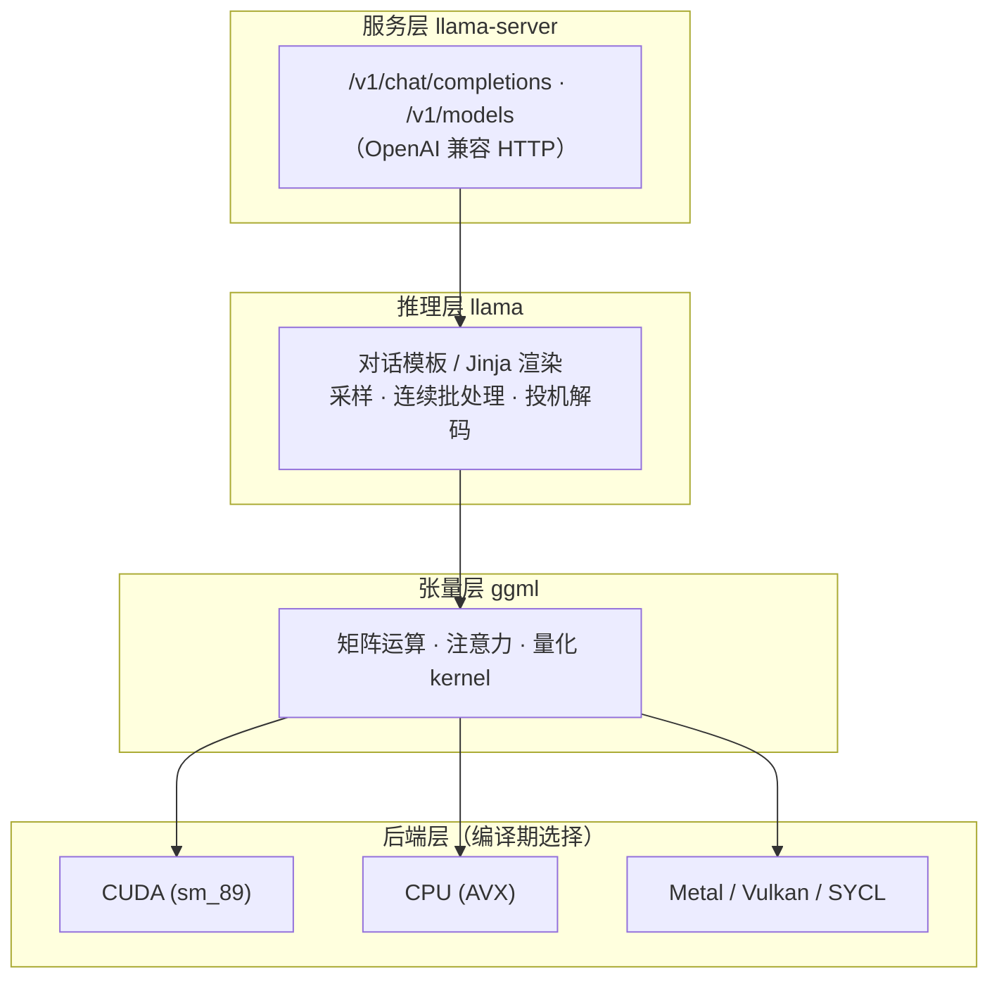

# llama.cpp 技术介绍

> 轻量级 LLM 推理引擎 · 本地多模态工具链推理后端

[文档首页](../../../文档首页.md) › [知识档案](../技术栈知识档案总览.md) › [AI 工具](../技术栈知识档案总览.md#ai) › llama.cpp 技术介绍　|　[← 返回总览](../技术栈知识档案总览.md)

---

## 1. 技术概述 <a id="overview"></a>

**llama.cpp** 是用 C/C++ 实现的**大模型推理引擎**（无强制第三方依赖），自带底层张量库 **ggml** 与
OpenAI 兼容的 HTTP 服务 **llama-server**。它的主张是「轻量、跨平台、量化友好」：能在纯 CPU 上跑大模型，
也可卸载到 CUDA / Metal / Vulkan 等 GPU 后端，原生使用 **GGUF** 量化格式，是本地离线推理的事实标准之一。
Ollama、LM Studio 等上层工具都构建在 llama.cpp 之上。

本项目中的角色：

- **本地推理后端**（主用途）：跑 [Qwen3.8-27B](Qwen3.8-27B技术介绍.md)（Q4_K_M 量化 + 视觉投影），
  以 `llama-server` 起 OpenAI 兼容服务（端口 8080），作为 [opencode](https://opencode.ai) 的本地模型后端，全程离线免费。
- **LLM 适配层候选**：OpenAI 兼容端点，可作 BMS LLM 适配层的私有化自托管选项，见《[LLM 适配层技术介绍](../后端核心/LLM适配层技术介绍.md)》。

| 项 | 值 |
| --- | --- |
| 语言 | C / C++11（ggml 张量库内置，无强制依赖） |
| 格式 | GGUF（模型容器：权重 + 元数据） |
| 后端 | CUDA / Metal / Vulkan / SYCL / OpenCL / CPU（AVX） |
| 服务 | `llama-server`：OpenAI 兼容（`/v1/chat/completions`、`/v1/models`） |
| 量化 | k-quants（Q8_0 / Q6_K / Q5_K_M / **Q4_K_M** / Q3…） |
| 许可 | MIT |
| 本机版本 | 0.3.0-dev（build 87，commit `9d81721`，CUDA `sm_89`，源码运行） |
| 生态 | Ollama、LM Studio 基于它；官方另有 Python 绑定 `llama-cpp-python` |

## 2. 核心概念与原理 <a id="principles"></a>

| 概念 | 说明 |
| --- | --- |
| GGUF | llama.cpp 的模型容器格式（取代旧 GGML），统一存权重、词表与元数据；不同量化工具的 GGUF 互认 |
| 量化（Quantization） | 把 FP16/BF16 权重压缩到低比特（如 4bit）以省显存/内存、提速，代价是精度损失；k-quants 用混合精度（部分层保高精度）降低损失 |
| 层卸载（`-ngl`） | 指定把 N 个 Transformer 层放到 GPU，其余留 CPU，实现 CPU/GPU 混合推理（`-ngl 999` = 全上卡） |
| KV Cache 量化（`-ctk` / `-ctv`） | 对注意力 K/V 缓存做量化压缩，长上下文时显著省显存（本项目用 `q4_0`） |
| Flash Attention | IO 友好的注意力实现，减少显存读写、加速长序列（`--flash-attn on`） |
| 连续批处理 | 多请求动态打包进同一解码批次，提高吞吐（`-np` 并发槽位） |
| 投机解码（draft / spec decode） | 小草稿模型先猜若干 token、大模型一次性校验，降低生成延迟 |
| Chat Template / Jinja | 把 `messages` 渲染成模型期望的 prompt；llama.cpp 用 `--jinja` + 模板文件（本项目用 Qwen3.8 专用模板） |
| 推理模型支持 | `--reasoning-format`（如 `deepseek`）+ `--reasoning-preserve`，输出思考块 `reasoning_content` |
| 多模态（`-mm`） | 加载 mmproj 视觉投影，把图像编码为 token 参与推理（本项目 Qwen3.8 支持图片输入） |

## 3. 架构与分层 <a id="arch"></a>

llama.cpp 自上而下分四层，`llama-server` 只是最上的一层薄壳：



本项目实际运行的关键参数（`llama-server`）：

| 项 | 值 | 说明 |
| --- | --- | --- |
| 主模型 | Qwen3.8-27B `Q4_K_M`（16G） | GGUF，混合 4-bit 量化 |
| 视觉投影 | mmproj `f16`（885M） | 多模态 |
| 层卸载 | `-ngl 999` | 全部层上 GPU |
| 上下文 | `-c 262144`（256K） | KV 缓存按此预留 |
| KV 量化 | `-ctk q4_0 -ctv q4_0` | 压缩长上下文显存 |
| 加速 | `--flash-attn on` | Flash Attention |
| 服务 | `--host 127.0.0.1 --port 8080` | llama.cpp 默认端口 |
| 模板 | `--jinja --chat-template-file …qwen38…jinja` | Qwen3.8 专用 chat 模板 |
| 推理 | `--reasoning-format deepseek --reasoning-preserve` | 先思考后作答 |

## 4. 量化与性能权衡 <a id="quant"></a>

> llama.cpp 是**单实例、低延迟优先**的推理引擎，不追求 vLLM/SGLang 那种多租户高吞吐；量化档位是「精度 / 体积 / 速度」的三角权衡。

| 量化档 | 体积（相对） | 精度 | 适用 |
| --- | --- | --- | --- |
| Q8_0 / F16 | 大 | 最高 | 显存充裕、精度敏感 |
| Q6_K | 中 | 高 | 精度与体积平衡 |
| **Q4_K_M**（本项目） | 小 | 良好 | 通用甜点档，27B 约 16G |
| Q3_K_M 及更低 | 更小 | 下降明显 | 显存/内存紧张时的妥协 |

- **CPU/GPU 混合**：`-ngl` 决定多少层上卡；显存不够时把部分层留 CPU（变慢但能跑），纯 CPU 也能推理（AVX 加速）。
- **上下文 ≠ 显存**：256K 上下文要留足 KV 缓存；本项目用 `q4_0` KV 量化压住 24G 显存。
- **本项目实测**：Qwen3.8-27B Q4_K_M 在 RTX 4090（24G）上 `llama-server` 首次加载约 30–60 秒；
  推理模型先输出思考（`reasoning_content`）再出正文，短问答也需给足 `max_tokens`（见《[llamacpp部署使用说明](../../AI/llamacpp部署使用说明.md)》）。

## 5. 在 BMS 项目中的用途 <a id="usage"></a>

- **本地推理后端（主用途）**：以 `llama-server` 跑 Qwen3.8-27B，接 opencode 的 `llamacpp` 提供商（8080），
  为 AI 助手提供本地多模态能力（识图、界面评审、文档理解、交叉检查），数据不出机器。部署细节见《[llamacpp部署使用说明](../../AI/llamacpp部署使用说明.md)》。
- **与 LM Studio 的关系**：opencode 另有一个 `lmstudio` 提供商（1234）；两者都基于 llama.cpp 生态，
  但本项目实际推理走 `llamacpp`（llama.cpp 源码 + `llama-server`，8080）。
- **LLM 适配层候选**：OpenAI 兼容端点，可作为 BMS LLM 适配层的自托管选项（见《[LLM 适配层技术介绍](../后端核心/LLM适配层技术介绍.md)》）。
- **边界**：服务本地 AI 工具链（助手能力与模型交叉检查），与 BMS 业务运行时 AI 链路分离。

## 6. 本地部署与运行 <a id="deploy"></a>

### 6.1 硬件要求 <a id="hw"></a>

- 取决于「模型量化体积 + 上下文 KV 缓存」：本项目 Qwen3.8-27B Q4_K_M 约 16G 权重 + 256K KV（q4_0），
  24G 显存（RTX 4090）可整卡装下；显存小则降 `-ngl` 走 CPU 混合或换更小量化。
- 纯 CPU 也可运行（无需 GPU），速度较慢，适合轻量模型或无卡环境。

### 6.2 获取与编译 <a id="paths"></a>

```bash
git clone https://github.com/ggml-org/llama.cpp        # 国内可加 ghfast.top 前缀加速
cd llama.cpp
# CUDA 编译（架构 89 = RTX 4090；纯 CPU 去掉 -DGGML_CUDA）
cmake -B build -DCMAKE_BUILD_TYPE=Release -DGGML_CUDA=ON -DCMAKE_CUDA_ARCHITECTURES=89
cmake --build build --config Release -j
```

### 6.3 启动服务与调用 <a id="api"></a>

```bash
# 启动 llama-server（OpenAI 兼容，:8080；本机三个 Qwen3.8-27B 量化版用脚本 qwen-ud/std/unc.sh 切换，见部署说明）
build/bin/llama-server \
  -m /home/minjian/ai/models/Qwen3.8-27B-UD-Q4_K_M.gguf \
  -mm /home/minjian/ai/models/mmproj-Qwen3.8-27B-f16.gguf \
  -ngl 999 -c 262144 -ctk q4_0 -ctv q4_0 \
  --flash-attn on --host 127.0.0.1 --port 8080

# 调用（任意 OpenAI 客户端）
curl -s http://127.0.0.1:8080/v1/chat/completions \
  -H "Content-Type: application/json" \
  -d '{"model":"…","messages":[{"role":"user","content":"1+1=？"}],"max_tokens":64}'
```

> 服务托管、启停脚本、桌面快捷方式等完整部署见《[llamacpp部署使用说明](../../AI/llamacpp部署使用说明.md)》。

## 7. 常见问题与注意事项 <a id="pitfalls"></a>

- **量化不是越小越好**：Q4_K_M 是通用甜点档；追求精度用 Q6_K/Q8_0，显存紧张才降到 Q3。换档要重下/重转 GGUF。
- **`-ngl` 与显存**：`-ngl 999` 全上卡最省心；显存不够时减小 `-ngl`（部分层留 CPU），日志会提示是否装下。
- **上下文吃显存**：`-c` 按上限预留 KV；实际用不到 256K 时调小可省显存、降延迟。
- **推理模型费 token**：`--reasoning-format` 下先出思考块；短问答 `max_tokens` 给足，否则 `content` 为空。
- **多实例 / 端口**：同一模型起多个 `llama-server` 会各占一份显存；换端口改 `--port` 并同步客户端 `baseURL`。
- **版本制品区分**：不同 commit、不同量化 GGUF 行为可能不同（模板、参数、多模态支持），记录实际版本与制品。
- **它不是高吞吐服务器**：需要大并发/多租户服务化时，考虑 vLLM/SGLang（见第 4 节定位）。

## 8. 学习与参考资料 <a id="learn"></a>

| 资源 | 网址 | 说明 |
| --- | --- | --- |
| 官方仓库（github.com/ggml-org/llama.cpp） | https://github.com/ggml-org/llama.cpp | 源码、`llama-server` 文档与示例（权威入口） |
| llama.cpp 文档目录 | https://github.com/ggml-org/llama.cpp/tree/master/docs | 后端、量化、服务器等专题文档 |
| GGUF 格式说明 | https://github.com/ggml-org/ggml | 底层张量库与 GGUF 规范 |
| k-quants（量化） | https://github.com/ggml-org/llama.cpp/pull/2167 | 混合量化（Q4_K_M 等）的设计与动机 |
| llama-cpp-python | https://github.com/germanml/llama-cpp-python | Python 绑定（若以库方式调用） |
| Ollama（基于 llama.cpp） | https://ollama.com/ | 易用封装，本地快速上手 |
| LM Studio（基于 llama.cpp） | https://lmstudio.ai/ | GUI 封装（本项目 opencode 另一 provider） |

## 9. 项目内关联文档 <a id="related"></a>

| 文档 | 说明 |
| --- | --- |
| 《[llamacpp部署使用说明](../../AI/llamacpp部署使用说明.md)》 | 本项目源码编译、`llama-server` 托管、启停与桌面快捷方式 |
| 《[Qwen3.8-27B 技术介绍](Qwen3.8-27B技术介绍.md)》 | 本引擎承载的本地多模态模型 |
| 《[LLM 适配层技术介绍](../后端核心/LLM适配层技术介绍.md)》 | OpenAI 兼容端点作为适配层自托管候选 |
| 《[项目规划说明](../../../规划/项目规划说明.md)》 | AI 能力与技术栈约定 |

---

> 依《[文档生成规范](../../../规范/文档生成规范.md)》编写 · 基于 llama.cpp 0.3.0-dev（build 87 / commit `9d81721`，CUDA `sm_89`）
